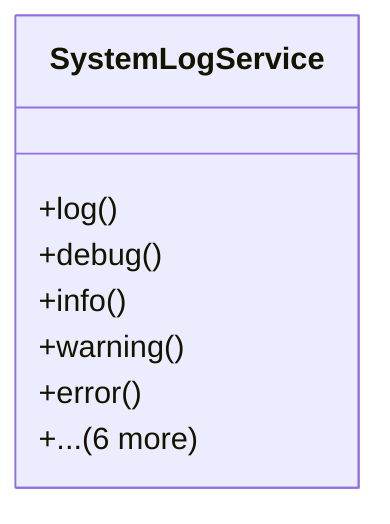

# services_modules.utilities.services.system_log_service

## Imports
- django.utils
- models.system_log

## Classes
- SystemLogService
  - method: `log`
  - method: `debug`
  - method: `info`
  - method: `warning`
  - method: `error`
  - method: `critical`
  - method: `get_logs`
  - method: `get_recent_logs`
  - method: `get_error_logs`
  - method: `get_critical_logs`
  - method: `clear_old_logs`

## Functions
- log
- debug
- info
- warning
- error
- critical
- get_logs
- get_recent_logs
- get_error_logs
- get_critical_logs
- clear_old_logs

## Class Diagram

