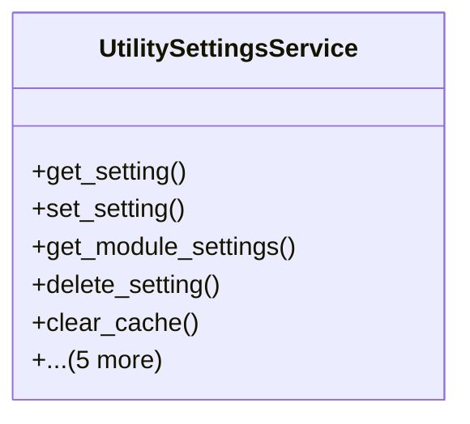

# services_modules.utilities.services.utility_settings_service

## Imports
- django.core.cache
- django.core.exceptions
- models.utility_setting

## Classes
- UtilitySettingsService
  - method: `get_setting`
  - method: `set_setting`
  - method: `get_module_settings`
  - method: `delete_setting`
  - method: `clear_cache`
  - method: `get_all_settings`
  - method: `validate_setting`
  - method: `reset_to_defaults`
  - method: `export_settings`
  - method: `import_settings`

## Functions
- get_setting
- set_setting
- get_module_settings
- delete_setting
- clear_cache
- get_all_settings
- validate_setting
- reset_to_defaults
- export_settings
- import_settings

## Class Diagram

