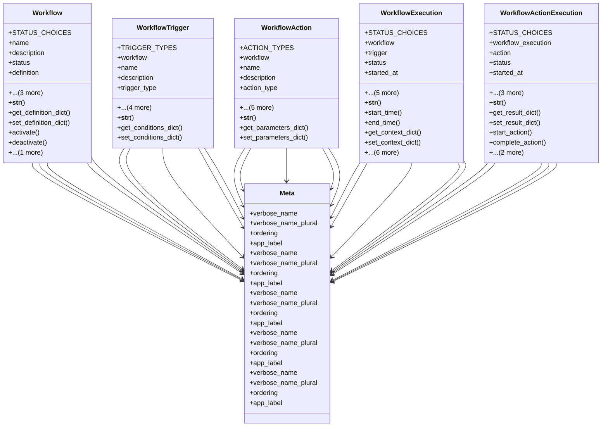

# services_modules.workflows.models.workflow

## Imports
- django.conf
- django.db
- django.utils
- django.utils.translation
- json

## Classes
- Workflow
  - attr: `STATUS_CHOICES`
  - attr: `name`
  - attr: `description`
  - attr: `status`
  - attr: `definition`
  - attr: `created_by`
  - attr: `created_at`
  - attr: `updated_at`
  - method: `__str__`
  - method: `get_definition_dict`
  - method: `set_definition_dict`
  - method: `activate`
  - method: `deactivate`
  - method: `archive`
- WorkflowTrigger
  - attr: `TRIGGER_TYPES`
  - attr: `workflow`
  - attr: `name`
  - attr: `description`
  - attr: `trigger_type`
  - attr: `conditions`
  - attr: `is_active`
  - attr: `created_at`
  - attr: `updated_at`
  - method: `__str__`
  - method: `get_conditions_dict`
  - method: `set_conditions_dict`
- WorkflowAction
  - attr: `ACTION_TYPES`
  - attr: `workflow`
  - attr: `name`
  - attr: `description`
  - attr: `action_type`
  - attr: `parameters`
  - attr: `order`
  - attr: `is_active`
  - attr: `created_at`
  - attr: `updated_at`
  - method: `__str__`
  - method: `get_parameters_dict`
  - method: `set_parameters_dict`
- WorkflowExecution
  - attr: `STATUS_CHOICES`
  - attr: `workflow`
  - attr: `trigger`
  - attr: `status`
  - attr: `started_at`
  - attr: `completed_at`
  - attr: `context`
  - attr: `result`
  - attr: `error_message`
  - attr: `created_at`
  - method: `__str__`
  - method: `start_time`
  - method: `end_time`
  - method: `get_context_dict`
  - method: `set_context_dict`
  - method: `get_result_dict`
  - method: `set_result_dict`
  - method: `start_execution`
  - method: `complete_execution`
  - method: `fail_execution`
  - method: `cancel_execution`
- WorkflowActionExecution
  - attr: `STATUS_CHOICES`
  - attr: `workflow_execution`
  - attr: `action`
  - attr: `status`
  - attr: `started_at`
  - attr: `completed_at`
  - attr: `result`
  - attr: `error_message`
  - method: `__str__`
  - method: `get_result_dict`
  - method: `set_result_dict`
  - method: `start_action`
  - method: `complete_action`
  - method: `fail_action`
  - method: `skip_action`
- Meta
  - attr: `verbose_name`
  - attr: `verbose_name_plural`
  - attr: `ordering`
  - attr: `app_label`
- Meta
  - attr: `verbose_name`
  - attr: `verbose_name_plural`
  - attr: `ordering`
  - attr: `app_label`
- Meta
  - attr: `verbose_name`
  - attr: `verbose_name_plural`
  - attr: `ordering`
  - attr: `app_label`
- Meta
  - attr: `verbose_name`
  - attr: `verbose_name_plural`
  - attr: `ordering`
  - attr: `app_label`
- Meta
  - attr: `verbose_name`
  - attr: `verbose_name_plural`
  - attr: `ordering`
  - attr: `app_label`

## Functions
- __str__
- get_definition_dict
- set_definition_dict
- activate
- deactivate
- archive
- __str__
- get_conditions_dict
- set_conditions_dict
- __str__
- get_parameters_dict
- set_parameters_dict
- __str__
- start_time
- end_time
- get_context_dict
- set_context_dict
- get_result_dict
- set_result_dict
- start_execution
- complete_execution
- fail_execution
- cancel_execution
- __str__
- get_result_dict
- set_result_dict
- start_action
- complete_action
- fail_action
- skip_action

## Module Variables
- `User`

## Class Diagram

