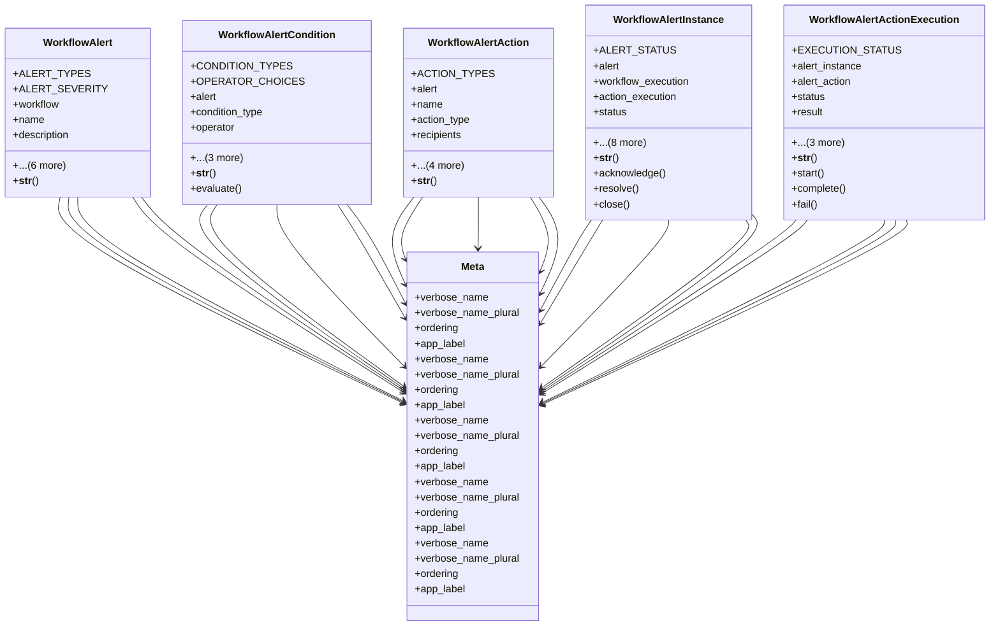

# services_modules.workflows.models.workflow_alerts

## Imports
- django.contrib.auth
- django.db
- django.utils
- django.utils.translation
- re
- typing

## Classes
- WorkflowAlert
  - attr: `ALERT_TYPES`
  - attr: `ALERT_SEVERITY`
  - attr: `workflow`
  - attr: `name`
  - attr: `description`
  - attr: `alert_type`
  - attr: `severity`
  - attr: `is_active`
  - attr: `auto_resolve`
  - attr: `created_at`
  - attr: `updated_at`
  - method: `__str__`
- WorkflowAlertCondition
  - attr: `CONDITION_TYPES`
  - attr: `OPERATOR_CHOICES`
  - attr: `alert`
  - attr: `condition_type`
  - attr: `operator`
  - attr: `expected_value`
  - attr: `action`
  - attr: `custom_expression`
  - method: `__str__`
  - method: `evaluate`
- WorkflowAlertAction
  - attr: `ACTION_TYPES`
  - attr: `alert`
  - attr: `name`
  - attr: `action_type`
  - attr: `recipients`
  - attr: `template`
  - attr: `custom_data`
  - attr: `order`
  - attr: `is_active`
  - method: `__str__`
- WorkflowAlertInstance
  - attr: `ALERT_STATUS`
  - attr: `alert`
  - attr: `workflow_execution`
  - attr: `action_execution`
  - attr: `status`
  - attr: `message`
  - attr: `details`
  - attr: `created_at`
  - attr: `updated_at`
  - attr: `acknowledged_by`
  - attr: `acknowledged_at`
  - attr: `resolved_by`
  - attr: `resolved_at`
  - method: `__str__`
  - method: `acknowledge`
  - method: `resolve`
  - method: `close`
- WorkflowAlertActionExecution
  - attr: `EXECUTION_STATUS`
  - attr: `alert_instance`
  - attr: `alert_action`
  - attr: `status`
  - attr: `result`
  - attr: `error_message`
  - attr: `started_at`
  - attr: `completed_at`
  - method: `__str__`
  - method: `start`
  - method: `complete`
  - method: `fail`
- Meta
  - attr: `verbose_name`
  - attr: `verbose_name_plural`
  - attr: `ordering`
  - attr: `app_label`
- Meta
  - attr: `verbose_name`
  - attr: `verbose_name_plural`
  - attr: `ordering`
  - attr: `app_label`
- Meta
  - attr: `verbose_name`
  - attr: `verbose_name_plural`
  - attr: `ordering`
  - attr: `app_label`
- Meta
  - attr: `verbose_name`
  - attr: `verbose_name_plural`
  - attr: `ordering`
  - attr: `app_label`
- Meta
  - attr: `verbose_name`
  - attr: `verbose_name_plural`
  - attr: `ordering`
  - attr: `app_label`

## Functions
- __str__
- __str__
- evaluate
- __str__
- __str__
- acknowledge
- resolve
- close
- __str__
- start
- complete
- fail

## Module Variables
- `User`

## Class Diagram

