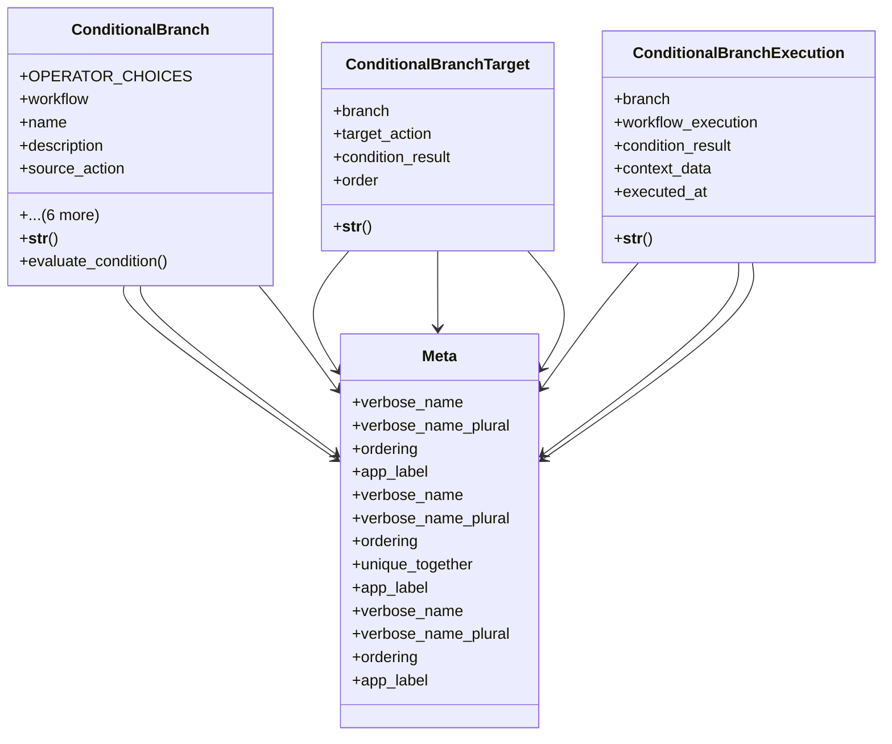

# services_modules.workflows.models.workflow_conditional

## Imports
- django.contrib.auth
- django.db
- django.utils.translation
- json

## Classes
- ConditionalBranch
  - attr: `OPERATOR_CHOICES`
  - attr: `workflow`
  - attr: `name`
  - attr: `description`
  - attr: `source_action`
  - attr: `condition_field`
  - attr: `condition_operator`
  - attr: `condition_value`
  - attr: `is_active`
  - attr: `created_at`
  - attr: `updated_at`
  - method: `__str__`
  - method: `evaluate_condition`
- ConditionalBranchTarget
  - attr: `branch`
  - attr: `target_action`
  - attr: `condition_result`
  - attr: `order`
  - method: `__str__`
- ConditionalBranchExecution
  - attr: `branch`
  - attr: `workflow_execution`
  - attr: `condition_result`
  - attr: `context_data`
  - attr: `executed_at`
  - method: `__str__`
- Meta
  - attr: `verbose_name`
  - attr: `verbose_name_plural`
  - attr: `ordering`
  - attr: `app_label`
- Meta
  - attr: `verbose_name`
  - attr: `verbose_name_plural`
  - attr: `ordering`
  - attr: `unique_together`
  - attr: `app_label`
- Meta
  - attr: `verbose_name`
  - attr: `verbose_name_plural`
  - attr: `ordering`
  - attr: `app_label`

## Functions
- __str__
- evaluate_condition
- __str__
- __str__

## Module Variables
- `User`

## Class Diagram

