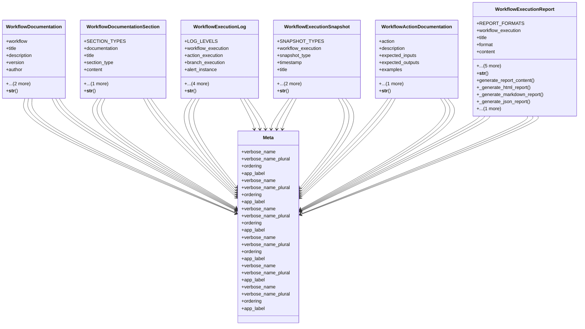

# services_modules.workflows.models.workflow_documentation

## Imports
- django.contrib.auth
- django.db
- django.utils.translation
- json

## Classes
- WorkflowDocumentation
  - attr: `workflow`
  - attr: `title`
  - attr: `description`
  - attr: `version`
  - attr: `author`
  - attr: `created_at`
  - attr: `updated_at`
  - method: `__str__`
- WorkflowDocumentationSection
  - attr: `SECTION_TYPES`
  - attr: `documentation`
  - attr: `title`
  - attr: `section_type`
  - attr: `content`
  - attr: `order`
  - method: `__str__`
- WorkflowExecutionLog
  - attr: `LOG_LEVELS`
  - attr: `workflow_execution`
  - attr: `action_execution`
  - attr: `branch_execution`
  - attr: `alert_instance`
  - attr: `timestamp`
  - attr: `level`
  - attr: `message`
  - attr: `details`
  - method: `__str__`
- WorkflowExecutionSnapshot
  - attr: `SNAPSHOT_TYPES`
  - attr: `workflow_execution`
  - attr: `snapshot_type`
  - attr: `timestamp`
  - attr: `title`
  - attr: `description`
  - attr: `state_data`
  - method: `__str__`
- WorkflowActionDocumentation
  - attr: `action`
  - attr: `description`
  - attr: `expected_inputs`
  - attr: `expected_outputs`
  - attr: `examples`
  - attr: `notes`
  - method: `__str__`
- WorkflowExecutionReport
  - attr: `REPORT_FORMATS`
  - attr: `workflow_execution`
  - attr: `title`
  - attr: `format`
  - attr: `content`
  - attr: `include_logs`
  - attr: `include_snapshots`
  - attr: `include_alerts`
  - attr: `generated_at`
  - attr: `generated_by`
  - method: `__str__`
  - method: `generate_report_content`
  - method: `_generate_html_report`
  - method: `_generate_markdown_report`
  - method: `_generate_json_report`
  - method: `_generate_text_report`
- Meta
  - attr: `verbose_name`
  - attr: `verbose_name_plural`
  - attr: `ordering`
  - attr: `app_label`
- Meta
  - attr: `verbose_name`
  - attr: `verbose_name_plural`
  - attr: `ordering`
  - attr: `app_label`
- Meta
  - attr: `verbose_name`
  - attr: `verbose_name_plural`
  - attr: `ordering`
  - attr: `app_label`
- Meta
  - attr: `verbose_name`
  - attr: `verbose_name_plural`
  - attr: `ordering`
  - attr: `app_label`
- Meta
  - attr: `verbose_name`
  - attr: `verbose_name_plural`
  - attr: `app_label`
- Meta
  - attr: `verbose_name`
  - attr: `verbose_name_plural`
  - attr: `ordering`
  - attr: `app_label`

## Functions
- __str__
- __str__
- __str__
- __str__
- __str__
- __str__
- generate_report_content
- _generate_html_report
- _generate_markdown_report
- _generate_json_report
- _generate_text_report

## Module Variables
- `User`

## Class Diagram

