# services_modules.workflows.serializers

## Imports
- django.contrib.auth
- json
- models
- rest_framework

## Classes
- UserSerializer
  - attr: `name`
  - method: `get_name`
- WorkflowSerializer
  - attr: `created_by`
  - attr: `status_display`
- WorkflowTriggerSerializer
  - attr: `trigger_type_display`
  - method: `validate_conditions`
- WorkflowActionSerializer
  - attr: `action_type_display`
  - method: `validate_parameters`
- WorkflowActionExecutionSerializer
  - attr: `action`
  - attr: `status_display`
- WorkflowExecutionSerializer
  - attr: `workflow`
  - attr: `trigger`
  - attr: `action_executions`
  - attr: `status_display`
- ConditionalBranchSerializer
  - attr: `condition_operator_display`
- ConditionalBranchTargetSerializer
  - attr: `target_action`
- ConditionalBranchExecutionSerializer
  - attr: `branch`
- WorkflowAlertConditionSerializer
  - attr: `condition_type_display`
  - attr: `operator_display`
- WorkflowAlertActionSerializer
  - attr: `action_type_display`
- WorkflowAlertSerializer
  - attr: `alert_type_display`
  - attr: `severity_display`
  - attr: `conditions`
  - attr: `actions`
- WorkflowAlertInstanceSerializer
  - attr: `alert`
  - attr: `status_display`
  - attr: `acknowledged_by`
  - attr: `resolved_by`
- WorkflowAlertActionExecutionSerializer
  - attr: `alert_action`
  - attr: `status_display`
- WorkflowDetailSerializer
  - attr: `triggers`
  - attr: `actions`
  - attr: `conditional_branches`
  - attr: `alerts`
- WorkflowExecutionDetailSerializer
  - attr: `branch_executions`
  - attr: `alert_instances`
- Meta
  - attr: `model`
  - attr: `fields`
- Meta
  - attr: `model`
  - attr: `fields`
  - attr: `read_only_fields`
- Meta
  - attr: `model`
  - attr: `fields`
  - attr: `read_only_fields`
- Meta
  - attr: `model`
  - attr: `fields`
  - attr: `read_only_fields`
- Meta
  - attr: `model`
  - attr: `fields`
  - attr: `read_only_fields`
- Meta
  - attr: `model`
  - attr: `fields`
  - attr: `read_only_fields`
- Meta
  - attr: `model`
  - attr: `fields`
  - attr: `read_only_fields`
- Meta
  - attr: `model`
  - attr: `fields`
- Meta
  - attr: `model`
  - attr: `fields`
  - attr: `read_only_fields`
- Meta
  - attr: `model`
  - attr: `fields`
  - attr: `read_only_fields`
- Meta
  - attr: `model`
  - attr: `fields`
  - attr: `read_only_fields`
- Meta
  - attr: `model`
  - attr: `fields`
  - attr: `read_only_fields`
- Meta
  - attr: `model`
  - attr: `fields`
  - attr: `read_only_fields`
- Meta
  - attr: `model`
  - attr: `fields`
  - attr: `read_only_fields`
- Meta
  - attr: `fields`
- Meta
  - attr: `fields`

## Functions
- get_name
- validate_conditions
- validate_parameters

## Module Variables
- `User`

## Class Diagram

```mermaid
classDiagram
    class UserSerializer {
        +name
        +get_name()
    }
    class WorkflowSerializer {
        +created_by
        +status_display
    }
    class WorkflowTriggerSerializer {
        +trigger_type_display
        +validate_conditions()
    }
    class WorkflowActionSerializer {
        +action_type_display
        +validate_parameters()
    }
    class WorkflowActionExecutionSerializer {
        +action
        +status_display
    }
    class WorkflowExecutionSerializer {
        +workflow
        +trigger
        +action_executions
        +status_display
    }
    class ConditionalBranchSerializer {
        +condition_operator_display
    }
    class ConditionalBranchTargetSerializer {
        +target_action
    }
    class ConditionalBranchExecutionSerializer {
        +branch
    }
    class WorkflowAlertConditionSerializer {
        +condition_type_display
        +operator_display
    }
    class WorkflowAlertActionSerializer {
        +action_type_display
    }
    class WorkflowAlertSerializer {
        +alert_type_display
        +severity_display
        +conditions
        +actions
    }
    class WorkflowAlertInstanceSerializer {
        +alert
        +status_display
        +acknowledged_by
        +resolved_by
    }
    class WorkflowAlertActionExecutionSerializer {
        +alert_action
        +status_display
    }
    class WorkflowDetailSerializer {
        +triggers
        +actions
        +conditional_branches
        +alerts
    }
    class WorkflowExecutionDetailSerializer {
        +branch_executions
        +alert_instances
    }
    class Meta {
        +model
        +fields
    }
    class Meta {
        +model
        +fields
        +read_only_fields
    }
    class Meta {
        +model
        +fields
        +read_only_fields
    }
    class Meta {
        +model
        +fields
        +read_only_fields
    }
    class Meta {
        +model
        +fields
        +read_only_fields
    }
    class Meta {
        +model
        +fields
        +read_only_fields
    }
    class Meta {
        +model
        +fields
        +read_only_fields
    }
    class Meta {
        +model
        +fields
    }
    class Meta {
        +model
        +fields
        +read_only_fields
    }
    class Meta {
        +model
        +fields
        +read_only_fields
    }
    class Meta {
        +model
        +fields
        +read_only_fields
    }
    class Meta {
        +model
        +fields
        +read_only_fields
    }
    class Meta {
        +model
        +fields
        +read_only_fields
    }
    class Meta {
        +model
        +fields
        +read_only_fields
    }
    class Meta {
        +fields
    }
    class Meta {
        +fields
    }
    UserSerializer --> Meta
    UserSerializer --> Meta
    UserSerializer --> Meta
    UserSerializer --> Meta
    UserSerializer --> Meta
    UserSerializer --> Meta
    UserSerializer --> Meta
    UserSerializer --> Meta
    UserSerializer --> Meta
    UserSerializer --> Meta
    UserSerializer --> Meta
    UserSerializer --> Meta
    UserSerializer --> Meta
    UserSerializer --> Meta
    UserSerializer --> Meta
    UserSerializer --> Meta
    WorkflowSerializer --> Meta
    WorkflowSerializer --> Meta
    WorkflowSerializer --> Meta
    WorkflowSerializer --> Meta
    WorkflowSerializer --> Meta
    WorkflowSerializer --> Meta
    WorkflowSerializer --> Meta
    WorkflowSerializer --> Meta
    WorkflowSerializer --> Meta
    WorkflowSerializer --> Meta
    WorkflowSerializer --> Meta
    WorkflowSerializer --> Meta
    WorkflowSerializer --> Meta
    WorkflowSerializer --> Meta
    WorkflowSerializer --> Meta
    WorkflowSerializer --> Meta
    WorkflowTriggerSerializer --> Meta
    WorkflowTriggerSerializer --> Meta
    WorkflowTriggerSerializer --> Meta
    WorkflowTriggerSerializer --> Meta
    WorkflowTriggerSerializer --> Meta
    WorkflowTriggerSerializer --> Meta
    WorkflowTriggerSerializer --> Meta
    WorkflowTriggerSerializer --> Meta
    WorkflowTriggerSerializer --> Meta
    WorkflowTriggerSerializer --> Meta
    WorkflowTriggerSerializer --> Meta
    WorkflowTriggerSerializer --> Meta
    WorkflowTriggerSerializer --> Meta
    WorkflowTriggerSerializer --> Meta
    WorkflowTriggerSerializer --> Meta
    WorkflowTriggerSerializer --> Meta
    WorkflowActionSerializer --> Meta
    WorkflowActionSerializer --> Meta
    WorkflowActionSerializer --> Meta
    WorkflowActionSerializer --> Meta
    WorkflowActionSerializer --> Meta
    WorkflowActionSerializer --> Meta
    WorkflowActionSerializer --> Meta
    WorkflowActionSerializer --> Meta
    WorkflowActionSerializer --> Meta
    WorkflowActionSerializer --> Meta
    WorkflowActionSerializer --> Meta
    WorkflowActionSerializer --> Meta
    WorkflowActionSerializer --> Meta
    WorkflowActionSerializer --> Meta
    WorkflowActionSerializer --> Meta
    WorkflowActionSerializer --> Meta
    WorkflowActionExecutionSerializer --> Meta
    WorkflowActionExecutionSerializer --> Meta
    WorkflowActionExecutionSerializer --> Meta
    WorkflowActionExecutionSerializer --> Meta
    WorkflowActionExecutionSerializer --> Meta
    WorkflowActionExecutionSerializer --> Meta
    WorkflowActionExecutionSerializer --> Meta
    WorkflowActionExecutionSerializer --> Meta
    WorkflowActionExecutionSerializer --> Meta
    WorkflowActionExecutionSerializer --> Meta
    WorkflowActionExecutionSerializer --> Meta
    WorkflowActionExecutionSerializer --> Meta
    WorkflowActionExecutionSerializer --> Meta
    WorkflowActionExecutionSerializer --> Meta
    WorkflowActionExecutionSerializer --> Meta
    WorkflowActionExecutionSerializer --> Meta
    WorkflowExecutionSerializer --> Meta
    WorkflowExecutionSerializer --> Meta
    WorkflowExecutionSerializer --> Meta
    WorkflowExecutionSerializer --> Meta
    WorkflowExecutionSerializer --> Meta
    WorkflowExecutionSerializer --> Meta
    WorkflowExecutionSerializer --> Meta
    WorkflowExecutionSerializer --> Meta
    WorkflowExecutionSerializer --> Meta
    WorkflowExecutionSerializer --> Meta
    WorkflowExecutionSerializer --> Meta
    WorkflowExecutionSerializer --> Meta
    WorkflowExecutionSerializer --> Meta
    WorkflowExecutionSerializer --> Meta
    WorkflowExecutionSerializer --> Meta
    WorkflowExecutionSerializer --> Meta
    ConditionalBranchSerializer --> Meta
    ConditionalBranchSerializer --> Meta
    ConditionalBranchSerializer --> Meta
    ConditionalBranchSerializer --> Meta
    ConditionalBranchSerializer --> Meta
    ConditionalBranchSerializer --> Meta
    ConditionalBranchSerializer --> Meta
    ConditionalBranchSerializer --> Meta
    ConditionalBranchSerializer --> Meta
    ConditionalBranchSerializer --> Meta
    ConditionalBranchSerializer --> Meta
    ConditionalBranchSerializer --> Meta
    ConditionalBranchSerializer --> Meta
    ConditionalBranchSerializer --> Meta
    ConditionalBranchSerializer --> Meta
    ConditionalBranchSerializer --> Meta
    ConditionalBranchTargetSerializer --> Meta
    ConditionalBranchTargetSerializer --> Meta
    ConditionalBranchTargetSerializer --> Meta
    ConditionalBranchTargetSerializer --> Meta
    ConditionalBranchTargetSerializer --> Meta
    ConditionalBranchTargetSerializer --> Meta
    ConditionalBranchTargetSerializer --> Meta
    ConditionalBranchTargetSerializer --> Meta
    ConditionalBranchTargetSerializer --> Meta
    ConditionalBranchTargetSerializer --> Meta
    ConditionalBranchTargetSerializer --> Meta
    ConditionalBranchTargetSerializer --> Meta
    ConditionalBranchTargetSerializer --> Meta
    ConditionalBranchTargetSerializer --> Meta
    ConditionalBranchTargetSerializer --> Meta
    ConditionalBranchTargetSerializer --> Meta
    ConditionalBranchExecutionSerializer --> Meta
    ConditionalBranchExecutionSerializer --> Meta
    ConditionalBranchExecutionSerializer --> Meta
    ConditionalBranchExecutionSerializer --> Meta
    ConditionalBranchExecutionSerializer --> Meta
    ConditionalBranchExecutionSerializer --> Meta
    ConditionalBranchExecutionSerializer --> Meta
    ConditionalBranchExecutionSerializer --> Meta
    ConditionalBranchExecutionSerializer --> Meta
    ConditionalBranchExecutionSerializer --> Meta
    ConditionalBranchExecutionSerializer --> Meta
    ConditionalBranchExecutionSerializer --> Meta
    ConditionalBranchExecutionSerializer --> Meta
    ConditionalBranchExecutionSerializer --> Meta
    ConditionalBranchExecutionSerializer --> Meta
    ConditionalBranchExecutionSerializer --> Meta
    WorkflowAlertConditionSerializer --> Meta
    WorkflowAlertConditionSerializer --> Meta
    WorkflowAlertConditionSerializer --> Meta
    WorkflowAlertConditionSerializer --> Meta
    WorkflowAlertConditionSerializer --> Meta
    WorkflowAlertConditionSerializer --> Meta
    WorkflowAlertConditionSerializer --> Meta
    WorkflowAlertConditionSerializer --> Meta
    WorkflowAlertConditionSerializer --> Meta
    WorkflowAlertConditionSerializer --> Meta
    WorkflowAlertConditionSerializer --> Meta
    WorkflowAlertConditionSerializer --> Meta
    WorkflowAlertConditionSerializer --> Meta
    WorkflowAlertConditionSerializer --> Meta
    WorkflowAlertConditionSerializer --> Meta
    WorkflowAlertConditionSerializer --> Meta
    WorkflowAlertActionSerializer --> Meta
    WorkflowAlertActionSerializer --> Meta
    WorkflowAlertActionSerializer --> Meta
    WorkflowAlertActionSerializer --> Meta
    WorkflowAlertActionSerializer --> Meta
    WorkflowAlertActionSerializer --> Meta
    WorkflowAlertActionSerializer --> Meta
    WorkflowAlertActionSerializer --> Meta
    WorkflowAlertActionSerializer --> Meta
    WorkflowAlertActionSerializer --> Meta
    WorkflowAlertActionSerializer --> Meta
    WorkflowAlertActionSerializer --> Meta
    WorkflowAlertActionSerializer --> Meta
    WorkflowAlertActionSerializer --> Meta
    WorkflowAlertActionSerializer --> Meta
    WorkflowAlertActionSerializer --> Meta
    WorkflowAlertSerializer --> Meta
    WorkflowAlertSerializer --> Meta
    WorkflowAlertSerializer --> Meta
    WorkflowAlertSerializer --> Meta
    WorkflowAlertSerializer --> Meta
    WorkflowAlertSerializer --> Meta
    WorkflowAlertSerializer --> Meta
    WorkflowAlertSerializer --> Meta
    WorkflowAlertSerializer --> Meta
    WorkflowAlertSerializer --> Meta
    WorkflowAlertSerializer --> Meta
    WorkflowAlertSerializer --> Meta
    WorkflowAlertSerializer --> Meta
    WorkflowAlertSerializer --> Meta
    WorkflowAlertSerializer --> Meta
    WorkflowAlertSerializer --> Meta
    WorkflowAlertInstanceSerializer --> Meta
    WorkflowAlertInstanceSerializer --> Meta
    WorkflowAlertInstanceSerializer --> Meta
    WorkflowAlertInstanceSerializer --> Meta
    WorkflowAlertInstanceSerializer --> Meta
    WorkflowAlertInstanceSerializer --> Meta
    WorkflowAlertInstanceSerializer --> Meta
    WorkflowAlertInstanceSerializer --> Meta
    WorkflowAlertInstanceSerializer --> Meta
    WorkflowAlertInstanceSerializer --> Meta
    WorkflowAlertInstanceSerializer --> Meta
    WorkflowAlertInstanceSerializer --> Meta
    WorkflowAlertInstanceSerializer --> Meta
    WorkflowAlertInstanceSerializer --> Meta
    WorkflowAlertInstanceSerializer --> Meta
    WorkflowAlertInstanceSerializer --> Meta
    WorkflowAlertActionExecutionSerializer --> Meta
    WorkflowAlertActionExecutionSerializer --> Meta
    WorkflowAlertActionExecutionSerializer --> Meta
    WorkflowAlertActionExecutionSerializer --> Meta
    WorkflowAlertActionExecutionSerializer --> Meta
    WorkflowAlertActionExecutionSerializer --> Meta
    WorkflowAlertActionExecutionSerializer --> Meta
    WorkflowAlertActionExecutionSerializer --> Meta
    WorkflowAlertActionExecutionSerializer --> Meta
    WorkflowAlertActionExecutionSerializer --> Meta
    WorkflowAlertActionExecutionSerializer --> Meta
    WorkflowAlertActionExecutionSerializer --> Meta
    WorkflowAlertActionExecutionSerializer --> Meta
    WorkflowAlertActionExecutionSerializer --> Meta
    WorkflowAlertActionExecutionSerializer --> Meta
    WorkflowAlertActionExecutionSerializer --> Meta
    WorkflowDetailSerializer --> Meta
    WorkflowDetailSerializer --> Meta
    WorkflowDetailSerializer --> Meta
    WorkflowDetailSerializer --> Meta
    WorkflowDetailSerializer --> Meta
    WorkflowDetailSerializer --> Meta
    WorkflowDetailSerializer --> Meta
    WorkflowDetailSerializer --> Meta
    WorkflowDetailSerializer --> Meta
    WorkflowDetailSerializer --> Meta
    WorkflowDetailSerializer --> Meta
    WorkflowDetailSerializer --> Meta
    WorkflowDetailSerializer --> Meta
    WorkflowDetailSerializer --> Meta
    WorkflowDetailSerializer --> Meta
    WorkflowDetailSerializer --> Meta
    WorkflowExecutionDetailSerializer --> Meta
    WorkflowExecutionDetailSerializer --> Meta
    WorkflowExecutionDetailSerializer --> Meta
    WorkflowExecutionDetailSerializer --> Meta
    WorkflowExecutionDetailSerializer --> Meta
    WorkflowExecutionDetailSerializer --> Meta
    WorkflowExecutionDetailSerializer --> Meta
    WorkflowExecutionDetailSerializer --> Meta
    WorkflowExecutionDetailSerializer --> Meta
    WorkflowExecutionDetailSerializer --> Meta
    WorkflowExecutionDetailSerializer --> Meta
    WorkflowExecutionDetailSerializer --> Meta
    WorkflowExecutionDetailSerializer --> Meta
    WorkflowExecutionDetailSerializer --> Meta
    WorkflowExecutionDetailSerializer --> Meta
    WorkflowExecutionDetailSerializer --> Meta
```

