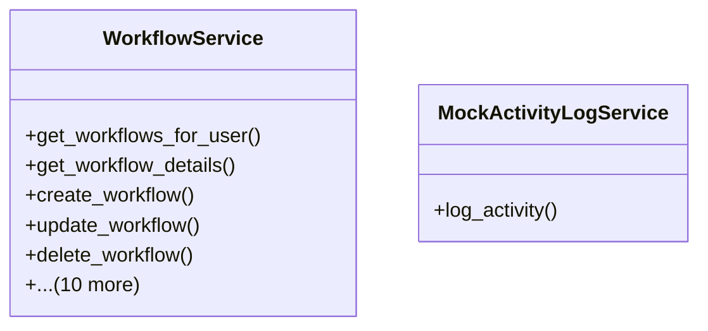

# services_modules.workflows.services

## Imports
- core_modules.activity_log.services
- django.contrib.auth
- django.core.exceptions
- django.db
- django.utils
- json
- models

## Classes
- WorkflowService
  - method: `get_workflows_for_user`
  - method: `get_workflow_details`
  - method: `create_workflow`
  - method: `update_workflow`
  - method: `delete_workflow`
  - method: `activate_workflow`
  - method: `deactivate_workflow`
  - method: `create_trigger`
  - method: `update_trigger`
  - method: `delete_trigger`
  - method: `create_action`
  - method: `update_action`
  - method: `delete_action`
  - method: `execute_workflow`
  - method: `_execute_action`
- MockActivityLogService
  - method: `log_activity`

## Functions
- get_workflows_for_user
- get_workflow_details
- create_workflow
- update_workflow
- delete_workflow
- activate_workflow
- deactivate_workflow
- create_trigger
- update_trigger
- delete_trigger
- create_action
- update_action
- delete_action
- execute_workflow
- _execute_action
- log_activity

## Module Variables
- `User`

## Class Diagram

