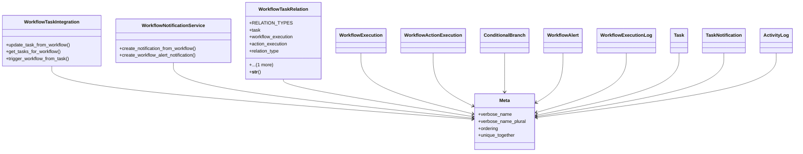

# services_modules.workflows.services.workflow_integration

## Imports
- django.contrib.auth.models
- django.contrib.contenttypes.models
- django.db
- django.utils.translation
- gaara_erp_new.core_modules.activity_log.models
- gaara_erp_new.core_modules.tasks.models.task
- gaara_erp_new.core_modules.tasks.models.task_notifications
- gaara_erp_new.services_modules.workflows.models.workflow
- gaara_erp_new.services_modules.workflows.models.workflow_alerts
- gaara_erp_new.services_modules.workflows.models.workflow_conditional
- gaara_erp_new.services_modules.workflows.models.workflow_documentation
- logging

## Classes
- WorkflowTaskIntegration
  - method: `update_task_from_workflow`
  - method: `get_tasks_for_workflow`
  - method: `trigger_workflow_from_task`
- WorkflowNotificationService
  - method: `create_notification_from_workflow`
  - method: `create_workflow_alert_notification`
- WorkflowTaskRelation
  - attr: `RELATION_TYPES`
  - attr: `task`
  - attr: `workflow_execution`
  - attr: `action_execution`
  - attr: `relation_type`
  - attr: `created_at`
  - method: `__str__`
- Meta
  - attr: `verbose_name`
  - attr: `verbose_name_plural`
  - attr: `ordering`
  - attr: `unique_together`
- WorkflowExecution
- WorkflowActionExecution
- ConditionalBranch
- WorkflowAlert
- WorkflowExecutionLog
- Task
- TaskNotification
- ActivityLog

## Functions
- create_task_from_workflow
- update_task_from_workflow
- get_tasks_for_workflow
- trigger_workflow_from_task
- create_notification_from_workflow
- create_workflow_alert_notification
- __str__

## Module Variables
- `logger`

## Class Diagram

