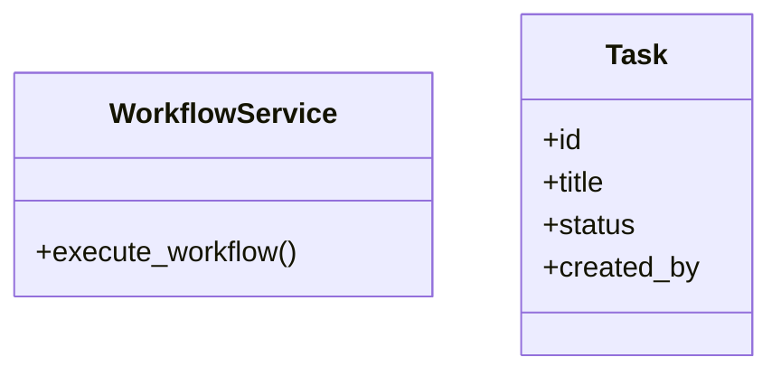

# services_modules.workflows.signals

## Imports
- core_modules.tasks.models
- django.contrib.auth
- django.db.models.signals
- django.dispatch
- json
- models
- services
- services_modules.tasks.models

## Classes
- WorkflowService
  - method: `execute_workflow`
- Task
  - attr: `id`
  - attr: `title`
  - attr: `status`
  - attr: `created_by`

## Functions
- task_saved_handler
- workflow_execution_created_handler
- workflow_saved_handler
- workflow_deleted_handler
- task_status_changed_handler
- track_model_changes
- task_pre_save_handler
- execute_workflow

## Module Variables
- `User`

## Class Diagram

