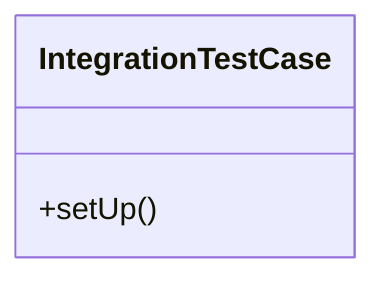

# test_integration

## Imports
- agricultural_modules.farms.models
- agricultural_modules.nurseries.models
- business_modules.accounting.models
- business_modules.inventory.models
- business_modules.sales.models
- core_modules.core.models
- django
- django.conf
- django.contrib.auth
- django.db
- django.test
- django.test.utils
- django.utils
- integration_modules.ai_agent.models
- integration_modules.memory_ai.models
- json
- os
- sys
- uuid
- warnings

## Classes
- IntegrationTestCase
  - method: `setUp`

## Functions
- test_database_operations
- test_api_authentication
- test_module_interactions
- test_ai_module_integration
- test_agricultural_module_integration
- main
- setUp

## Module Variables
- `User`

## Class Diagram

