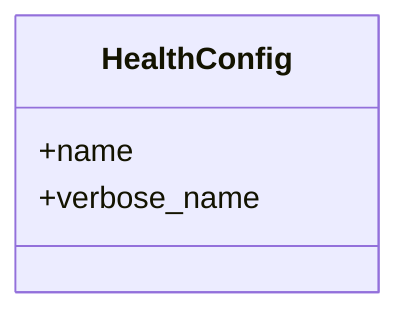

# utility_modules.health.apps

## Imports
- django.apps

## Classes
- HealthConfig
  - attr: `name`
  - attr: `verbose_name`

## Class Diagram

```mermaid
classDiagram
    class HealthConfig {
        +name
        +verbose_name
    }
```
