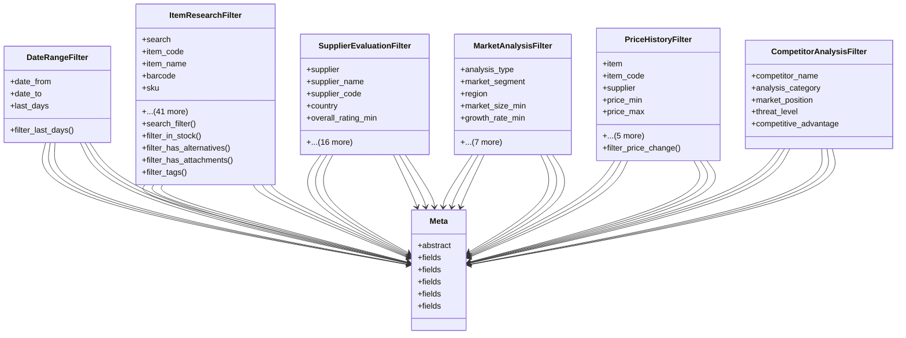

# utility_modules.item_research.backup_files.filters

## Imports
- datetime
- decimal
- django.contrib.auth
- django.db.models
- django.utils.translation
- django_filters

## Classes
- DateRangeFilter
  - attr: `date_from`
  - attr: `date_to`
  - attr: `last_days`
  - method: `filter_last_days`
- ItemResearchFilter
  - attr: `search`
  - attr: `item_code`
  - attr: `item_name`
  - attr: `barcode`
  - attr: `sku`
  - attr: `category`
  - attr: `category_name`
  - attr: `subcategory`
  - attr: `brand`
  - attr: `research_status`
  - attr: `research_type`
  - attr: `priority`
  - attr: `price_min`
  - attr: `price_max`
  - attr: `price_range`
  - attr: `cost_min`
  - attr: `cost_max`
  - attr: `margin_min`
  - attr: `supplier`
  - attr: `supplier_name`
  - attr: `manufacturer`
  - attr: `manufacturer_name`
  - attr: `country_of_origin`
  - attr: `quality_score_min`
  - attr: `quality_score_max`
  - attr: `rating_min`
  - attr: `has_certification`
  - attr: `certification_type`
  - attr: `in_stock`
  - attr: `stock_level_min`
  - attr: `lead_time_max`
  - attr: `moq_max`
  - attr: `researcher`
  - attr: `reviewed_by`
  - attr: `department`
  - attr: `is_active`
  - attr: `is_approved`
  - attr: `is_discontinued`
  - attr: `requires_review`
  - attr: `has_alternatives`
  - attr: `has_attachments`
  - attr: `market_demand`
  - attr: `competition_level`
  - attr: `tags`
  - attr: `keywords`
  - attr: `ordering`
  - method: `search_filter`
  - method: `filter_in_stock`
  - method: `filter_has_alternatives`
  - method: `filter_has_attachments`
  - method: `filter_tags`
- SupplierEvaluationFilter
  - attr: `supplier`
  - attr: `supplier_name`
  - attr: `supplier_code`
  - attr: `country`
  - attr: `overall_rating_min`
  - attr: `quality_rating_min`
  - attr: `delivery_rating_min`
  - attr: `price_rating_min`
  - attr: `service_rating_min`
  - attr: `is_certified`
  - attr: `certification_expiry`
  - attr: `compliance_status`
  - attr: `on_time_delivery_rate_min`
  - attr: `defect_rate_max`
  - attr: `response_time_max`
  - attr: `payment_terms`
  - attr: `credit_limit_min`
  - attr: `discount_rate_min`
  - attr: `status`
  - attr: `is_preferred`
  - attr: `ordering`
- MarketAnalysisFilter
  - attr: `analysis_type`
  - attr: `market_segment`
  - attr: `region`
  - attr: `market_size_min`
  - attr: `growth_rate_min`
  - attr: `market_share_min`
  - attr: `competitor_count_max`
  - attr: `competition_intensity`
  - attr: `status`
  - attr: `is_current`
  - attr: `confidence_level`
  - attr: `ordering`
- PriceHistoryFilter
  - attr: `item`
  - attr: `item_code`
  - attr: `supplier`
  - attr: `price_min`
  - attr: `price_max`
  - attr: `price_change_type`
  - attr: `change_percentage_min`
  - attr: `currency`
  - attr: `price_source`
  - attr: `ordering`
  - method: `filter_price_change`
- CompetitorAnalysisFilter
  - attr: `competitor_name`
  - attr: `analysis_category`
  - attr: `market_position`
  - attr: `threat_level`
  - attr: `competitive_advantage`
- Meta
  - attr: `abstract`
- Meta
  - attr: `fields`
- Meta
  - attr: `fields`
- Meta
  - attr: `fields`
- Meta
  - attr: `fields`
- Meta
  - attr: `fields`

## Functions
- create_dynamic_filter
- filter_last_days
- search_filter
- filter_in_stock
- filter_has_alternatives
- filter_has_attachments
- filter_tags
- filter_price_change

## Module Variables
- `User`

## Class Diagram

