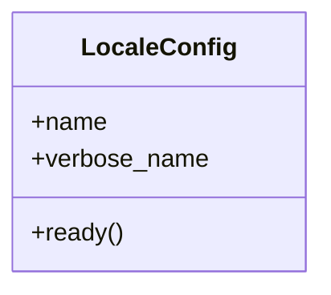

# utility_modules.locale.apps

## Imports
- django.apps
- django.utils.translation
- utility_modules.locale.signals

## Classes
- LocaleConfig
  - attr: `name`
  - attr: `verbose_name`
  - method: `ready`

## Functions
- ready

## Class Diagram

