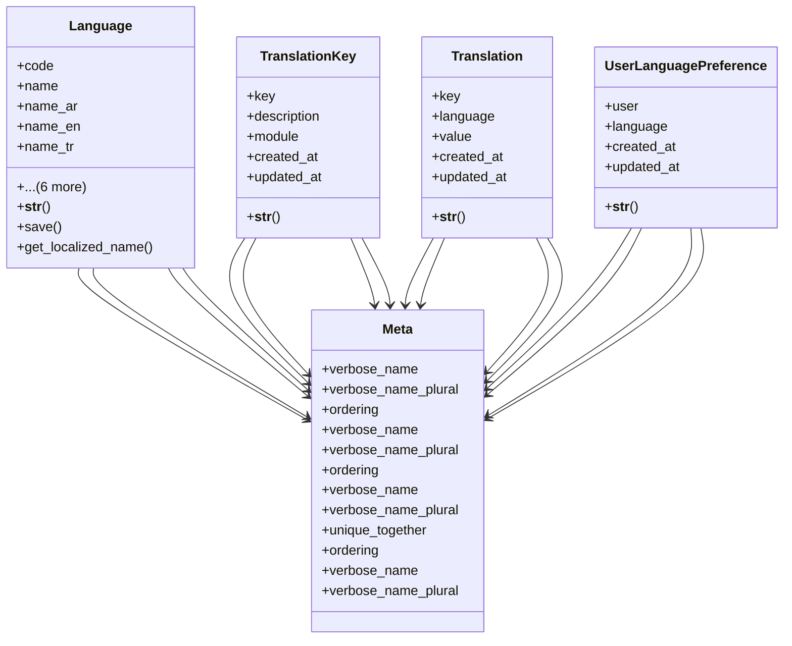

# utility_modules.locale.models

## Imports
- django.conf
- django.core.exceptions
- django.db
- django.utils
- django.utils.translation

## Classes
- Language
  - attr: `code`
  - attr: `name`
  - attr: `name_ar`
  - attr: `name_en`
  - attr: `name_tr`
  - attr: `rtl`
  - attr: `is_default`
  - attr: `is_active`
  - attr: `flag_icon`
  - attr: `created_at`
  - attr: `updated_at`
  - method: `__str__`
  - method: `save`
  - method: `get_localized_name`
- TranslationKey
  - attr: `key`
  - attr: `description`
  - attr: `module`
  - attr: `created_at`
  - attr: `updated_at`
  - method: `__str__`
- Translation
  - attr: `key`
  - attr: `language`
  - attr: `value`
  - attr: `created_at`
  - attr: `updated_at`
  - method: `__str__`
- UserLanguagePreference
  - attr: `user`
  - attr: `language`
  - attr: `created_at`
  - attr: `updated_at`
  - method: `__str__`
- Meta
  - attr: `verbose_name`
  - attr: `verbose_name_plural`
  - attr: `ordering`
- Meta
  - attr: `verbose_name`
  - attr: `verbose_name_plural`
  - attr: `ordering`
- Meta
  - attr: `verbose_name`
  - attr: `verbose_name_plural`
  - attr: `unique_together`
  - attr: `ordering`
- Meta
  - attr: `verbose_name`
  - attr: `verbose_name_plural`

## Functions
- __str__
- save
- get_localized_name
- __str__
- __str__
- __str__

## Class Diagram

