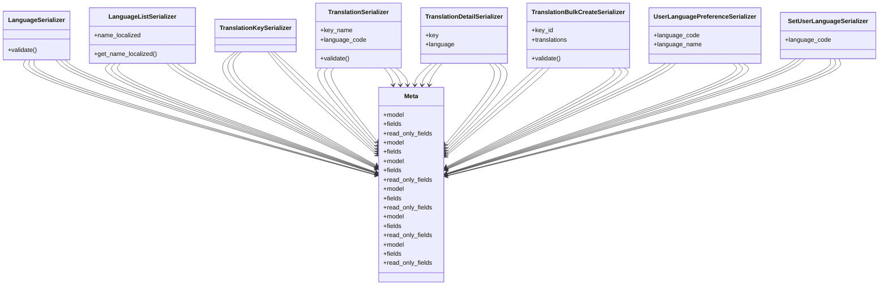

# utility_modules.locale.serializers

## Imports
- django.utils.translation
- models
- rest_framework

## Classes
- LanguageSerializer
  - method: `validate`
- LanguageListSerializer
  - attr: `name_localized`
  - method: `get_name_localized`
- TranslationKeySerializer
- TranslationSerializer
  - attr: `key_name`
  - attr: `language_code`
  - method: `validate`
- TranslationDetailSerializer
  - attr: `key`
  - attr: `language`
- TranslationBulkCreateSerializer
  - attr: `key_id`
  - attr: `translations`
  - method: `validate`
- UserLanguagePreferenceSerializer
  - attr: `language_code`
  - attr: `language_name`
- SetUserLanguageSerializer
  - attr: `language_code`
- Meta
  - attr: `model`
  - attr: `fields`
  - attr: `read_only_fields`
- Meta
  - attr: `model`
  - attr: `fields`
- Meta
  - attr: `model`
  - attr: `fields`
  - attr: `read_only_fields`
- Meta
  - attr: `model`
  - attr: `fields`
  - attr: `read_only_fields`
- Meta
  - attr: `model`
  - attr: `fields`
  - attr: `read_only_fields`
- Meta
  - attr: `model`
  - attr: `fields`
  - attr: `read_only_fields`

## Functions
- validate
- get_name_localized
- validate
- validate

## Class Diagram

