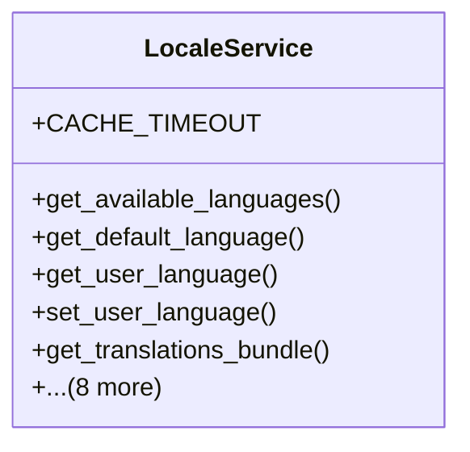

# utility_modules.locale.services

## Imports
- datetime
- django.conf
- django.contrib.auth
- django.core.cache
- django.db
- django.utils
- django.utils.translation
- json
- logging
- models
- os
- polib
- typing

## Classes
- LocaleService
  - attr: `CACHE_TIMEOUT`
  - method: `get_available_languages`
  - method: `get_default_language`
  - method: `get_user_language`
  - method: `set_user_language`
  - method: `get_translations_bundle`
  - method: `import_translations_from_po`
  - method: `export_translations_to_po`
  - method: `sync_translations_between_languages`
  - method: `get_missing_translations`
  - method: `get_translation_statistics`
  - method: `initialize_system_languages`
  - method: `_clear_translations_cache`
  - method: `_clear_all_caches`

## Functions
- get_available_languages
- get_default_language
- get_user_language
- set_user_language
- get_translations_bundle
- import_translations_from_po
- export_translations_to_po
- sync_translations_between_languages
- get_missing_translations
- get_translation_statistics
- initialize_system_languages
- _clear_translations_cache
- _clear_all_caches

## Module Variables
- `User`
- `logger`
- `locale_service`

## Class Diagram

