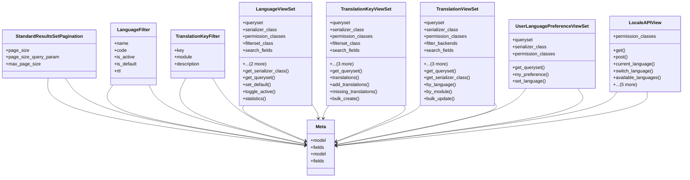

# utility_modules.locale.views

## Imports
- django.conf
- django.core.cache
- django.db
- django.db.models
- django.http
- django.utils
- django.utils.translation
- django_filters
- logging
- models
- os
- rest_framework
- rest_framework.decorators
- rest_framework.exceptions
- rest_framework.pagination
- rest_framework.response
- rest_framework.views
- serializers
- services
- tempfile
- typing

## Classes
- StandardResultsSetPagination
  - attr: `page_size`
  - attr: `page_size_query_param`
  - attr: `max_page_size`
- LanguageFilter
  - attr: `name`
  - attr: `code`
  - attr: `is_active`
  - attr: `is_default`
  - attr: `rtl`
- TranslationKeyFilter
  - attr: `key`
  - attr: `module`
  - attr: `description`
- LanguageViewSet
  - attr: `queryset`
  - attr: `serializer_class`
  - attr: `permission_classes`
  - attr: `filterset_class`
  - attr: `search_fields`
  - attr: `ordering_fields`
  - attr: `ordering`
  - method: `get_serializer_class`
  - method: `get_queryset`
  - method: `set_default`
  - method: `toggle_active`
  - method: `statistics`
- TranslationKeyViewSet
  - attr: `queryset`
  - attr: `serializer_class`
  - attr: `permission_classes`
  - attr: `filterset_class`
  - attr: `search_fields`
  - attr: `ordering_fields`
  - attr: `ordering`
  - attr: `pagination_class`
  - method: `get_queryset`
  - method: `translations`
  - method: `add_translations`
  - method: `missing_translations`
  - method: `bulk_create`
- TranslationViewSet
  - attr: `queryset`
  - attr: `serializer_class`
  - attr: `permission_classes`
  - attr: `filter_backends`
  - attr: `search_fields`
  - attr: `ordering_fields`
  - attr: `ordering`
  - attr: `pagination_class`
  - method: `get_queryset`
  - method: `get_serializer_class`
  - method: `by_language`
  - method: `by_module`
  - method: `bulk_update`
- UserLanguagePreferenceViewSet
  - attr: `queryset`
  - attr: `serializer_class`
  - attr: `permission_classes`
  - method: `get_queryset`
  - method: `my_preference`
  - method: `set_language`
- LocaleAPIView
  - attr: `permission_classes`
  - method: `get`
  - method: `post`
  - method: `current_language`
  - method: `switch_language`
  - method: `available_languages`
  - method: `translations_bundle`
  - method: `translation_statistics`
  - method: `import_po`
  - method: `export_po`
  - method: `sync_languages`
- Meta
  - attr: `model`
  - attr: `fields`
- Meta
  - attr: `model`
  - attr: `fields`

## Functions
- get_serializer_class
- get_queryset
- set_default
- toggle_active
- statistics
- get_queryset
- translations
- add_translations
- missing_translations
- bulk_create
- get_queryset
- get_serializer_class
- by_language
- by_module
- bulk_update
- get_queryset
- my_preference
- set_language
- get
- post
- current_language
- switch_language
- available_languages
- translations_bundle
- translation_statistics
- import_po
- export_po
- sync_languages

## Module Variables
- `logger`

## Class Diagram

