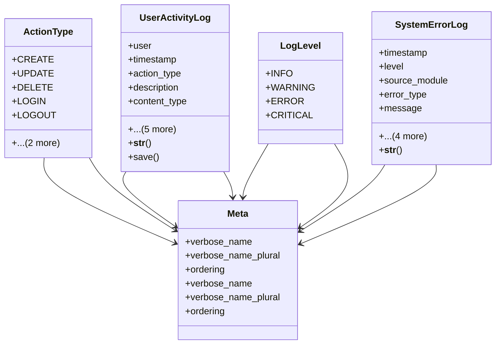

# utility_modules.utilities.activity_log

## Imports
- django.conf
- django.contrib.contenttypes.fields
- django.contrib.contenttypes.models
- django.db
- django.utils.translation

## Classes
- ActionType
  - attr: `CREATE`
  - attr: `UPDATE`
  - attr: `DELETE`
  - attr: `LOGIN`
  - attr: `LOGOUT`
  - attr: `VIEW`
  - attr: `OTHER`
- UserActivityLog
  - attr: `user`
  - attr: `timestamp`
  - attr: `action_type`
  - attr: `description`
  - attr: `content_type`
  - attr: `object_id`
  - attr: `target_object`
  - attr: `target_repr`
  - attr: `changes`
  - attr: `ip_address`
  - method: `__str__`
  - method: `save`
- LogLevel
  - attr: `INFO`
  - attr: `WARNING`
  - attr: `ERROR`
  - attr: `CRITICAL`
- SystemErrorLog
  - attr: `timestamp`
  - attr: `level`
  - attr: `source_module`
  - attr: `error_type`
  - attr: `message`
  - attr: `traceback`
  - attr: `user`
  - attr: `request_info`
  - attr: `activity_log`
  - method: `__str__`
- Meta
  - attr: `verbose_name`
  - attr: `verbose_name_plural`
  - attr: `ordering`
- Meta
  - attr: `verbose_name`
  - attr: `verbose_name_plural`
  - attr: `ordering`

## Functions
- __str__
- save
- __str__

## Module Variables
- `AUTH_USER_MODEL`

## Class Diagram

