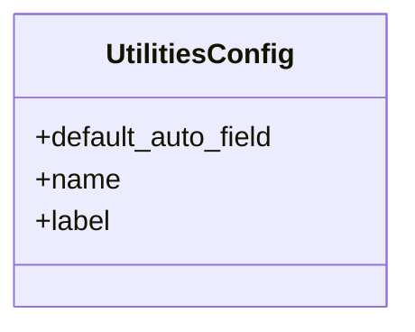

# utility_modules.utilities.backup_files.apps

## Imports
- django.apps

## Classes
- UtilitiesConfig
  - attr: `default_auto_field`
  - attr: `name`
  - attr: `label`

## Class Diagram

```mermaid
classDiagram
    class UtilitiesConfig {
        +default_auto_field
        +name
        +label
    }
```
