# utility_modules.utilities.backup_files.serializers

## Imports
- django.conf
- django.contrib.auth
- django.contrib.contenttypes.models
- django.utils
- models
- rest_framework

## Classes
- UserSerializer
  - attr: `name`
  - method: `get_name`
- SystemMetricSerializer
- DatabaseStatusSerializer
- UserStatisticSerializer
- SystemAlertSerializer
  - attr: `resolved_by_details`
  - attr: `level_display`
  - method: `update`
- UserActivityLogSerializer
  - attr: `user_details`
  - attr: `action_type_display`
  - attr: `target_object_type`
  - method: `get_target_object_type`
- SystemErrorLogSerializer
  - attr: `user_details`
  - attr: `activity_log_details`
  - attr: `level_display`
- Meta
  - attr: `model`
  - attr: `fields`
- Meta
  - attr: `model`
  - attr: `fields`
  - attr: `read_only_fields`
- Meta
  - attr: `model`
  - attr: `fields`
  - attr: `read_only_fields`
- Meta
  - attr: `model`
  - attr: `fields`
  - attr: `read_only_fields`
- Meta
  - attr: `model`
  - attr: `fields`
  - attr: `read_only_fields`
  - attr: `extra_kwargs`
- Meta
  - attr: `model`
  - attr: `fields`
  - attr: `read_only_fields`
- Meta
  - attr: `model`
  - attr: `fields`
  - attr: `read_only_fields`
- SystemMetric
- DatabaseStatus
- UserStatistic
- SystemAlert
- UserActivityLog
- SystemErrorLog

## Functions
- get_name
- update
- get_target_object_type

## Module Variables
- `AUTH_USER_MODEL`
- `User`

## Class Diagram

```mermaid
classDiagram
    class UserSerializer {
        +name
        +get_name()
    }
    class SystemMetricSerializer {
    }
    class DatabaseStatusSerializer {
    }
    class UserStatisticSerializer {
    }
    class SystemAlertSerializer {
        +resolved_by_details
        +level_display
        +update()
    }
    class UserActivityLogSerializer {
        +user_details
        +action_type_display
        +target_object_type
        +get_target_object_type()
    }
    class SystemErrorLogSerializer {
        +user_details
        +activity_log_details
        +level_display
    }
    class Meta {
        +model
        +fields
    }
    class Meta {
        +model
        +fields
        +read_only_fields
    }
    class Meta {
        +model
        +fields
        +read_only_fields
    }
    class Meta {
        +model
        +fields
        +read_only_fields
    }
    class Meta {
        +model
        +fields
        +read_only_fields
        +extra_kwargs
    }
    class Meta {
        +model
        +fields
        +read_only_fields
    }
    class Meta {
        +model
        +fields
        +read_only_fields
    }
    class SystemMetric {
    }
    class DatabaseStatus {
    }
    class UserStatistic {
    }
    class SystemAlert {
    }
    class UserActivityLog {
    }
    class SystemErrorLog {
    }
    UserSerializer --> Meta
    UserSerializer --> Meta
    UserSerializer --> Meta
    UserSerializer --> Meta
    UserSerializer --> Meta
    UserSerializer --> Meta
    UserSerializer --> Meta
    SystemMetricSerializer --> Meta
    SystemMetricSerializer --> Meta
    SystemMetricSerializer --> Meta
    SystemMetricSerializer --> Meta
    SystemMetricSerializer --> Meta
    SystemMetricSerializer --> Meta
    SystemMetricSerializer --> Meta
    DatabaseStatusSerializer --> Meta
    DatabaseStatusSerializer --> Meta
    DatabaseStatusSerializer --> Meta
    DatabaseStatusSerializer --> Meta
    DatabaseStatusSerializer --> Meta
    DatabaseStatusSerializer --> Meta
    DatabaseStatusSerializer --> Meta
    UserStatisticSerializer --> Meta
    UserStatisticSerializer --> Meta
    UserStatisticSerializer --> Meta
    UserStatisticSerializer --> Meta
    UserStatisticSerializer --> Meta
    UserStatisticSerializer --> Meta
    UserStatisticSerializer --> Meta
    SystemAlertSerializer --> Meta
    SystemAlertSerializer --> Meta
    SystemAlertSerializer --> Meta
    SystemAlertSerializer --> Meta
    SystemAlertSerializer --> Meta
    SystemAlertSerializer --> Meta
    SystemAlertSerializer --> Meta
    UserActivityLogSerializer --> Meta
    UserActivityLogSerializer --> Meta
    UserActivityLogSerializer --> Meta
    UserActivityLogSerializer --> Meta
    UserActivityLogSerializer --> Meta
    UserActivityLogSerializer --> Meta
    UserActivityLogSerializer --> Meta
    SystemErrorLogSerializer --> Meta
    SystemErrorLogSerializer --> Meta
    SystemErrorLogSerializer --> Meta
    SystemErrorLogSerializer --> Meta
    SystemErrorLogSerializer --> Meta
    SystemErrorLogSerializer --> Meta
    SystemErrorLogSerializer --> Meta
    SystemMetric --> Meta
    SystemMetric --> Meta
    SystemMetric --> Meta
    SystemMetric --> Meta
    SystemMetric --> Meta
    SystemMetric --> Meta
    SystemMetric --> Meta
    DatabaseStatus --> Meta
    DatabaseStatus --> Meta
    DatabaseStatus --> Meta
    DatabaseStatus --> Meta
    DatabaseStatus --> Meta
    DatabaseStatus --> Meta
    DatabaseStatus --> Meta
    UserStatistic --> Meta
    UserStatistic --> Meta
    UserStatistic --> Meta
    UserStatistic --> Meta
    UserStatistic --> Meta
    UserStatistic --> Meta
    UserStatistic --> Meta
    SystemAlert --> Meta
    SystemAlert --> Meta
    SystemAlert --> Meta
    SystemAlert --> Meta
    SystemAlert --> Meta
    SystemAlert --> Meta
    SystemAlert --> Meta
    UserActivityLog --> Meta
    UserActivityLog --> Meta
    UserActivityLog --> Meta
    UserActivityLog --> Meta
    UserActivityLog --> Meta
    UserActivityLog --> Meta
    UserActivityLog --> Meta
    SystemErrorLog --> Meta
    SystemErrorLog --> Meta
    SystemErrorLog --> Meta
    SystemErrorLog --> Meta
    SystemErrorLog --> Meta
    SystemErrorLog --> Meta
    SystemErrorLog --> Meta
```

