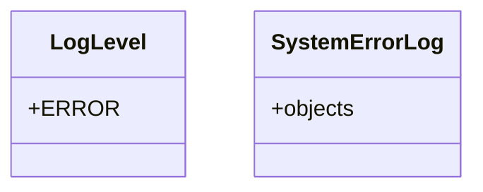

# utility_modules.utilities.backup_files.utils

## Imports
- django.utils
- logging
- models
- sys
- traceback

## Classes
- LogLevel
  - attr: `ERROR`
- SystemErrorLog
  - attr: `objects`

## Functions
- log_system_error

## Module Variables
- `logger`

## Class Diagram

