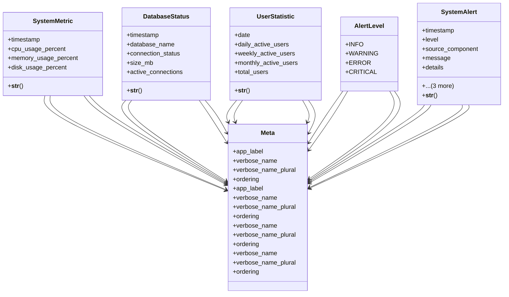

# utility_modules.utilities.monitoring

## Imports
- django.conf
- django.db
- django.utils.translation

## Classes
- SystemMetric
  - attr: `timestamp`
  - attr: `cpu_usage_percent`
  - attr: `memory_usage_percent`
  - attr: `disk_usage_percent`
  - method: `__str__`
- DatabaseStatus
  - attr: `timestamp`
  - attr: `database_name`
  - attr: `connection_status`
  - attr: `size_mb`
  - attr: `active_connections`
  - method: `__str__`
- UserStatistic
  - attr: `date`
  - attr: `daily_active_users`
  - attr: `weekly_active_users`
  - attr: `monthly_active_users`
  - attr: `total_users`
  - method: `__str__`
- AlertLevel
  - attr: `INFO`
  - attr: `WARNING`
  - attr: `ERROR`
  - attr: `CRITICAL`
- SystemAlert
  - attr: `timestamp`
  - attr: `level`
  - attr: `source_component`
  - attr: `message`
  - attr: `details`
  - attr: `is_resolved`
  - attr: `resolved_at`
  - attr: `resolved_by`
  - method: `__str__`
- Meta
  - attr: `app_label`
  - attr: `verbose_name`
  - attr: `verbose_name_plural`
  - attr: `ordering`
- Meta
  - attr: `app_label`
  - attr: `verbose_name`
  - attr: `verbose_name_plural`
  - attr: `ordering`
- Meta
  - attr: `verbose_name`
  - attr: `verbose_name_plural`
  - attr: `ordering`
- Meta
  - attr: `verbose_name`
  - attr: `verbose_name_plural`
  - attr: `ordering`

## Functions
- __str__
- __str__
- __str__
- __str__

## Class Diagram

