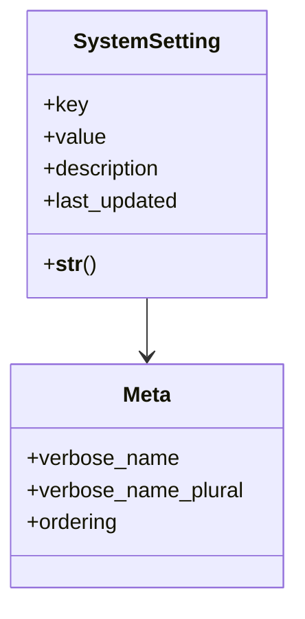

# utility_modules.utilities.settings_model

## Imports
- django.db
- django.utils.translation

## Classes
- SystemSetting
  - attr: `key`
  - attr: `value`
  - attr: `description`
  - attr: `last_updated`
  - method: `__str__`
- Meta
  - attr: `verbose_name`
  - attr: `verbose_name_plural`
  - attr: `ordering`

## Functions
- __str__

## Class Diagram

