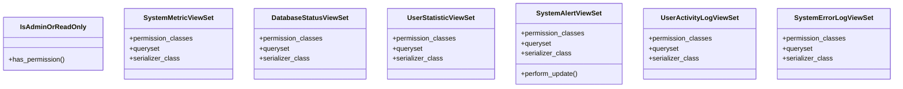

# utility_modules.utilities.views

## Imports
- rest_framework

## Classes
- IsAdminOrReadOnly
  - method: `has_permission`
- SystemMetricViewSet
  - attr: `permission_classes`
  - attr: `queryset`
  - attr: `serializer_class`
- DatabaseStatusViewSet
  - attr: `permission_classes`
  - attr: `queryset`
  - attr: `serializer_class`
- UserStatisticViewSet
  - attr: `permission_classes`
  - attr: `queryset`
  - attr: `serializer_class`
- SystemAlertViewSet
  - attr: `permission_classes`
  - attr: `queryset`
  - attr: `serializer_class`
  - method: `perform_update`
- UserActivityLogViewSet
  - attr: `permission_classes`
  - attr: `queryset`
  - attr: `serializer_class`
- SystemErrorLogViewSet
  - attr: `permission_classes`
  - attr: `queryset`
  - attr: `serializer_class`

## Functions
- has_permission
- perform_update

## Class Diagram

