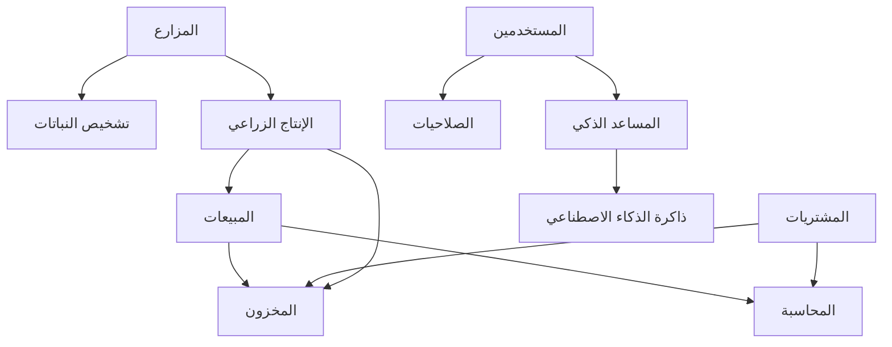

# خرائط المشروع - Gaara ERP v12

## نظرة عامة
خرائط شاملة لهيكل مشروع Gaara ERP v12 مع توضيح العلاقات والتدفقات بين المكونات المختلفة.

## 1. الخريطة الهيكلية العامة

### 1.1 هيكل المجلدات الرئيسية
```
gaara-erp-v12/
├── gaara_erp/                    # مجلد المشروع الرئيسي
│   ├── settings/                 # إعدادات Django
│   ├── urls.py                   # توجيه URLs الرئيسي
│   ├── wsgi.py                   # واجهة WSGI
│   └── celery.py                 # إعدادات Celery
├── core_modules/                 # الوحدات الأساسية
│   ├── users/                    # إدارة المستخدمين
│   ├── permissions/              # إدارة الصلاحيات
│   └── system_settings/          # إعدادات النظام
├── business_modules/             # الوحدات التجارية
│   ├── accounting/               # المحاسبة
│   ├── inventory/                # المخزون
│   ├── sales/                    # المبيعات
│   └── purchasing/               # المشتريات
├── agricultural_modules/         # الوحدات الزراعية
│   ├── farms/                    # إدارة المزارع
│   ├── plant_diagnosis/          # تشخيص النباتات
│   └── production/               # الإنتاج الزراعي
├── ai_modules/                   # وحدات الذكاء الاصطناعي
│   ├── intelligent_assistant/    # المساعد الذكي
│   ├── ai_memory/                # ذاكرة الذكاء الاصطناعي
│   └── ai_models/                # نماذج الذكاء الاصطناعي
├── integration_modules/          # وحدات التكامل
│   ├── ai/                       # تكامل الذكاء الاصطناعي
│   └── ai_agriculture/           # تكامل الذكاء الاصطناعي الزراعي
├── services_modules/             # وحدات الخدمات
│   ├── hr/                       # الموارد البشرية
│   └── projects/                 # إدارة المشاريع
├── admin_modules/                # وحدات الإدارة
│   ├── custom_admin/             # الإدارة المخصصة
│   └── system_monitoring/        # مراقبة النظام
├── security/                     # وحدة الأمان
├── static/                       # الملفات الثابتة
├── media/                        # ملفات الوسائط
├── templates/                    # قوالب HTML
├── locale/                       # ملفات الترجمة
├── tests/                        # الاختبارات
├── docs/                         # التوثيق
├── docker/                       # ملفات Docker
└── requirements/                 # متطلبات Python
```

## 2. خريطة تدفق البيانات

### 2.1 تدفق العمليات التجارية الأساسية

**دورة المبيعات**:
العميل → طلب عرض سعر → عرض سعر → أمر بيع → فاتورة → دفع → تسليم

**دورة المشتريات**:
طلب شراء → عرض سعر من مورد → أمر شراء → استلام → فاتورة مورد → دفع

**دورة المخزون**:
استلام بضاعة → فحص جودة → إدخال مخزون → تخزين → صرف → تسليم

### 2.2 تدفق البيانات بين الوحدات



## 3. خريطة واجهات المستخدم

### 3.1 التسلسل الهرمي للواجهات

**الواجهة الرئيسية**:
- لوحة التحكم الرئيسية
  - إحصائيات سريعة
  - الرسوم البيانية
  - التنبيهات والإشعارات
  - الاختصارات السريعة

**واجهات الوحدات التجارية**:
- المحاسبة
  - شجرة الحسابات
  - القيود اليومية
  - التقارير المالية
- المخزون
  - كتالوج المنتجات
  - حركات المخزون
  - تقارير المخزون
- المبيعات
  - قائمة العملاء
  - أوامر البيع
  - الفواتير
- المشتريات
  - قائمة الموردين
  - أوامر الشراء
  - فواتير الموردين

## 4. خريطة قاعدة البيانات

### 4.1 العلاقات الرئيسية بين الجداول

**الجداول الأساسية**:
- Users (المستخدمين)
- Companies (الشركات)
- Branches (الفروع)

**جداول المحاسبة**:
- Accounts (الحسابات)
- JournalEntries (القيود اليومية)
- JournalEntryLines (بنود القيود)

**جداول المخزون**:
- Products (المنتجات)
- ProductCategories (فئات المنتجات)
- StockMoves (حركات المخزون)
- Warehouses (المستودعات)

**جداول المبيعات**:
- Customers (العملاء)
- SalesOrders (أوامر البيع)
- SalesOrderLines (بنود أوامر البيع)
- Invoices (الفواتير)

## 5. خريطة الأمان والصلاحيات

### 5.1 مستويات الأمان

**المستوى الأول - المصادقة**:
- تسجيل الدخول
- المصادقة متعددة العوامل (MFA)
- إدارة الجلسات

**المستوى الثاني - التفويض**:
- الأدوار والصلاحيات
- صلاحيات على مستوى الكائنات
- التحكم في الوصول

**المستوى الثالث - الحماية**:
- تشفير البيانات
- Rate Limiting
- مراقبة التهديدات

## 6. خريطة التكامل

### 6.1 التكامل الداخلي

**API الداخلي**:
- REST API لجميع الوحدات
- GraphQL للاستعلامات المعقدة
- WebSocket للتحديثات الفورية

**التكامل بين الوحدات**:
- إشارات Django للتواصل
- Celery للمهام غير المتزامنة
- Redis للتخزين المؤقت

### 6.2 التكامل الخارجي

**خدمات الذكاء الاصطناعي**:
- OpenAI API
- Anthropic Claude
- Google AI Platform

**الخدمات المالية**:
- البوابات المصرفية
- أنظمة الدفع الإلكتروني
- خدمات الضرائب

## 7. خريطة النشر والبنية التحتية

### 7.1 بيئات النشر

**بيئة التطوير**:
- Docker Compose محلي
- قاعدة بيانات SQLite/PostgreSQL
- Redis محلي

**بيئة الاختبار**:
- خوادم اختبار مخصصة
- قاعدة بيانات منفصلة
- بيانات اختبار

**بيئة الإنتاج**:
- خوادم سحابية متعددة
- قاعدة بيانات عالية التوفر
- CDN للملفات الثابتة
- نظام مراقبة شامل

### 7.2 مكونات البنية التحتية

**طبقة التطبيق**:
- خوادم Django متعددة
- موازن الأحمال (Load Balancer)
- خوادم Celery للمهام

**طبقة البيانات**:
- PostgreSQL الرئيسي
- Redis للتخزين المؤقت
- نسخ احتياطية منتظمة

**طبقة الأمان**:
- جدار حماية (Firewall)
- شهادات SSL/TLS
- نظام كشف التسلل

## 8. خريطة سير العمل (Workflow)

### 8.1 سير عمل التطوير

**مرحلة التخطيط**:
تحليل المتطلبات → تصميم النظام → تخطيط المهام → تقدير الوقت

**مرحلة التطوير**:
إنشاء الفرع → كتابة الكود → الاختبار المحلي → مراجعة الكود

**مرحلة النشر**:
دمج الكود → اختبار التكامل → نشر الاختبار → نشر الإنتاج

### 8.2 سير عمل المستخدم

**المستخدم الجديد**:
التسجيل → التفعيل → تعيين الصلاحيات → التدريب → البدء في الاستخدام

**العمليات اليومية**:
تسجيل الدخول → مراجعة لوحة التحكم → تنفيذ المهام → مراجعة التقارير → تسجيل الخروج

## 9. خريطة الأداء والتحسين

### 9.1 نقاط الاختناق المحتملة

**قاعدة البيانات**:
- الاستعلامات المعقدة
- عدم وجود فهارس مناسبة
- نمو حجم البيانات

**التطبيق**:
- تحميل البيانات الكبيرة
- عدم استخدام التخزين المؤقت
- معالجة الملفات الكبيرة

### 9.2 استراتيجيات التحسين

**تحسين قاعدة البيانات**:
- إضافة فهارس مناسبة
- تحسين الاستعلامات
- تقسيم الجداول الكبيرة

**تحسين التطبيق**:
- استخدام التخزين المؤقت
- تحميل البيانات بالتدريج
- ضغط الاستجابات

---

**تاريخ آخر تحديث**: نوفمبر 2025  
**إصدار النظام**: Gaara ERP v12 Enhanced Security Edition  
**حالة الخرائط**: شاملة ومحدثة
