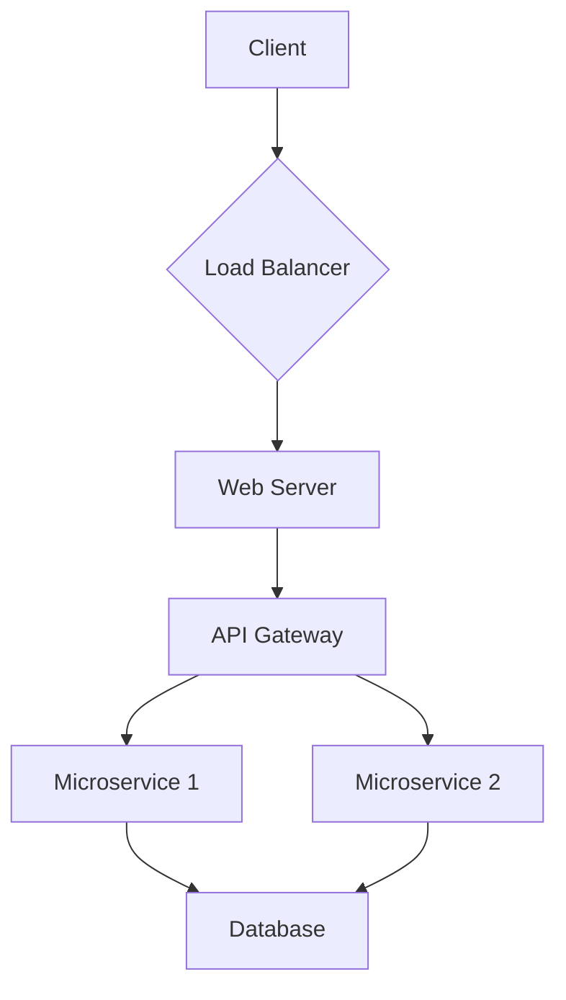

> This is a template. Fill this out for your specific project.

# System Architecture

**Version:** 1.0  
**Last Updated:** YYYY-MM-DD

---

## 1. Overview

*Provide a high-level overview of the system architecture. What are the major components? How do they interact? What are the guiding architectural principles (e.g., microservices, monolithic, serverless)?*

## 2. Architectural Diagram

*Insert a high-level architectural diagram here. This should be a visual representation of the components and their interactions. You can use tools like Mermaid, PlantUML, or Draw.io and embed the image.*

## 3. Components

*Describe each major component in detail.*

### 3.1. Frontend

- **Framework:** (e.g., React, Vue, Angular)
- **Language:** (e.g., TypeScript, JavaScript)
- **Styling:** (e.g., Tailwind CSS, SCSS, CSS Modules)
- **State Management:** (e.g., Redux, Vuex, Context API)
- **Key Responsibilities:** (e.g., UI rendering, user interaction, client-side routing)

### 3.2. Backend

- **Framework:** (e.g., Node.js/Express, Python/Django, Go/Gin)
- **Language:** (e.g., TypeScript, Python, Go)
- **Architecture:** (e.g., Monolithic, Microservices)
- **API:** (e.g., REST, GraphQL)
- **Key Responsibilities:** (e.g., Business logic, API endpoints, authentication)

### 3.3. Database

- **Type:** (e.g., PostgreSQL, MySQL, MongoDB, DynamoDB)
- **ORM:** (e.g., Prisma, TypeORM, SQLAlchemy)
- **Key Responsibilities:** (e.g., Data persistence, querying, transactions)

### 3.4. Caching Layer

- **Technology:** (e.g., Redis, Memcached)
- **Purpose:** (e.g., Session storage, query caching, rate limiting)

### 3.5. Message Queue

- **Technology:** (e.g., RabbitMQ, Kafka, SQS)
- **Purpose:** (e.g., Asynchronous tasks, inter-service communication)

## 4. Data Flow

*Describe the flow of data through the system for key user scenarios.*

**Example: User Registration**

1. User submits registration form on the **Frontend**.
2. **Frontend** sends a POST request to the `/api/register` endpoint on the **Backend**.
3. The **Backend** validates the data.
4. The **Backend** hashes the password and saves the new user to the **Database**.
5. The **Backend** returns a JWT token to the **Frontend**.
6. The **Frontend** stores the token and redirects the user to the dashboard.

## 5. Technology Stack

*List all technologies used in the project.*

| Category      | Technology        |
|---------------|-------------------|
| Frontend      | React, TypeScript |
| Backend       | Node.js, Express  |
| Database      | PostgreSQL        |
| Caching       | Redis             |
| Deployment    | Docker, Kubernetes|
| CI/CD         | GitHub Actions    |
| Monitoring    | Prometheus, Grafana|

## 6. Architectural Decisions

*Link to the `Solution_Tradeoff_Log.md` for detailed architectural decisions and their rationale.*

- See [Solution Tradeoff Log](./Solution_Tradeoff_Log.md) for a record of key architectural decisions.

