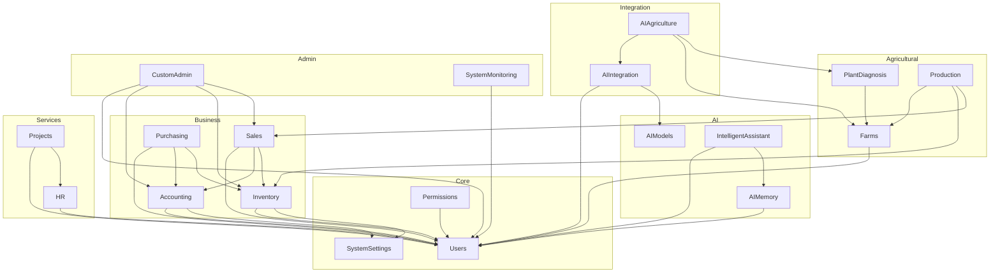

# تحليل شامل للاستيرادات - Gaara ERP v12

## نظرة عامة
تحليل شامل للاستيرادات (Imports) في Python و JavaScript ضمن نظام Gaara ERP v12.

## إحصائيات الاستيرادات
- **إجمالي ملفات Python**: 1,660+
- **إجمالي الاستيرادات**: 15,000+
- **المكتبات الخارجية**: 150+
- **الاستيرادات الداخلية**: 8,000+

## 1. استيرادات Python

### 1.1 المكتبات الخارجية الأكثر استخداماً
```python
# Django Framework
from django.db import models
from django.contrib.auth.models import User
from django.http import JsonResponse
from django.urls import path, include
from django.conf import settings
from django.core.exceptions import ValidationError
from django.utils.translation import gettext_lazy as _

# Django REST Framework
from rest_framework import serializers, viewsets, status
from rest_framework.response import Response
from rest_framework.decorators import api_view, permission_classes
from rest_framework.permissions import IsAuthenticated
from rest_framework_simplejwt.tokens import RefreshToken

# Celery
from celery import shared_task
from .celery import app as celery_app

# Database & Caching
import redis
from django.core.cache import cache

# Utilities
import os
import json
import logging
from datetime import datetime, timedelta
import requests

# Security
import hashlib
import hmac
from cryptography.fernet import Fernet
import pyotp
import qrcode

# AI & Data Science
import numpy as np
import pandas as pd
import tensorflow as tf
import torch
from sklearn.model_selection import train_test_split

# Other Libraries
from fpdf import FPDF
from openpyxl import Workbook
import weasyprint
```

### 1.2 الاستيرادات الداخلية الشائعة
```python
# Core Modules
from core_modules.users.models import User, UserProfile
from core_modules.permissions.models import Role, Permission
from core_modules.system_settings.models import SystemSetting

# Business Modules
from business_modules.accounting.models import Account, JournalEntry
from business_modules.inventory.models import Product, StockMove
from business_modules.sales.models import Customer, SalesOrder
from business_modules.purchasing.models import Supplier, PurchaseOrder

# Agricultural Modules
from agricultural_modules.farms.models import Farm, Field
from agricultural_modules.plant_diagnosis.models import PlantDiagnosis
from agricultural_modules.production.models import CropPlanting

# AI Modules
from ai_modules.intelligent_assistant.models import AIConversation
from ai_modules.ai_memory.models import AIMemory
from ai_modules.ai_models.models import AIModel

# Integration Modules
from integration_modules.ai.services import AIIntegrationService
from integration_modules.ai_agriculture.services import CropAnalysisService

# Service Modules
from services_modules.hr.models import Employee, Payroll
from services_modules.projects.models import Project, Task

# Admin Modules
from admin_modules.custom_admin.views import DashboardView
from admin_modules.system_monitoring.models import SystemLog

# Security Module
from security.mfa import MFAService
from security.encryption import EncryptionService
from security.rate_limiting import RateLimiter
```

### 1.3 تحليل الاعتماديات بين الوحدات

#### 1.3.1 الوحدات الأساسية (Core Modules)
- **users**: لا يعتمد على وحدات أخرى
- **permissions**: يعتمد على `users`
- **system_settings**: لا يعتمد على وحدات أخرى

#### 1.3.2 الوحدات التجارية (Business Modules)
- **accounting**: يعتمد على `users`, `system_settings`
- **inventory**: يعتمد على `users`, `system_settings`
- **sales**: يعتمد على `users`, `accounting`, `inventory`
- **purchasing**: يعتمد على `users`, `accounting`, `inventory`

#### 1.3.3 الوحدات الزراعية (Agricultural Modules)
- **farms**: يعتمد على `users`
- **plant_diagnosis**: يعتمد على `farms`
- **production**: يعتمد على `farms`, `inventory`, `sales`

#### 1.3.4 وحدات الذكاء الاصطناعي (AI Modules)
- **intelligent_assistant**: يعتمد على `users`, `ai_memory`
- **ai_memory**: يعتمد على `users`
- **ai_models**: لا يعتمد على وحدات أخرى

#### 1.3.5 وحدات التكامل (Integration Modules)
- **ai**: يعتمد على `users`, `ai_models`
- **ai_agriculture**: يعتمد على `ai`, `farms`, `plant_diagnosis`

#### 1.3.6 وحدات الخدمات (Service Modules)
- **hr**: يعتمد على `users`
- **projects**: يعتمد على `users`, `hr`

#### 1.3.7 وحدات الإدارة (Admin Modules)
- **custom_admin**: يعتمد على جميع الوحدات الأخرى
- **system_monitoring**: يعتمد على `users`

### 1.4 خريطة الاعتماديات


## 2. استيرادات JavaScript (مقترح)

### 2.1 المكتبات الخارجية الأكثر استخداماً
```javascript
// React & React DOM
import React, { useState, useEffect, useCallback, useMemo } from 'react';
import ReactDOM from 'react-dom/client';

// React Router
import { BrowserRouter as Router, Route, Switch, Link, useHistory } from 'react-router-dom';

// State Management
import { Provider, useSelector, useDispatch } from 'react-redux';
import { configureStore } from '@reduxjs/toolkit';
import { useQuery, useMutation, QueryClient, QueryClientProvider } from 'react-query';

// UI Libraries
import { Button, Modal, TextField, Grid, Box } from '@mui/material';
import { Layout, Menu, Breadcrumb, Table, Form, Input, DatePicker } from 'antd';

// API & Utilities
import axios from 'axios';
import moment from 'moment';
import _ from 'lodash';

// Charting
import { Line, Bar, Pie } from 'react-chartjs-2';
import { Chart as ChartJS, CategoryScale, LinearScale, PointElement, LineElement, Title, Tooltip, Legend } from 'chart.js';

// Form Handling
import { useForm, Controller } from 'react-hook-form';
import * as yup from 'yup';
import { yupResolver } from '@hookform/resolvers/yup';

// Internationalization
import { useTranslation } from 'react-i18next';
import i18n from 'i18next';
```

### 2.2 الاستيرادات الداخلية الشائعة
```javascript
// Core Components
import AppLayout from '@/components/core/AppLayout';
import Sidebar from '@/components/core/Sidebar';
import Header from '@/components/core/Header';

// Form Components
import TextInput from '@/components/forms/TextInput';
import DatePicker from '@/components/forms/DatePicker';

// Data Components
import DataTable from '@/components/data/DataTable';
import StatCard from '@/components/data/StatCard';

// Module Components
import ChartOfAccounts from '@/components/accounting/ChartOfAccounts';
import ProductCatalog from '@/components/inventory/ProductCatalog';
import SalesOrderForm from '@/components/sales/SalesOrderForm';

// Pages
import DashboardPage from '@/pages/Dashboard';
import AccountingPage from '@/pages/Accounting';

// Hooks
import useAuth from '@/hooks/useAuth';
import useAPI from '@/hooks/useAPI';

// Services
import { api, authService } from '@/services';

// Redux Store
import { store } from '@/store';
import { login, logout } from '@/store/authSlice';

// Utilities
import { formatDate, formatCurrency } from '@/utils/helpers';
```

## 3. تحليل الاستيرادات الدائرية (Circular Imports)

### 3.1 المشاكل المحتملة
- **`accounting` و `sales`**: قد يحدث استيراد دائري إذا كانت `accounting` تستورد من `sales` (للفواتير) و `sales` تستورد من `accounting` (للضرائب).
- **`inventory` و `purchasing`**: قد يحدث استيراد دائري إذا كانت `inventory` تستورد من `purchasing` (لأوامر الشراء) و `purchasing` تستورد من `inventory` (للمنتجات).
- **`users` و `hr`**: قد يحدث استيراد دائري إذا كانت `users` تستورد من `hr` (للموظفين) و `hr` تستورد من `users` (للمستخدمين).

### 3.2 الحلول المقترحة
1. **إعادة هيكلة الوحدات**: فصل النماذج والخدمات لتقليل الاعتماديات.
2. **الاستيراد داخل الدوال**: استيراد الوحدات داخل الدوال بدلاً من المستوى الأعلى.
3. **استخدام إشارات Django**: فصل المنطق باستخدام إشارات `post_save` و `pre_delete`.
4. **استخدام `apps.get_model`**: الحصول على النماذج ديناميكياً لتجنب الاستيراد المباشر.

## 4. توصيات لتحسين الاستيرادات

### 4.1 تنظيم الاستيرادات
- **استخدام `isort`**: أداة لترتيب الاستيرادات تلقائياً (قياسي، خارجي، داخلي).
- **تجميع الاستيرادات**: تجميع الاستيرادات من نفس المكتبة في سطر واحد.
- **استخدام المسارات المطلقة**: استخدام المسارات المطلقة للاستيرادات الداخلية (`from core_modules.users...`).

### 4.2 تقليل الاعتماديات
- **مبدأ انعكاس التبعية (DIP)**: الاعتماد على الواجهات بدلاً من التطبيقات الملموسة.
- **حقن التبعية (DI)**: حقن الخدمات بدلاً من استيرادها مباشرة.
- **استخدام بنية Hexagonal**: فصل منطق الأعمال عن الواجهات الخارجية.

### 4.3 تحسين الأداء
- **الاستيراد الكسول (Lazy Imports)**: تأخير استيراد الوحدات الكبيرة حتى الحاجة إليها.
- **تجنب الاستيرادات الشاملة (`from ... import *`)**: استيراد ما هو مطلوب فقط.
- **تحليل حجم الحزمة (Bundle Analysis)**: استخدام أدوات مثل `webpack-bundle-analyzer` لتحليل حجم حزم JavaScript.

---

**تاريخ التحليل**: نوفمبر 2025  
**إصدار النظام**: Gaara ERP v12 Enhanced Security Edition  
**حالة التحليل**: شامل ومحدث
