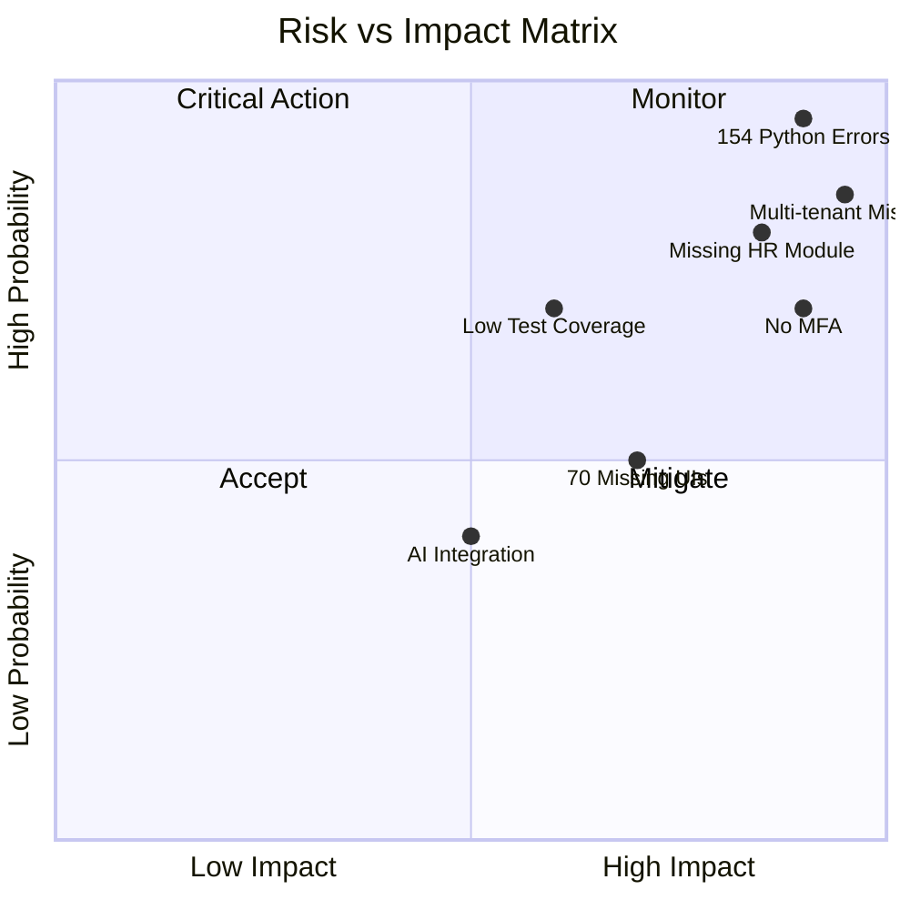
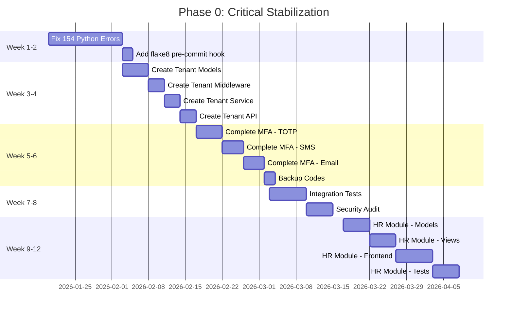
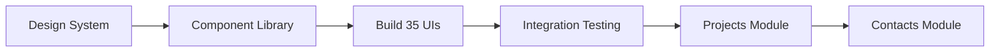

# Plan: Gaara ERP v12 - Master Implementation Plan
# الخطة التقنية الشاملة لنظام قارا ERP v12

**Architect:** Global Professional Core Prompt v35.0 Singularity
**Risk Level:** 🟠 MEDIUM-HIGH (Large existing codebase, critical new features)
**Date:** 2026-01-17
**Total Phases:** 4
**Total Duration:** 15 months (estimated)

---

## 1. الهندسة التنبؤية / Predictive Engineering (Risk Analysis)

### 1.1 مصفوفة المخاطر / Risk Matrix



### 1.2 المخاطر والحلول / Risks & Mitigations

| # | المخاطر / Risk | الاحتمالية | التأثير | الحل / Mitigation |
|---|----------------|-----------|--------|-------------------|
| 1 | **154 أخطاء Python حرجة** | 🔴 High | 🔴 Critical | Run flake8 + autopep8 automated fix first |
| 2 | **Multi-tenant غير موجود** | 🔴 High | 🔴 Critical | Build schema-based isolation with django-tenants |
| 3 | **MFA غير مكتمل** | 🔴 High | 🔴 Critical | Complete MFA with pyotp + Twilio |
| 4 | **HR Module مفقود** | 🔴 High | 🟠 High | Create from existing modules template |
| 5 | **تغطية اختبارات منخفضة** | 🟠 Medium | 🟠 High | Parallel test writing with implementation |
| 6 | **70 واجهة مفقودة** | 🟠 Medium | 🟠 High | Create Design System first |
| 7 | **تكامل AI** | 🟡 Low | 🟡 Medium | Graceful degradation pattern |
| 8 | **Database Migrations** | 🟠 Medium | 🔴 Critical | Test migrations on copy first |
| 9 | **Performance Degradation** | 🟡 Low | 🟠 High | Add indexes + Redis caching |
| 10 | **Security Vulnerabilities** | 🟠 Medium | 🔴 Critical | Security audit each phase |

### 1.3 Pre-Mortem Analysis

> **إذا فشل المشروع، سيكون بسبب:**
> 1. Python errors crash production before MFA is complete
> 2. Multi-tenant data leaks between organizations
> 3. Test coverage too low to catch regressions
> 4. HR/Projects modules delay blocks customer adoption

---

## 2. هياكل البيانات / Data Structures (The Backbone)

### 2.1 Multi-Tenant Models

```python
# backend/src/models/tenant.py

import uuid
from django.db import models
from django.contrib.auth import get_user_model
from django.utils.translation import gettext_lazy as _

class Tenant(models.Model):
    """
    نموذج المستأجر - يمثل مؤسسة واحدة في النظام
    Tenant Model - Represents one organization in the system
    """
    id = models.UUIDField(
        primary_key=True, 
        default=uuid.uuid4, 
        editable=False
    )
    name = models.CharField(
        max_length=255, 
        verbose_name=_("اسم المؤسسة")
    )
    slug = models.SlugField(
        unique=True, 
        verbose_name=_("المعرف الفريد")
    )
    schema_name = models.CharField(
        max_length=63, 
        unique=True,
        verbose_name=_("اسم الـ Schema")
    )
    custom_domain = models.CharField(
        max_length=255, 
        null=True, 
        blank=True,
        unique=True,
        verbose_name=_("النطاق المخصص")
    )
    is_active = models.BooleanField(
        default=True,
        verbose_name=_("نشط")
    )
    created_at = models.DateTimeField(auto_now_add=True)
    updated_at = models.DateTimeField(auto_now=True)
    
    class Meta:
        db_table = 'tenants'
        verbose_name = _("مستأجر")
        verbose_name_plural = _("المستأجرون")
    
    def __str__(self):
        return self.name


class TenantUser(models.Model):
    """
    ربط المستخدم بالمستأجر مع الدور
    """
    ROLE_CHOICES = [
        ('owner', _('مالك')),
        ('admin', _('مدير')),
        ('user', _('مستخدم')),
    ]
    
    id = models.UUIDField(primary_key=True, default=uuid.uuid4)
    tenant = models.ForeignKey(
        Tenant, 
        on_delete=models.CASCADE,
        related_name='tenant_users'
    )
    user = models.ForeignKey(
        get_user_model(),
        on_delete=models.CASCADE,
        related_name='tenant_memberships'
    )
    role = models.CharField(max_length=20, choices=ROLE_CHOICES, default='user')
    is_owner = models.BooleanField(default=False)
    created_at = models.DateTimeField(auto_now_add=True)
    
    class Meta:
        db_table = 'tenant_users'
        unique_together = ['tenant', 'user']


class TenantSettings(models.Model):
    """
    إعدادات المستأجر
    """
    ACCOUNTING_STANDARD_CHOICES = [
        ('IFRS', _('المعايير الدولية')),
        ('GAAP', _('المعايير الأمريكية')),
    ]
    
    id = models.UUIDField(primary_key=True, default=uuid.uuid4)
    tenant = models.OneToOneField(
        Tenant,
        on_delete=models.CASCADE,
        related_name='settings'
    )
    timezone = models.CharField(max_length=50, default='Asia/Riyadh')
    locale = models.CharField(max_length=10, default='ar')
    accounting_standard = models.CharField(
        max_length=10,
        choices=ACCOUNTING_STANDARD_CHOICES,
        default='IFRS'
    )
    base_currency = models.CharField(max_length=3, default='SAR')
    custom_settings = models.JSONField(default=dict, blank=True)


class TenantPlan(models.Model):
    """
    خطة المستأجر والحصص
    """
    PLAN_CHOICES = [
        ('free', _('مجاني')),
        ('starter', _('مبتدئ')),
        ('professional', _('احترافي')),
        ('enterprise', _('مؤسسي')),
    ]
    
    id = models.UUIDField(primary_key=True, default=uuid.uuid4)
    tenant = models.OneToOneField(
        Tenant,
        on_delete=models.CASCADE,
        related_name='plan'
    )
    plan_type = models.CharField(max_length=20, choices=PLAN_CHOICES, default='starter')
    max_users = models.IntegerField(default=10)
    max_storage_gb = models.IntegerField(default=5)
    ai_quota_tokens = models.IntegerField(default=10000)
    valid_until = models.DateTimeField(null=True, blank=True)
```

### 2.2 MFA Models

```python
# backend/src/modules/mfa/models.py

import uuid
import hashlib
from django.db import models
from django.conf import settings
from django.utils.translation import gettext_lazy as _

class MFASettings(models.Model):
    """
    إعدادات MFA للمستخدم
    """
    METHOD_CHOICES = [
        ('sms', _('رسالة نصية')),
        ('totp', _('تطبيق المصادقة')),
        ('email', _('بريد إلكتروني')),
    ]
    
    id = models.UUIDField(primary_key=True, default=uuid.uuid4)
    user = models.OneToOneField(
        settings.AUTH_USER_MODEL,
        on_delete=models.CASCADE,
        related_name='mfa_settings'
    )
    is_enabled = models.BooleanField(default=False)
    primary_method = models.CharField(
        max_length=10,
        choices=METHOD_CHOICES,
        null=True
    )
    
    # TOTP
    totp_secret_encrypted = models.CharField(max_length=255, null=True, blank=True)
    totp_verified = models.BooleanField(default=False)
    
    # SMS
    phone_number = models.CharField(max_length=20, null=True, blank=True)
    phone_verified = models.BooleanField(default=False)
    
    # Email
    mfa_email = models.EmailField(null=True, blank=True)
    email_verified = models.BooleanField(default=False)
    
    last_verified_at = models.DateTimeField(null=True, blank=True)
    created_at = models.DateTimeField(auto_now_add=True)
    updated_at = models.DateTimeField(auto_now=True)


class OTPRecord(models.Model):
    """
    سجل OTP مؤقت
    """
    id = models.UUIDField(primary_key=True, default=uuid.uuid4)
    user = models.ForeignKey(
        settings.AUTH_USER_MODEL,
        on_delete=models.CASCADE,
        related_name='otp_records'
    )
    otp_hash = models.CharField(max_length=64)  # SHA-256 hash
    method = models.CharField(max_length=10)
    expires_at = models.DateTimeField()
    attempt_count = models.IntegerField(default=0)
    is_verified = models.BooleanField(default=False)
    created_at = models.DateTimeField(auto_now_add=True)
    
    @staticmethod
    def hash_otp(otp: str) -> str:
        return hashlib.sha256(otp.encode()).hexdigest()


class MFABackupCode(models.Model):
    """
    أكواد النسخ الاحتياطي للمصادقة
    """
    id = models.UUIDField(primary_key=True, default=uuid.uuid4)
    user = models.ForeignKey(
        settings.AUTH_USER_MODEL,
        on_delete=models.CASCADE,
        related_name='mfa_backup_codes'
    )
    code_hash = models.CharField(max_length=64)  # SHA-256 hash
    is_used = models.BooleanField(default=False)
    used_at = models.DateTimeField(null=True, blank=True)
    created_at = models.DateTimeField(auto_now_add=True)
```

### 2.3 HR Models

```python
# backend/src/modules/hr/models/employee.py

import uuid
from django.db import models
from django.conf import settings
from django.utils.translation import gettext_lazy as _
from decimal import Decimal

class Department(models.Model):
    """
    نموذج القسم
    """
    id = models.UUIDField(primary_key=True, default=uuid.uuid4)
    name = models.CharField(max_length=255, verbose_name=_("اسم القسم"))
    code = models.CharField(max_length=20, unique=True, verbose_name=_("رمز القسم"))
    parent = models.ForeignKey(
        'self',
        on_delete=models.SET_NULL,
        null=True,
        blank=True,
        related_name='children'
    )
    manager = models.ForeignKey(
        'Employee',
        on_delete=models.SET_NULL,
        null=True,
        blank=True,
        related_name='managed_departments'
    )
    is_active = models.BooleanField(default=True)
    created_at = models.DateTimeField(auto_now_add=True)
    
    class Meta:
        db_table = 'hr_departments'
        verbose_name = _("قسم")
        verbose_name_plural = _("الأقسام")


class Employee(models.Model):
    """
    نموذج الموظف
    """
    EMPLOYMENT_TYPE_CHOICES = [
        ('full_time', _('دوام كامل')),
        ('part_time', _('دوام جزئي')),
        ('contract', _('عقد')),
        ('intern', _('متدرب')),
    ]
    
    GENDER_CHOICES = [
        ('male', _('ذكر')),
        ('female', _('أنثى')),
    ]
    
    id = models.UUIDField(primary_key=True, default=uuid.uuid4)
    user = models.OneToOneField(
        settings.AUTH_USER_MODEL,
        on_delete=models.SET_NULL,
        null=True,
        blank=True,
        related_name='employee_profile'
    )
    employee_number = models.CharField(
        max_length=20,
        unique=True,
        verbose_name=_("الرقم الوظيفي")
    )
    department = models.ForeignKey(
        Department,
        on_delete=models.SET_NULL,
        null=True,
        related_name='employees'
    )
    
    # Personal Info
    first_name = models.CharField(max_length=100, verbose_name=_("الاسم الأول"))
    last_name = models.CharField(max_length=100, verbose_name=_("اسم العائلة"))
    national_id = models.CharField(max_length=20, unique=True, verbose_name=_("رقم الهوية"))
    gender = models.CharField(max_length=10, choices=GENDER_CHOICES)
    birth_date = models.DateField(verbose_name=_("تاريخ الميلاد"))
    
    # Contact
    email = models.EmailField(verbose_name=_("البريد الإلكتروني"))
    phone = models.CharField(max_length=20, verbose_name=_("رقم الهاتف"))
    address = models.TextField(blank=True, verbose_name=_("العنوان"))
    
    # Employment
    job_title = models.CharField(max_length=100, verbose_name=_("المسمى الوظيفي"))
    hire_date = models.DateField(verbose_name=_("تاريخ التعيين"))
    employment_type = models.CharField(
        max_length=20,
        choices=EMPLOYMENT_TYPE_CHOICES,
        default='full_time'
    )
    salary = models.DecimalField(
        max_digits=12,
        decimal_places=2,
        default=Decimal('0.00'),
        verbose_name=_("الراتب الأساسي")
    )
    
    is_active = models.BooleanField(default=True)
    termination_date = models.DateField(null=True, blank=True)
    created_at = models.DateTimeField(auto_now_add=True)
    updated_at = models.DateTimeField(auto_now=True)
    
    class Meta:
        db_table = 'hr_employees'
        verbose_name = _("موظف")
        verbose_name_plural = _("الموظفون")
    
    @property
    def full_name(self):
        return f"{self.first_name} {self.last_name}"
```

---

## 3. عمليات الملفات / File Operations

### 3.1 الملفات المطلوب إنشاؤها / Files to CREATE

```
📁 PHASE 0: Critical Stabilization
├── backend/src/models/tenant.py                    [NEW] Multi-tenant models
├── backend/src/middleware/tenant_middleware.py     [NEW] Schema routing
├── backend/src/services/tenant_service.py          [NEW] Tenant CRUD
├── backend/src/routes/tenant_routes.py             [NEW] Tenant API
├── backend/src/validators/tenant_validators.py     [NEW] Input validation
├── backend/src/modules/mfa/models.py               [MODIFY] Complete MFA models
├── backend/src/modules/mfa/totp_service.py         [NEW] TOTP implementation
├── backend/src/modules/mfa/sms_service.py          [NEW] SMS OTP
├── backend/src/modules/mfa/email_service.py        [NEW] Email OTP
├── backend/src/modules/mfa/backup_service.py       [NEW] Backup codes
└── backend/tests/test_multi_tenancy.py             [NEW] Tests

📁 PHASE 1: HR Module
├── backend/src/modules/hr/models/__init__.py       [NEW]
├── backend/src/modules/hr/models/department.py     [NEW]
├── backend/src/modules/hr/models/employee.py       [NEW]
├── backend/src/modules/hr/models/attendance.py     [NEW]
├── backend/src/modules/hr/models/leave.py          [NEW]
├── backend/src/modules/hr/models/payroll.py        [NEW]
├── backend/src/modules/hr/views/__init__.py        [NEW]
├── backend/src/modules/hr/views/employee_views.py  [NEW]
├── backend/src/modules/hr/views/attendance_views.py [NEW]
├── backend/src/modules/hr/views/leave_views.py     [NEW]
├── backend/src/modules/hr/views/payroll_views.py   [NEW]
├── backend/src/modules/hr/services/              [NEW] Service layer
├── backend/src/modules/hr/serializers/           [NEW] DRF serializers
└── backend/tests/test_hr_module.py               [NEW] Tests

📁 PHASE 1: Projects Module
├── backend/src/modules/projects/models/project.py  [NEW]
├── backend/src/modules/projects/models/task.py     [NEW]
├── backend/src/modules/projects/views/           [NEW]
├── backend/src/modules/projects/services/        [NEW]
└── backend/tests/test_projects_module.py         [NEW]

📁 Frontend
├── gaara-erp-frontend/src/services/tenantService.js  [NEW] API integration
├── gaara-erp-frontend/src/services/mfaService.js     [NEW] MFA API
├── gaara-erp-frontend/src/services/hrService.js      [NEW] HR API
└── gaara-erp-frontend/src/pages/hr/*                 [NEW] HR pages
```

### 3.2 الملفات المطلوب تعديلها / Files to MODIFY

```
📝 Configuration
├── backend/gaara_erp/settings/base.py      → Add SIMPLE_JWT, MFA settings
├── backend/gaara_erp/urls.py               → Add new route includes
├── backend/requirements.txt                → Add pyotp, twilio, django-tenants
└── .env.example                            → Add MFA environment variables

📝 Existing Code
├── backend/src/routes/__init__.py          → Register new routes
├── backend/src/models/__init__.py          → Export new models
├── backend/src/middleware/__init__.py      → Register tenant middleware
└── gaara-erp-frontend/src/pages/core/MultiTenancyPage.jsx → Real API integration
```

---

## 4. استراتيجية التنفيذ / Step-by-Step Implementation Strategy

### Phase 0: Critical Stabilization (الأشهر 1-3)



#### Step 0.1: Fix Critical Errors (Week 1-2)

```bash
# Command sequence
cd D:\Ai_Project\5-gaara_erp\backend

# 1. Run flake8 to identify all errors
flake8 src/ --statistics --count > ../errors/flake8_report.txt

# 2. Auto-fix what can be auto-fixed
autopep8 --in-place --recursive --aggressive src/

# 3. Manual fix remaining errors
# Focus on F821 (undefined names) and E9 (syntax errors)

# 4. Verify all fixed
flake8 src/ --select=E9,F821,F811 --show-source
```

#### Step 0.2: Create Multi-Tenant Models (Week 3)

1. Create `backend/src/models/tenant.py` (from Data Structures above)
2. Create migrations: `python manage.py makemigrations`
3. Apply migrations: `python manage.py migrate`
4. Create `tenant_middleware.py`
5. Register middleware in settings

#### Step 0.3: Complete MFA (Week 5-6)

1. Install dependencies: `pip install pyotp twilio qrcode`
2. Create TOTP service with QR generation
3. Create SMS service with Twilio
4. Create Email OTP service
5. Create backup codes service
6. Integrate with auth flow

#### Step 0.4: Create HR Module (Week 9-12)

1. Create model files
2. Run migrations
3. Create serializers
4. Create views/routes
5. Create frontend pages
6. Write tests

### Phase 1: UI Unification (الأشهر 4-9)



1. **Month 4**: Create Design System + Component Library
2. **Month 5-7**: Build frontend for 35 modules
3. **Month 8**: Projects Module (Backend + Frontend)
4. **Month 9**: Contacts Module + Integration

### Phase 2: Advanced Features (الأشهر 10-12)

1. Complete remaining 11 missing modules
2. AI Service Layer completion
3. Build remaining 35 frontends
4. Achieve 80% test coverage

### Phase 3: Optimization (الأشهر 13-15)

1. Performance optimization
2. Complete documentation
3. Security audit
4. Final testing
5. Achieve 9.5+/10 score

---

## 5. Dependencies Installation

### 5.1 Backend Dependencies

```bash
# Add to requirements.txt
django-tenants==3.5.0        # Multi-tenancy
pyotp==2.9.0                 # TOTP generation
twilio==8.10.0               # SMS sending
qrcode[pil]==7.4.2           # QR code generation
cryptography==41.0.7         # Secret encryption
django-celery-beat==2.5.0    # Scheduled tasks
```

### 5.2 Frontend Dependencies

```bash
# Already using these (verified in MultiTenancyPage.jsx)
# @hookform/resolvers
# react-hook-form
# zod
# sonner (toast)
# lucide-react (icons)
```

---

## 6. Environment Variables

```env
# .env additions for Phase 0

# Multi-Tenancy
TENANT_DEFAULT_SCHEMA=public
TENANT_SCHEMA_PREFIX=tenant_

# MFA - TOTP
MFA_ENCRYPTION_KEY=your-32-char-fernet-key-here
MFA_TOTP_ISSUER=Gaara ERP

# MFA - SMS (Twilio)
TWILIO_ACCOUNT_SID=your_account_sid
TWILIO_AUTH_TOKEN=your_auth_token
TWILIO_PHONE_NUMBER=+1234567890

# MFA - Email
MFA_EMAIL_FROM=noreply@gaara-erp.com

# Rate Limiting
MFA_SMS_RATE_LIMIT=3/10m
MFA_EMAIL_RATE_LIMIT=5/15m
MFA_MAX_ATTEMPTS=5
MFA_LOCKOUT_DURATION=1800  # 30 minutes
```

---

## 7. Database Migrations Strategy

### 7.1 Migration Order

```
1. Create public schema tables (tenants, tenant_users, etc.)
2. Create MFA tables in public schema
3. Create tenant-specific migrations
4. Apply migrations per tenant on creation
```

### 7.2 Safe Migration Protocol

```python
# Always test migrations first
python manage.py makemigrations --dry-run
python manage.py migrate --plan

# Backup before migration
pg_dump gaara_erp > backup_before_migration.sql

# Apply migrations
python manage.py migrate

# Verify
python manage.py showmigrations
```

---

## 8. Testing Strategy

### 8.1 Test Coverage Targets

| Module | Current | Target | Priority |
|--------|---------|--------|----------|
| Multi-Tenancy | 0% | **95%** | 🔴 Critical |
| MFA | ~30% | **95%** | 🔴 Critical |
| HR | 0% | **85%** | 🔴 Critical |
| Auth | ~60% | **90%** | 🟠 High |
| Sales | ~50% | **80%** | 🟠 High |
| Overall | ~45% | **80%** | Target |

### 8.2 Test Commands

```bash
# Run all tests
pytest backend/tests/ -v --cov=backend/src --cov-report=html

# Run specific module tests
pytest backend/tests/test_multi_tenancy.py -v

# Run with coverage threshold
pytest --cov=backend/src --cov-fail-under=80
```

---

## 9. Success Criteria / Checkpoints

### Phase 0 Checkpoint (End of Month 3)

- [ ] ✅ 0 flake8 errors (currently 154)
- [ ] ✅ Multi-tenant isolation works
- [ ] ✅ MFA all 3 methods working
- [ ] ✅ HR Module basic CRUD working
- [ ] ✅ Test coverage > 70%
- [ ] ✅ Security audit passed

### Phase 1 Checkpoint (End of Month 9)

- [ ] ✅ Design System created
- [ ] ✅ 35+ frontends built
- [ ] ✅ Projects Module complete
- [ ] ✅ Test coverage > 75%

### Phase 2 Checkpoint (End of Month 12)

- [ ] ✅ All 94 modules have UI
- [ ] ✅ Test coverage > 80%
- [ ] ✅ All AI modules integrated

### Phase 3 Final (End of Month 15)

- [ ] ✅ Performance targets met
- [ ] ✅ Documentation complete
- [ ] ✅ Score 9.5+/10

---

## 10. Command Reference

### Quick Start Commands

```bash
# Start development
cd D:\Ai_Project\5-gaara_erp

# Backend
cd backend
python -m venv venv
.\venv\Scripts\activate
pip install -r requirements.txt
python manage.py migrate
python manage.py runserver

# Frontend
cd gaara-erp-frontend
npm install
npm run dev

# Tests
cd backend
pytest tests/ -v

# Lint
flake8 src/ --max-line-length=120
```

---

**Plan Complete.**
**Next Command:** `/speckit.tasks` to generate implementation tasks
