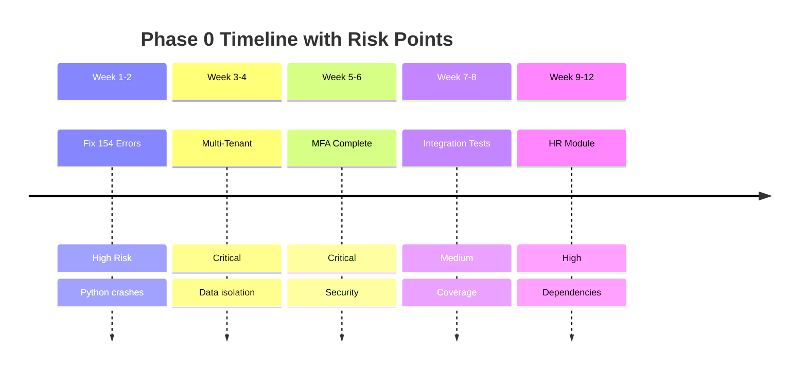

# Plan: Phase 0 - Critical Stabilization
# خطة المرحلة 0 - الاستقرار الحرج

**Architect:** Global v35.0 Singularity
**Risk Level:** 🔴 HIGH
**Duration:** 12 Weeks (3 Months)
**Priority:** CRITICAL - Must complete before any new features

---

## 1. Predictive Engineering (Risk Analysis)

### Week-by-Week Risk Map



### Risk Mitigations

| Week | Risk | Mitigation | Fallback |
|------|------|------------|----------|
| 1-2 | Auto-fix breaks code | Git branch per fix batch | Revert + manual fix |
| 3-4 | Schema migration fails | Test on DB copy first | Rollback plan ready |
| 5-6 | Twilio API limits | Test with mock service | Email-only MFA |
| 7-8 | Low test coverage | Parallel test writing | Focus on critical paths |
| 9-12 | HR complexity | Copy from Sales module | Simplified MVP |

---

## 2. Week 1-2: Fix 154 Critical Errors

### Step-by-Step Execution

```bash
# Day 1: Assessment
cd D:\Ai_Project\5-gaara_erp\backend
flake8 src/ --statistics > ../errors/flake8_full_report.txt

# Day 2-3: Auto-fix safe errors
autopep8 --in-place --recursive --aggressive --max-line-length=120 src/

# Day 4-7: Fix F821 (undefined names) - Manual
# These require understanding the code context

# Day 8-10: Fix F811 (redefinition)
# Usually duplicate imports or function definitions

# Day 11-14: Verification
flake8 src/ --select=E9,F821,F811,F823 --count
# Target: 0 errors
```

### Error Categories

| Error Code | Count | Type | Fix Strategy |
|------------|-------|------|--------------|
| F821 | 68 | Undefined name | Add imports or define |
| E9 | 24 | Syntax error | Manual fix |
| F811 | 62 | Redefinition | Remove duplicates |

### Pre-commit Hook

```yaml
# .pre-commit-config.yaml
repos:
  - repo: https://github.com/pycqa/flake8
    rev: 6.1.0
    hooks:
      - id: flake8
        args: ['--max-line-length=120', '--select=E9,F821,F811']
```

---

## 3. Week 3-4: Multi-Tenant Implementation

### Day-by-Day Plan

| Day | Task | Output |
|-----|------|--------|
| 1 | Create Tenant model | `models/tenant.py` |
| 2 | Create TenantUser, TenantSettings | Same file |
| 3 | Create TenantPlan | Same file |
| 4 | Run migrations | Database updated |
| 5 | Create TenantMiddleware | `middleware/tenant_middleware.py` |
| 6 | Test middleware routing | Manual test |
| 7 | Create TenantService | `services/tenant_service.py` |
| 8 | Create Tenant API routes | `routes/tenant_routes.py` |
| 9 | Integrate with existing auth | `routes/auth_unified.py` modified |
| 10 | Write unit tests | `tests/test_multi_tenancy.py` |
| 11-14 | Integration testing | All tests pass |

### Middleware Implementation

```python
# backend/src/middleware/tenant_middleware.py

from django.db import connection
from django.http import JsonResponse
from backend.src.models.tenant import Tenant

class TenantMiddleware:
    """
    وسيط تحديد المستأجر وتوجيه الـ Schema
    
    ترتيب التحقق:
    1. Subdomain (tenant.gaara-erp.com)
    2. Custom Domain (custom.com)
    3. X-Tenant-ID Header
    """
    
    EXEMPT_PATHS = [
        '/api/auth/login',
        '/api/auth/register',
        '/api/health',
        '/admin',
        '/static',
    ]
    
    def __init__(self, get_response):
        self.get_response = get_response
    
    def __call__(self, request):
        # Skip for exempt paths
        if any(request.path.startswith(path) for path in self.EXEMPT_PATHS):
            return self.get_response(request)
        
        # Resolve tenant
        tenant = self._resolve_tenant(request)
        
        if not tenant:
            return JsonResponse({
                'success': False,
                'error': 'TENANT_NOT_FOUND',
                'message': 'لم يتم العثور على المستأجر'
            }, status=404)
        
        if not tenant.is_active:
            return JsonResponse({
                'success': False,
                'error': 'TENANT_INACTIVE',
                'message': 'المستأجر غير نشط'
            }, status=403)
        
        # Set schema
        connection.set_schema(tenant.schema_name)
        request.tenant = tenant
        
        response = self.get_response(request)
        
        # Reset to public
        connection.set_schema('public')
        
        return response
    
    def _resolve_tenant(self, request):
        """محاولة تحديد المستأجر من مصادر متعددة"""
        
        # 1. Try subdomain
        host = request.get_host().split(':')[0]  # Remove port
        parts = host.split('.')
        
        if len(parts) >= 3:  # tenant.gaara-erp.com
            subdomain = parts[0]
            try:
                return Tenant.objects.get(slug=subdomain)
            except Tenant.DoesNotExist:
                pass
        
        # 2. Try custom domain
        try:
            return Tenant.objects.get(custom_domain=host)
        except Tenant.DoesNotExist:
            pass
        
        # 3. Try header
        tenant_id = request.headers.get('X-Tenant-ID')
        if tenant_id:
            try:
                return Tenant.objects.get(id=tenant_id)
            except Tenant.DoesNotExist:
                pass
        
        return None
```

---

## 4. Week 5-6: MFA Implementation

### Service Structure

```
backend/src/modules/mfa/
├── __init__.py
├── models.py           # MFASettings, OTPRecord, BackupCode
├── service.py          # Base MFA service
├── totp_service.py     # TOTP (Google Authenticator)
├── sms_service.py      # SMS OTP (Twilio)
├── email_service.py    # Email OTP
├── backup_service.py   # Backup codes
├── routes.py           # API endpoints
├── serializers.py      # Request/Response
└── validators.py       # Input validation
```

### TOTP Service

```python
# backend/src/modules/mfa/totp_service.py

import pyotp
import qrcode
import io
import base64
from cryptography.fernet import Fernet
from django.conf import settings

class TOTPService:
    """
    خدمة TOTP للمصادقة عبر تطبيقات مثل Google Authenticator
    """
    
    def __init__(self):
        self.fernet = Fernet(settings.MFA_ENCRYPTION_KEY.encode())
    
    def generate_secret(self) -> str:
        """توليد مفتاح سري جديد - 32 حرف Base32"""
        return pyotp.random_base32()
    
    def encrypt_secret(self, secret: str) -> str:
        """تشفير المفتاح باستخدام Fernet (AES)"""
        return self.fernet.encrypt(secret.encode()).decode()
    
    def decrypt_secret(self, encrypted: str) -> str:
        """فك تشفير المفتاح"""
        return self.fernet.decrypt(encrypted.encode()).decode()
    
    def generate_qr_code(self, email: str, secret: str) -> str:
        """
        توليد QR code للمسح بواسطة تطبيق المصادقة
        
        Returns: Base64 encoded PNG image
        """
        totp = pyotp.TOTP(secret)
        uri = totp.provisioning_uri(
            name=email,
            issuer_name=settings.MFA_TOTP_ISSUER or "Gaara ERP"
        )
        
        qr = qrcode.QRCode(
            version=1,
            error_correction=qrcode.constants.ERROR_CORRECT_L,
            box_size=10,
            border=4
        )
        qr.add_data(uri)
        qr.make(fit=True)
        
        img = qr.make_image(fill_color="black", back_color="white")
        
        buffer = io.BytesIO()
        img.save(buffer, format='PNG')
        buffer.seek(0)
        
        return base64.b64encode(buffer.getvalue()).decode()
    
    def verify_code(self, secret: str, code: str) -> bool:
        """
        التحقق من كود TOTP
        
        valid_window=1 يسمح بنافذة ±30 ثانية
        """
        totp = pyotp.TOTP(secret)
        return totp.verify(code, valid_window=1)
    
    def setup_totp(self, user) -> dict:
        """
        إعداد TOTP لمستخدم جديد
        
        Returns: {secret, qr_code_base64, backup_codes}
        """
        from .backup_service import BackupCodeService
        
        secret = self.generate_secret()
        encrypted_secret = self.encrypt_secret(secret)
        qr_code = self.generate_qr_code(user.email, secret)
        
        # Generate backup codes
        backup_service = BackupCodeService()
        backup_codes = backup_service.generate_codes(user.id)
        
        # Save to MFASettings
        mfa_settings, _ = user.mfa_settings.get_or_create(user=user)
        mfa_settings.totp_secret_encrypted = encrypted_secret
        mfa_settings.totp_verified = False
        mfa_settings.save()
        
        return {
            'qr_code': qr_code,
            'manual_key': secret,  # For manual entry
            'backup_codes': backup_codes
        }
```

---

## 5. Week 7-8: Integration Testing

### Test Plan

```python
# backend/tests/test_multi_tenancy.py

import pytest
from django.test import TestCase, Client
from backend.src.models.tenant import Tenant, TenantUser

class TestMultiTenancy(TestCase):
    """
    اختبارات تعدد المستأجرين
    """
    
    def setUp(self):
        """إنشاء بيانات اختبار"""
        self.tenant1 = Tenant.objects.create(
            name="شركة 1",
            slug="company1",
            schema_name="tenant_company1"
        )
        self.tenant2 = Tenant.objects.create(
            name="شركة 2",
            slug="company2",
            schema_name="tenant_company2"
        )
    
    def test_tenant_isolation(self):
        """التحقق من عزل البيانات بين المستأجرين"""
        # Create data in tenant1
        # Verify it's not visible in tenant2
        pass
    
    def test_subdomain_routing(self):
        """اختبار التوجيه عبر Subdomain"""
        client = Client()
        response = client.get(
            '/api/test/',
            HTTP_HOST='company1.gaara-erp.com'
        )
        # Verify correct tenant resolved
        pass
    
    def test_header_routing(self):
        """اختبار التوجيه عبر Header"""
        client = Client()
        response = client.get(
            '/api/test/',
            HTTP_X_TENANT_ID=str(self.tenant1.id)
        )
        pass
    
    def test_invalid_tenant(self):
        """اختبار رفض مستأجر غير صالح"""
        client = Client()
        response = client.get(
            '/api/test/',
            HTTP_HOST='invalid.gaara-erp.com'
        )
        self.assertEqual(response.status_code, 404)
```

---

## 6. Week 9-12: HR Module

### Module Structure

```
backend/src/modules/hr/
├── __init__.py
├── models/
│   ├── __init__.py
│   ├── department.py      # Department model
│   ├── employee.py        # Employee model  
│   ├── attendance.py      # Attendance tracking
│   ├── leave.py           # Leave management
│   └── payroll.py         # Payroll processing
├── views/
│   ├── __init__.py
│   ├── employee_views.py
│   ├── attendance_views.py
│   ├── leave_views.py
│   └── payroll_views.py
├── services/
│   ├── __init__.py
│   ├── attendance_service.py
│   ├── leave_service.py
│   └── payroll_service.py
├── serializers/
│   └── __init__.py
└── tests/
    └── __init__.py
```

### API Endpoints Summary

| Endpoint | Method | Function |
|----------|--------|----------|
| `/api/hr/departments/` | GET, POST | List, Create departments |
| `/api/hr/employees/` | GET, POST | List, Create employees |
| `/api/hr/employees/{id}/` | GET, PUT, DELETE | Employee details |
| `/api/hr/attendance/check-in/` | POST | Record check-in |
| `/api/hr/attendance/check-out/` | POST | Record check-out |
| `/api/hr/leaves/` | GET, POST | Leave requests |
| `/api/hr/leaves/{id}/approve/` | POST | Approve leave |
| `/api/hr/payroll/generate/` | POST | Generate payroll |

---

## 7. Success Criteria

### Phase 0 Exit Criteria

| Metric | Target | Measurement |
|--------|--------|-------------|
| Python Errors | 0 | `flake8 --count` |
| Multi-tenant Works | ✅ | Integration tests pass |
| MFA Complete | ✅ | All 3 methods work |
| HR CRUD Works | ✅ | API tests pass |
| Test Coverage | >70% | `pytest --cov` |
| Security Audit | Pass | No critical issues |

### Checkpoint Verification Commands

```bash
# Error check
flake8 backend/src/ --select=E9,F821,F811 --count

# Test coverage
pytest backend/tests/ --cov=backend/src --cov-report=term-missing

# Security check
bandit -r backend/src/ -f json

# All checks pass
echo "Phase 0 Complete!"
```

---

**Phase 0 Plan Complete.**
**Execute with:** Start at Week 1, Day 1 - Fix Python errors
