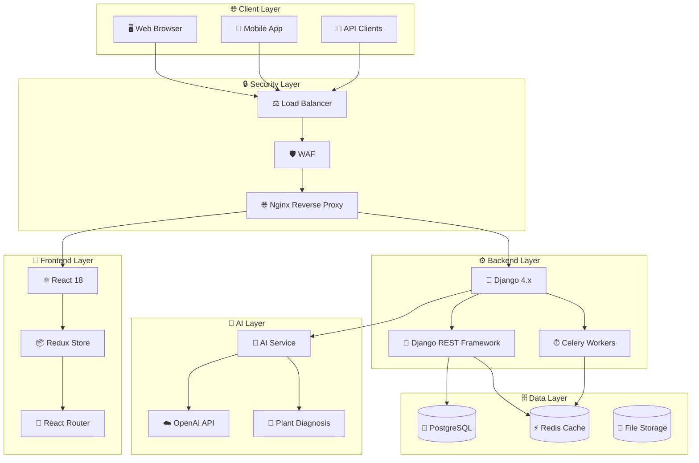
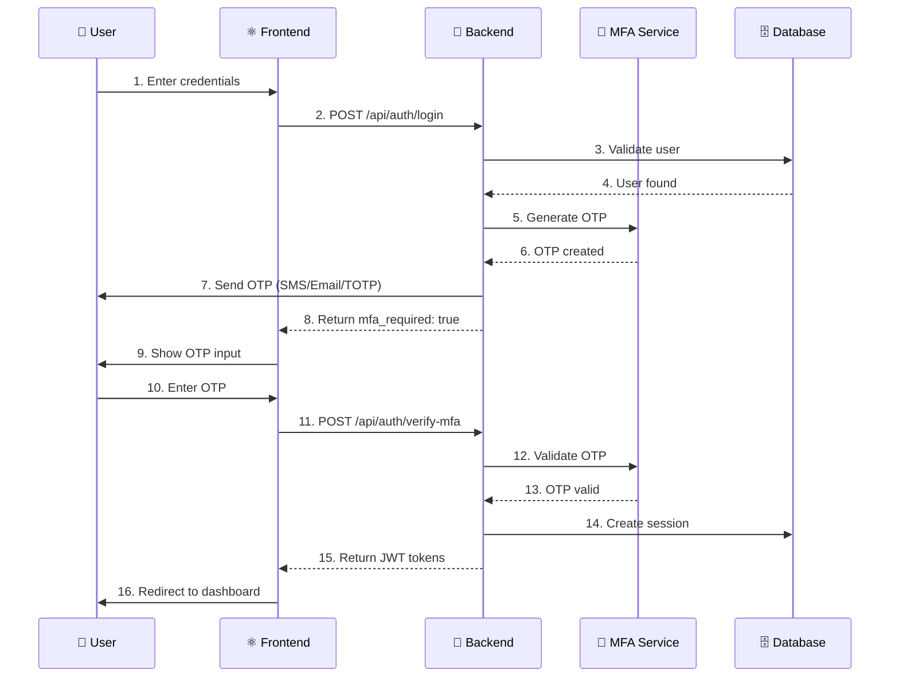
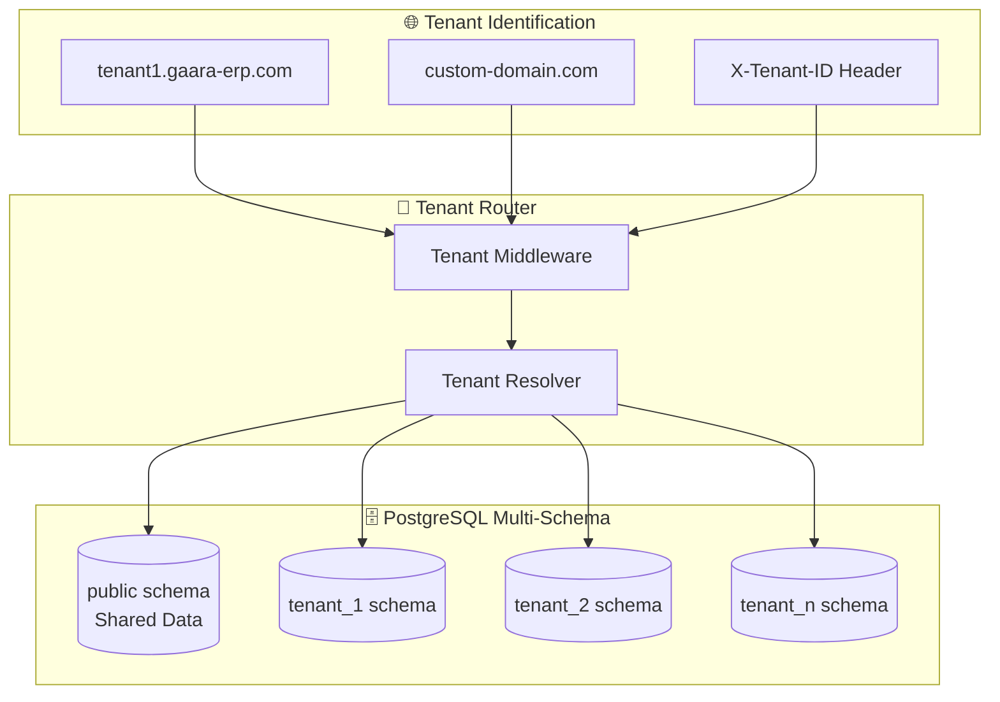
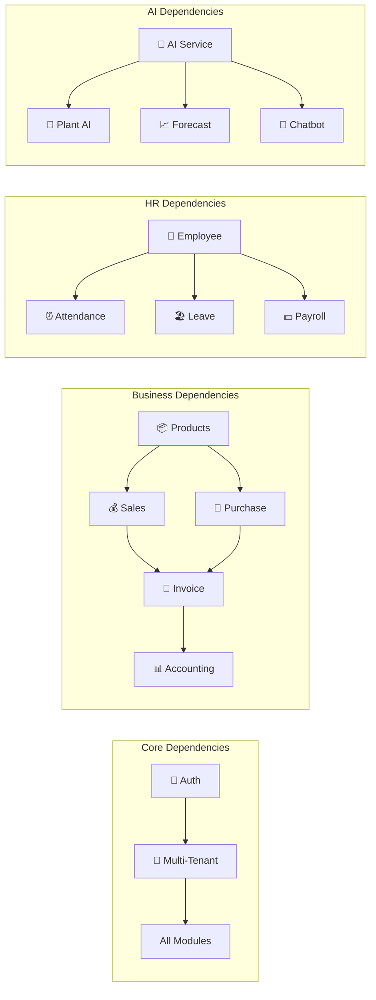

# Spec: Gaara ERP v12 - Master System Specification
# مواصفات نظام قارا ERP v12 الشاملة

**Version:** 1.0.0
**Date:** 2026-01-17
**Visual Hash:** GAARA-SPEC-2026-01-17-001
**Constitution Reference:** `CONSTITUTION.md`

---

## 1. النموذج البصري الشامل / The Visual Model (System Overview)

### 1.1 بنية النظام الكاملة / Complete System Architecture



### 1.2 تدفق المصادقة متعددة العوامل / MFA Authentication Flow



### 1.3 بنية تعدد المستأجرين / Multi-Tenant Architecture



---

## 2. قصص المستخدمين / User Stories (The "Why")

### 2.1 المستخدم المؤسسي / Enterprise User
> As an **Enterprise Administrator**, I want **a comprehensive ERP system that covers all business operations**, so that **I can manage my entire organization from one platform**.

### 2.2 المحاسب / Accountant
> As an **Accountant**, I want **IFRS/GAAP compliant accounting with multi-currency support**, so that **I can maintain accurate financial records**.

### 2.3 مدير المبيعات / Sales Manager
> As a **Sales Manager**, I want **to track quotes, orders, and invoices in real-time**, so that **I can optimize sales performance**.

### 2.4 مهندس زراعي / Agricultural Engineer
> As an **Agricultural Engineer**, I want **AI-powered plant disease diagnosis**, so that **I can quickly identify and treat crop diseases**.

### 2.5 مدير الموارد البشرية / HR Manager
> As an **HR Manager**, I want **employee management with attendance and leave tracking**, so that **I can manage workforce efficiently**.

---

## 3. المتطلبات الوظيفية / Functional Requirements (The "What")

### 3.1 وحدة الأمان والمصادقة / Security & Authentication Module

| REQ-ID | المتطلب | Requirement | الأولوية | Status |
|--------|---------|-------------|----------|--------|
| SEC-01 | JWT مع انتهاء 1 ساعة | JWT with 1h access token | 🔴 Critical | ✅ Exists |
| SEC-02 | Refresh Token 24 ساعة | 24h refresh token | 🔴 Critical | ✅ Exists |
| SEC-03 | MFA عبر SMS | SMS OTP authentication | 🔴 Critical | ⏳ Partial |
| SEC-04 | MFA عبر TOTP | Google Authenticator support | 🔴 Critical | ⏳ Partial |
| SEC-05 | MFA عبر Email | Email OTP authentication | 🔴 Critical | ⏳ Partial |
| SEC-06 | سياسة كلمات مرور قوية | Strong password policy (12+ chars) | 🔴 Critical | ✅ Exists |
| SEC-07 | Rate Limiting | API rate limiting per tenant | 🔴 Critical | ✅ Exists |
| SEC-08 | Session Security | IP binding, device tracking | 🟠 High | ⏳ Partial |

**Existing Files:**
- `backend/src/modules/mfa/` - MFA module (partial)
- `backend/src/middleware/rate_limiter.py` - Rate limiting
- `backend/src/jwt_manager.py` - JWT management
- `backend/src/routes/auth_unified.py` - Auth routes

### 3.2 وحدة تعدد المستأجرين / Multi-Tenancy Module

| REQ-ID | المتطلب | Requirement | الأولوية | Status |
|--------|---------|-------------|----------|--------|
| MT-01 | Tenant Model | Tenant data model | 🔴 Critical | ⏳ Needed |
| MT-02 | Schema Isolation | PostgreSQL schema per tenant | 🔴 Critical | ⏳ Needed |
| MT-03 | Tenant Middleware | Auto schema routing | 🔴 Critical | ⏳ Needed |
| MT-04 | Subdomain Detection | tenant.domain.com support | 🔴 Critical | ⏳ Needed |
| MT-05 | Custom Domain | Custom domain mapping | 🟠 High | ⏳ Needed |
| MT-06 | Tenant Admin UI | Admin interface for tenants | 🟠 High | ⏳ Needed |

**Target Files to Create:**
- `backend/src/models/tenant.py`
- `backend/src/middleware/tenant_middleware.py`
- `backend/src/services/tenant_service.py`

### 3.3 وحدة المحاسبة / Accounting Module

| REQ-ID | المتطلب | Requirement | الأولوية | Status |
|--------|---------|-------------|----------|--------|
| ACC-01 | Chart of Accounts | IFRS/GAAP compliant | 🔴 Critical | ✅ Exists |
| ACC-02 | Journal Entries | Double-entry bookkeeping | 🔴 Critical | ✅ Exists |
| ACC-03 | Multi-Currency | Currency conversion | 🔴 Critical | ✅ Exists |
| ACC-04 | Trial Balance | Report generation | 🟠 High | ✅ Exists |
| ACC-05 | Income Statement | P&L report | 🟠 High | ✅ Exists |
| ACC-06 | Balance Sheet | Financial position | 🟠 High | ✅ Exists |
| ACC-07 | Bank Reconciliation | Auto matching | 🟡 Medium | ⏳ Partial |

**Existing Files:**
- `backend/src/models/accounting_system.py`
- `backend/src/models/journal.py`
- `backend/src/routes/accounting_system.py`
- `backend/src/routes/financial_reports.py`

### 3.4 وحدة المبيعات / Sales Module

| REQ-ID | المتطلب | Requirement | الأولوية | Status |
|--------|---------|-------------|----------|--------|
| SAL-01 | Customer Management | Customer CRUD | 🔴 Critical | ✅ Exists |
| SAL-02 | Sales Quotes | Quotation management | 🔴 Critical | ✅ Exists |
| SAL-03 | Sales Orders | Order processing | 🔴 Critical | ✅ Exists |
| SAL-04 | Sales Invoices | Invoice generation | 🔴 Critical | ✅ Exists |
| SAL-05 | Price Lists | Dynamic pricing | 🟠 High | ✅ Exists |
| SAL-06 | Discounts | Discount management | 🟠 High | ✅ Exists |
| SAL-07 | Sales Reports | Analytics | 🟠 High | ✅ Exists |

**Existing Files:**
- `backend/src/models/customer.py`
- `backend/src/models/sale.py`
- `backend/src/models/invoice_unified.py`
- `backend/src/routes/sales.py`
- `backend/src/routes/invoices_unified.py`

### 3.5 وحدة المشتريات / Purchasing Module

| REQ-ID | المتطلب | Requirement | الأولوية | Status |
|--------|---------|-------------|----------|--------|
| PUR-01 | Supplier Management | Supplier CRUD | 🔴 Critical | ✅ Exists |
| PUR-02 | Purchase Orders | PO management | 🔴 Critical | ✅ Exists |
| PUR-03 | Goods Receipt | GRN processing | 🔴 Critical | ✅ Exists |
| PUR-04 | Purchase Invoices | Vendor invoices | 🔴 Critical | ✅ Exists |
| PUR-05 | Three-Way Match | PO-GRN-Invoice match | 🟠 High | ⏳ Partial |

**Existing Files:**
- `backend/src/models/supplier.py`
- `backend/src/models/purchase_order.py`
- `backend/src/models/purchase_receipt.py`
- `backend/src/routes/purchases.py`

### 3.6 وحدة المخزون / Inventory Module

| REQ-ID | المتطلب | Requirement | الأولوية | Status |
|--------|---------|-------------|----------|--------|
| INV-01 | Products | Product catalog | 🔴 Critical | ✅ Exists |
| INV-02 | Warehouses | Multi-warehouse | 🔴 Critical | ✅ Exists |
| INV-03 | Stock Movements | Track movements | 🔴 Critical | ✅ Exists |
| INV-04 | Lot Tracking | Batch/lot management | 🟠 High | ✅ Exists |
| INV-05 | Stock Adjustments | Inventory adjustments | 🟠 High | ✅ Exists |
| INV-06 | Warehouse Transfer | Inter-warehouse | 🟠 High | ✅ Exists |
| INV-07 | Stock Alerts | Low stock alerts | 🟡 Medium | ✅ Exists |

**Existing Files:**
- `backend/src/models/product_unified.py`
- `backend/src/models/warehouse_unified.py`
- `backend/src/models/stock_movement.py`
- `backend/src/models/lot_advanced.py`
- `backend/src/routes/inventory.py`
- `backend/src/routes/warehouses.py`

### 3.7 وحدة الموارد البشرية / HR Module

| REQ-ID | المتطلب | Requirement | الأولوية | Status |
|--------|---------|-------------|----------|--------|
| HR-01 | Employees | Employee management | 🔴 Critical | ⏳ Partial |
| HR-02 | Departments | Department structure | 🔴 Critical | ⏳ Partial |
| HR-03 | Attendance | Time tracking | 🔴 Critical | ❌ Missing |
| HR-04 | Leave Management | Leave requests | 🔴 Critical | ❌ Missing |
| HR-05 | Payroll | Salary processing | 🟠 High | ❌ Missing |
| HR-06 | Performance | Evaluations | 🟡 Medium | ❌ Missing |

**Existing Files (Partial):**
- `backend/src/modules/hr/` - Basic structure exists

**Target Files to Create:**
- `backend/src/modules/hr/models/employee.py`
- `backend/src/modules/hr/models/attendance.py`
- `backend/src/modules/hr/models/leave.py`
- `backend/src/modules/hr/models/payroll.py`

### 3.8 وحدة المشاريع / Projects Module

| REQ-ID | المتطلب | Requirement | الأولوية | Status |
|--------|---------|-------------|----------|--------|
| PRJ-01 | Projects | Project management | 🔴 Critical | ❌ Missing |
| PRJ-02 | Tasks | Task tracking | 🔴 Critical | ❌ Missing |
| PRJ-03 | Milestones | Milestone tracking | 🟠 High | ❌ Missing |
| PRJ-04 | Resource Allocation | Team assignment | 🟠 High | ❌ Missing |
| PRJ-05 | Gantt Charts | Visual timeline | 🟡 Medium | ❌ Missing |
| PRJ-06 | Time Tracking | Task time logs | 🟡 Medium | ❌ Missing |

**Target Files to Create:**
- `backend/src/modules/projects/models/project.py`
- `backend/src/modules/projects/models/task.py`
- `backend/src/modules/projects/views/project_views.py`

### 3.9 المديولات الزراعية / Agricultural Modules (10)

| REQ-ID | المديول | Module | الأولوية | Status |
|--------|---------|--------|----------|--------|
| AGR-01 | إدارة المزارع | Farms Management | 🔴 Critical | ✅ Exists |
| AGR-02 | إدارة المشاتل | Nurseries | 🔴 Critical | ✅ Exists |
| AGR-03 | التجارب الزراعية | Agricultural Experiments | 🟠 High | ✅ Exists |
| AGR-04 | تشخيص النباتات | Plant Diagnosis AI | 🟠 High | ✅ Exists |
| AGR-05 | الإنتاج الزراعي | Agricultural Production | 🟠 High | ✅ Exists |
| AGR-06 | البحث الزراعي | Research | 🟠 High | ✅ Exists |
| AGR-07 | تهجين البذور | Seed Hybridization | 🟡 Medium | ✅ Exists |
| AGR-08 | إنتاج البذور | Seed Production | 🟡 Medium | ✅ Exists |
| AGR-09 | تجارب الأصناف | Variety Trials | 🟡 Medium | ✅ Exists |
| AGR-10 | إدارة التجارب | Experiments | 🟡 Medium | ✅ Exists |

### 3.10 مديولات الذكاء الاصطناعي / AI Modules (13)

| REQ-ID | المديول | Module | الغرض | Status |
|--------|---------|--------|-------|--------|
| AI-01 | AI Service Layer | Unified AI interface | ⏳ Partial |
| AI-02 | Plant Diagnosis | Disease detection | ✅ Exists |
| AI-03 | Sentiment Analysis | Customer feedback | ⏳ Partial |
| AI-04 | Demand Forecasting | Sales prediction | ⏳ Partial |
| AI-05 | Price Optimization | Dynamic pricing | ❌ Missing |
| AI-06 | OCR Module | Document scanning | ✅ Exists |
| AI-07 | Chatbot | Customer support | ⏳ Partial |
| AI-08 | Recommendation | Product suggestions | ❌ Missing |
| AI-09 | Anomaly Detection | Fraud detection | ❌ Missing |
| AI-10 | Quality Prediction | Quality scoring | ❌ Missing |
| AI-11 | Yield Prediction | Crop yield forecast | ⏳ Partial |
| AI-12 | Weather Integration | Weather-based planning | ⏳ Partial |
| AI-13 | Resource Optimization | Resource allocation AI | ❌ Missing |

---

## 4. تقرير الظل / The Shadow Report (Anti-Patterns)

### 4.1 ⚠️ ما يجب تجنبه / What NOT to Do

| # | Anti-Pattern | السبب | البديل الصحيح |
|---|--------------|-------|---------------|
| 1 | ⚠️ **لا تخزن الأسرار في الكود** | Security breach | استخدم `.env` أو Vault |
| 2 | ⚠️ **لا تستخدم `select *`** | Performance | حدد الحقول المطلوبة فقط |
| 3 | ⚠️ **لا تثق بإدخال المستخدم** | SQL Injection, XSS | استخدم validators |
| 4 | ⚠️ **لا تنشئ ملفات مكررة** | Code duplication | راجع `file_registry.json` أولاً |
| 5 | ⚠️ **لا تتجاوز MFA** | Security | MFA إلزامي لجميع المستخدمين |
| 6 | ⚠️ **لا تستخدم JWT طويلة** | Token theft | 1h access, 24h refresh |
| 7 | ⚠️ **لا تخلط الـ schemas** | Data isolation | كل tenant في schema منفصل |
| 8 | ⚠️ **لا تستخدم sync في async** | Blocking | استخدم `await` و `async` |
| 9 | ⚠️ **لا تهمل الـ indexes** | Slow queries | أضف indexes للحقول المستخدمة كثيراً |
| 10 | ⚠️ **لا تنس التوثيق** | Unmaintainable | Docstrings بالعربية |

### 4.2 🛡️ تحذيرات أمنية / Security Warnings

```python
# ❌ WRONG - Never do this
password = "admin123"  # Hardcoded secret
query = f"SELECT * FROM users WHERE id = {user_id}"  # SQL Injection

# ✅ CORRECT - Always do this
password = os.environ.get('ADMIN_PASSWORD')
query = User.objects.filter(id=user_id)  # ORM with parameterized query
```

### 4.3 🔍 مراجعة المبتدئين / Junior Developer Misunderstandings

1. **❓ "لماذا نحتاج MFA؟"**
   - ✅ MFA يمنع 99.9% من هجمات سرقة كلمات المرور
   - ✅ مطلوب للمعايير الدولية (SOC2, ISO27001)

2. **❓ "لماذا schema لكل tenant؟"**
   - ✅ عزل كامل للبيانات بين العملاء
   - ✅ سهولة النسخ الاحتياطي والحذف

3. **❓ "لماذا لا نستخدم localStorage للـ JWT؟"**
   - ✅ localStorage عرضة لهجمات XSS
   - ✅ استخدم httpOnly cookies بدلاً من ذلك

---

## 5. معايير القبول / Acceptance Criteria (The "Done")

### 5.1 معايير الأمان / Security Criteria

- [ ] ✅ MFA يعمل لجميع طرق المصادقة (SMS, TOTP, Email)
- [ ] ✅ JWT access token ينتهي بعد 1 ساعة بالضبط
- [ ] ✅ Rate limiting يمنع أكثر من 100 طلب/دقيقة
- [ ] ✅ جميع الـ API endpoints محمية
- [ ] ✅ لا أسرار في الكود أو Git history
- [ ] ✅ OWASP Top 10 معالَج

### 5.2 معايير الأداء / Performance Criteria

- [ ] ⚡ وقت استجابة API < 200ms
- [ ] ⚡ وقت تحميل الصفحة < 2 ثانية
- [ ] ⚡ لا N+1 queries
- [ ] ⚡ Database indexes محسّنة
- [ ] ⚡ Redis cache hit rate > 80%

### 5.3 معايير الجودة / Quality Criteria

- [ ] 🧪 تغطية اختبارات ≥ 80%
- [ ] 🧪 جميع الاختبارات ناجحة
- [ ] 📝 Docstrings لجميع الدوال (بالعربية)
- [ ] 📝 README.md لكل مديول
- [ ] ✅ flake8 يمر بدون أخطاء
- [ ] ✅ ESLint يمر بدون أخطاء

### 5.4 معايير التكامل / Integration Criteria

- [ ] 🔗 جميع الـ modules تعمل معاً
- [ ] 🔗 Multi-tenant isolation يعمل
- [ ] 🔗 AI modules تتكامل مع النظام
- [ ] 🔗 Frontend يتصل بـ Backend بشكل صحيح

---

## 6. خريطة الملفات / File Map

### 6.1 الملفات الموجودة / Existing Files

```
✅ backend/src/models/
   ├── accounting_system.py   # محاسبة
   ├── customer.py            # عملاء
   ├── supplier.py            # موردين
   ├── product_unified.py     # منتجات
   ├── invoice_unified.py     # فواتير
   ├── warehouse_unified.py   # مستودعات
   ├── stock_movement.py      # حركة المخزون
   └── ...

✅ backend/src/routes/
   ├── auth_unified.py        # مصادقة
   ├── sales.py               # مبيعات
   ├── purchases.py           # مشتريات
   ├── inventory.py           # مخزون
   ├── accounting_system.py   # محاسبة
   └── ...
```

### 6.2 الملفات المطلوب إنشاؤها / Files to Create

```
❌ backend/src/models/
   ├── tenant.py              # Multi-tenancy
   └── ...

❌ backend/src/modules/
   ├── hr/
   │   ├── models/
   │   │   ├── employee.py    # موظفين
   │   │   ├── attendance.py  # حضور
   │   │   ├── leave.py       # إجازات
   │   │   └── payroll.py     # رواتب
   │   └── views/
   │       └── hr_views.py
   │
   ├── projects/
   │   ├── models/
   │   │   ├── project.py     # مشاريع
   │   │   └── task.py        # مهام
   │   └── views/
   │       └── project_views.py
   │
   └── contacts/
       ├── models/
       │   └── contact.py     # جهات اتصال
       └── views/
           └── contact_views.py
```

---

## 7. مصفوفة التبعيات / Dependency Matrix



---

## 8. ملخص الحالة / Status Summary

| Category | Total | ✅ Exists | ⏳ Partial | ❌ Missing |
|----------|-------|-----------|------------|------------|
| Security | 8 | 4 | 4 | 0 |
| Multi-Tenancy | 6 | 0 | 0 | 6 |
| Accounting | 7 | 6 | 1 | 0 |
| Sales | 7 | 7 | 0 | 0 |
| Purchasing | 5 | 4 | 1 | 0 |
| Inventory | 7 | 7 | 0 | 0 |
| HR | 6 | 0 | 2 | 4 |
| Projects | 6 | 0 | 0 | 6 |
| Agricultural | 10 | 10 | 0 | 0 |
| AI | 13 | 3 | 5 | 5 |
| **TOTAL** | **75** | **41 (55%)** | **13 (17%)** | **21 (28%)** |

---

## 9. الخطوات التالية / Next Steps

### 9.1 الأولوية القصوى / Highest Priority

1. **MT-01 to MT-06**: Create Multi-Tenancy module
2. **SEC-03 to SEC-05**: Complete MFA implementation
3. **HR-01 to HR-06**: Create HR module

### 9.2 الأولوية العالية / High Priority

4. **PRJ-01 to PRJ-06**: Create Projects module
5. **AI-01**: Complete AI Service Layer
6. **Fix 154 critical errors**

### 9.3 الأولوية المتوسطة / Medium Priority

7. Complete remaining AI modules
8. Create Design System
9. Achieve 80% test coverage

---

**Specification Complete.**
**Next Command:** `/speckit.clarify` or `/speckit.plan`
