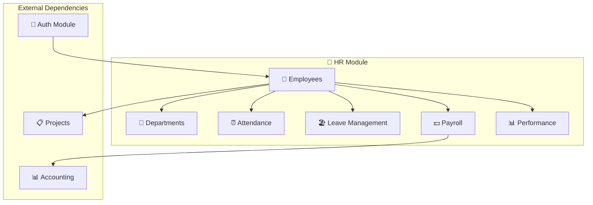
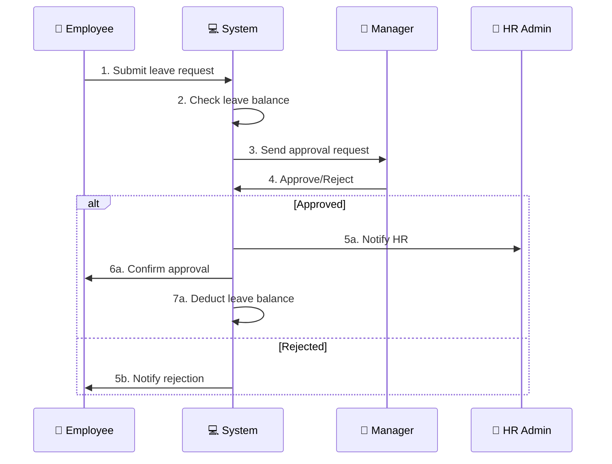
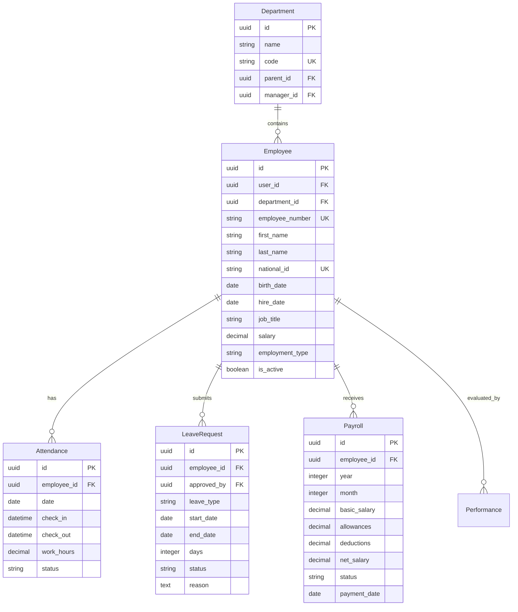

# Spec: HR Module (Human Resources)
# مواصفات مديول الموارد البشرية

**Version:** 1.0.0
**Date:** 2026-01-17
**Visual Hash:** HR-SPEC-001
**Priority:** 🔴 CRITICAL

---

## 1. النموذج البصري / The Visual Model

### 1.1 هيكل المديول / Module Structure



### 1.2 تدفق طلب الإجازة / Leave Request Flow



### 1.3 نموذج البيانات / Data Model



---

## 2. قصة المستخدم / User Story

> As an **HR Manager**, I want **to manage all employee information and track attendance**, so that **I can maintain accurate workforce records**.

> As an **Employee**, I want **to submit leave requests and view my payslips**, so that **I can manage my work-life balance**.

> As a **Department Manager**, I want **to approve leave requests and view team attendance**, so that **I can plan work schedules effectively**.

---

## 3. المتطلبات الوظيفية / Functional Requirements

### 3.1 Employee Management (HR-01)

| REQ-ID | المتطلب | Requirement |
|--------|---------|-------------|
| HR-01-A | إنشاء موظف جديد | Create new employee with all details |
| HR-01-B | تعديل بيانات الموظف | Update employee information |
| HR-01-C | إنهاء خدمة موظف | Terminate employee (soft delete) |
| HR-01-D | عرض قائمة الموظفين | List employees with filters |
| HR-01-E | البحث عن موظف | Search by name, ID, department |

### 3.2 Attendance (HR-03)

| REQ-ID | المتطلب | Requirement |
|--------|---------|-------------|
| HR-03-A | تسجيل الحضور | Check-in (manual or device) |
| HR-03-B | تسجيل الانصراف | Check-out |
| HR-03-C | عرض سجل الحضور | View attendance history |
| HR-03-D | تقرير الحضور | Attendance report (daily/monthly) |
| HR-03-E | التأخير والغياب | Track late arrivals and absences |

### 3.3 Leave Management (HR-04)

| REQ-ID | المتطلب | Requirement |
|--------|---------|-------------|
| HR-04-A | طلب إجازة | Submit leave request |
| HR-04-B | الموافقة على الإجازة | Approve/reject by manager |
| HR-04-C | رصيد الإجازات | Track leave balance |
| HR-04-D | أنواع الإجازات | Annual, sick, emergency, etc. |
| HR-04-E | التقويم | Leave calendar view |

### 3.4 Payroll (HR-05)

| REQ-ID | المتطلب | Requirement |
|--------|---------|-------------|
| HR-05-A | إعداد الرواتب | Generate monthly payroll |
| HR-05-B | البدلات | Allowances management |
| HR-05-C | الخصومات | Deductions (absence, advance, etc.) |
| HR-05-D | صرف الرواتب | Process payment |
| HR-05-E | كشف الراتب | Payslip generation (PDF) |

---

## 4. API Endpoints

### 4.1 Employees

| Endpoint | Method | Description |
|----------|--------|-------------|
| `/api/hr/employees/` | GET | List employees |
| `/api/hr/employees/` | POST | Create employee |
| `/api/hr/employees/{id}/` | GET | Get employee |
| `/api/hr/employees/{id}/` | PUT | Update employee |
| `/api/hr/employees/{id}/` | DELETE | Terminate employee |
| `/api/hr/employees/{id}/attendance/` | GET | Employee attendance |
| `/api/hr/employees/{id}/leaves/` | GET | Employee leaves |
| `/api/hr/employees/{id}/payslips/` | GET | Employee payslips |

### 4.2 Attendance

| Endpoint | Method | Description |
|----------|--------|-------------|
| `/api/hr/attendance/` | GET | List attendance |
| `/api/hr/attendance/check-in/` | POST | Check in |
| `/api/hr/attendance/check-out/` | POST | Check out |
| `/api/hr/attendance/report/` | GET | Attendance report |

### 4.3 Leaves

| Endpoint | Method | Description |
|----------|--------|-------------|
| `/api/hr/leaves/` | GET | List leave requests |
| `/api/hr/leaves/` | POST | Submit leave request |
| `/api/hr/leaves/{id}/approve/` | POST | Approve leave |
| `/api/hr/leaves/{id}/reject/` | POST | Reject leave |
| `/api/hr/leaves/balance/` | GET | Get leave balance |
| `/api/hr/leaves/types/` | GET | List leave types |

### 4.4 Payroll

| Endpoint | Method | Description |
|----------|--------|-------------|
| `/api/hr/payroll/` | GET | List payroll records |
| `/api/hr/payroll/generate/` | POST | Generate payroll |
| `/api/hr/payroll/{id}/` | GET | Get payroll details |
| `/api/hr/payroll/{id}/process/` | POST | Process payment |
| `/api/hr/payroll/{id}/payslip/` | GET | Download payslip PDF |

---

## 5. تقرير الظل / The Shadow Report

### ⚠️ Anti-Patterns

1. **⚠️ لا تخزن الراتب بدون تشفير**
   - ❌ Storing salary as plain text
   - ✅ Encrypt sensitive financial data

2. **⚠️ لا تسمح بتعديل الحضور بدون صلاحية**
   - ❌ Any employee can edit attendance
   - ✅ Only HR admin can modify attendance records

3. **⚠️ لا تنس ربط HR بالمحاسبة**
   - ❌ Payroll not connected to journal entries
   - ✅ Auto-generate accounting entries for payroll

4. **⚠️ لا تهمل الأرشفة**
   - ❌ Hard delete of terminated employees
   - ✅ Soft delete with data archiving

---

## 6. معايير القبول / Acceptance Criteria

- [ ] ✅ Employee CRUD operations work
- [ ] ✅ Attendance check-in/out works
- [ ] ✅ Leave request workflow complete
- [ ] ✅ Payroll generates correct amounts
- [ ] ✅ Payslip PDF downloads successfully
- [ ] ✅ Reports generate correctly
- [ ] ✅ Role-based access enforced
- [ ] ✅ Test coverage ≥ 80%

---

## 7. الملفات المطلوبة / Required Files

```
backend/src/modules/hr/
├── __init__.py
├── models/
│   ├── __init__.py
│   ├── department.py           # قسم
│   ├── employee.py             # موظف
│   ├── attendance.py           # حضور
│   ├── leave.py                # إجازات
│   └── payroll.py              # رواتب
├── views/
│   ├── __init__.py
│   ├── employee_views.py
│   ├── attendance_views.py
│   ├── leave_views.py
│   └── payroll_views.py
├── services/
│   ├── __init__.py
│   ├── attendance_service.py
│   ├── leave_service.py
│   └── payroll_service.py
├── serializers/
│   ├── __init__.py
│   └── hr_serializers.py
└── tests/
    ├── __init__.py
    ├── test_employee.py
    ├── test_attendance.py
    ├── test_leave.py
    └── test_payroll.py

frontend/src/pages/hr/
├── EmployeesPage.jsx
├── AttendancePage.jsx
├── LeavesPage.jsx
├── PayrollPage.jsx
└── HRDashboardPage.jsx
```

---

**Estimated Files:** 35+
**Next:** Implement starting with `employee.py` model
