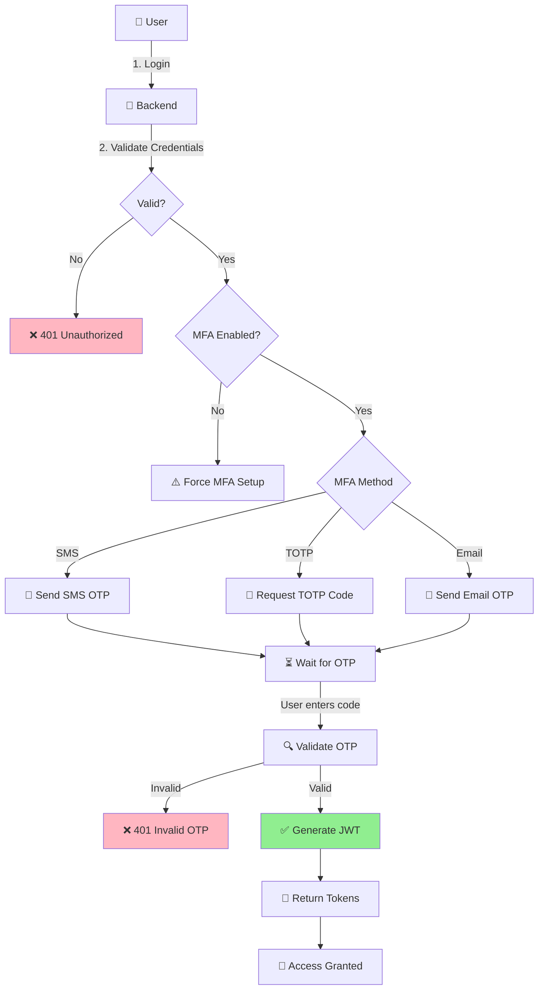
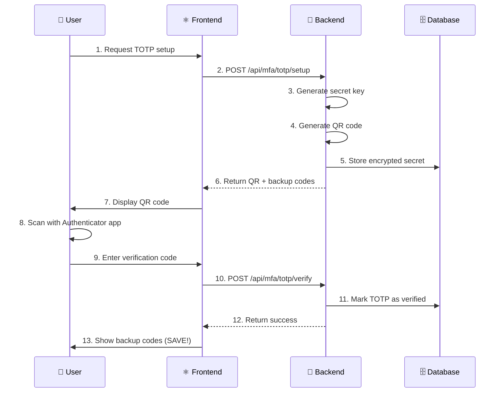
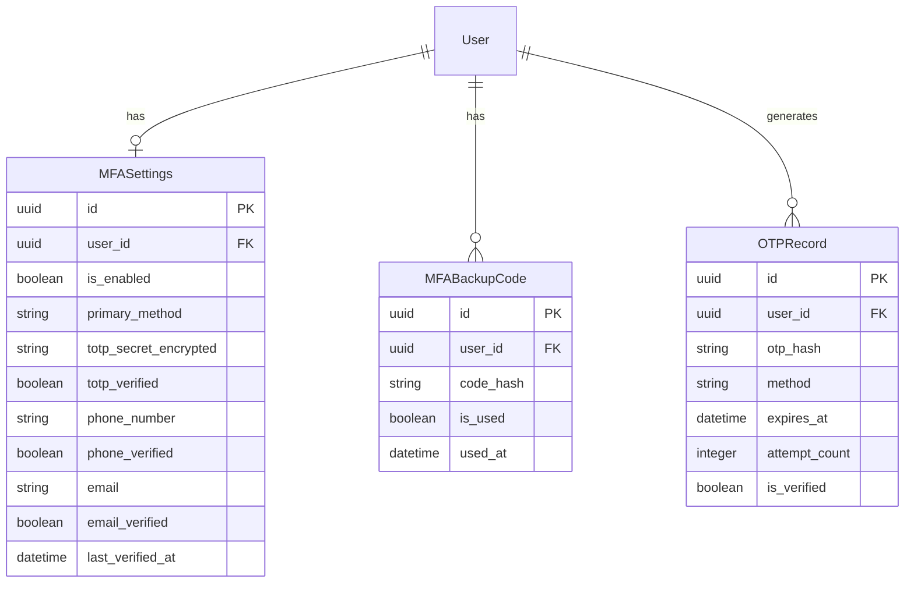

# Spec: MFA Security System
# مواصفات نظام المصادقة متعددة العوامل

**Version:** 1.0.0
**Date:** 2026-01-17
**Visual Hash:** MFA-SPEC-001
**Priority:** 🔴 CRITICAL

---

## 1. النموذج البصري / The Visual Model

### 1.1 تدفق المصادقة الكامل / Complete Auth Flow



### 1.2 تدفق إعداد TOTP / TOTP Setup Flow



### 1.3 نموذج البيانات / Data Model



---

## 2. قصة المستخدم / User Story

> As a **User**, I want **multiple options for MFA (SMS, TOTP, Email)**, so that **I can choose the most convenient method for me**.

> As a **Security Admin**, I want **to enforce MFA for all users**, so that **account security is guaranteed**.

> As a **User**, I want **backup codes**, so that **I can access my account if I lose my phone**.

---

## 3. المتطلبات الوظيفية / Functional Requirements

### 3.1 SMS OTP (SEC-03)

| REQ-ID | المتطلب | Requirement |
|--------|---------|-------------|
| SMS-01 | توليد OTP 6 أرقام | Generate 6-digit OTP |
| SMS-02 | صلاحية 5 دقائق | OTP expires in 5 minutes |
| SMS-03 | إرسال عبر Twilio | Send via Twilio API |
| SMS-04 | Rate limit: 3/10min | Max 3 SMS per 10 minutes |
| SMS-05 | تحقق من الرقم | Phone number verification |

### 3.2 TOTP (SEC-04)

| REQ-ID | المتطلب | Requirement |
|--------|---------|-------------|
| TOTP-01 | توليد secret key | Generate 32-char secret |
| TOTP-02 | QR code للتطبيق | Generate QR for authenticator app |
| TOTP-03 | التحقق من الكود | Verify TOTP code (30s window) |
| TOTP-04 | أكواد احتياطية | Generate 10 backup codes |
| TOTP-05 | تشفير السر | Encrypt secret with AES-256 |

### 3.3 Email OTP (SEC-05)

| REQ-ID | المتطلب | Requirement |
|--------|---------|-------------|
| EMAIL-01 | توليد OTP 6 أرقام | Generate 6-digit OTP |
| EMAIL-02 | صلاحية 10 دقائق | OTP expires in 10 minutes |
| EMAIL-03 | قالب عربي | Arabic email template |
| EMAIL-04 | Rate limit: 5/15min | Max 5 emails per 15 minutes |
| EMAIL-05 | إعادة الإرسال | Resend with cooldown (60s) |

---

## 4. API Endpoints

### 4.1 MFA Setup

| Endpoint | Method | Description |
|----------|--------|-------------|
| `/api/mfa/status/` | GET | Get MFA status for current user |
| `/api/mfa/methods/` | GET | List available MFA methods |

### 4.2 SMS OTP

| Endpoint | Method | Description |
|----------|--------|-------------|
| `/api/mfa/sms/setup/` | POST | Register phone number |
| `/api/mfa/sms/send/` | POST | Send SMS OTP |
| `/api/mfa/sms/verify/` | POST | Verify SMS OTP |

### 4.3 TOTP

| Endpoint | Method | Description |
|----------|--------|-------------|
| `/api/mfa/totp/setup/` | POST | Generate TOTP secret + QR |
| `/api/mfa/totp/verify/` | POST | Verify TOTP code |
| `/api/mfa/totp/disable/` | POST | Disable TOTP |

### 4.4 Email OTP

| Endpoint | Method | Description |
|----------|--------|-------------|
| `/api/mfa/email/setup/` | POST | Verify email for OTP |
| `/api/mfa/email/send/` | POST | Send email OTP |
| `/api/mfa/email/verify/` | POST | Verify email OTP |

### 4.5 Backup Codes

| Endpoint | Method | Description |
|----------|--------|-------------|
| `/api/mfa/backup-codes/` | GET | Get remaining backup codes |
| `/api/mfa/backup-codes/regenerate/` | POST | Generate new backup codes |
| `/api/mfa/backup-codes/verify/` | POST | Verify backup code (one-time) |

---

## 5. Implementation Details

### 5.1 TOTP Implementation

```python
# backend/src/modules/mfa/service.py

import pyotp
import qrcode
import io
import base64
from cryptography.fernet import Fernet

class TOTPService:
    """
    خدمة TOTP للمصادقة متعددة العوامل
    """
    
    def generate_secret(self) -> str:
        """توليد مفتاح سري جديد"""
        return pyotp.random_base32()
    
    def encrypt_secret(self, secret: str) -> str:
        """تشفير المفتاح السري باستخدام AES-256"""
        key = settings.MFA_ENCRYPTION_KEY
        f = Fernet(key)
        return f.encrypt(secret.encode()).decode()
    
    def generate_qr_code(self, user_email: str, secret: str) -> str:
        """توليد QR code للمصادقة"""
        totp = pyotp.TOTP(secret)
        uri = totp.provisioning_uri(
            name=user_email,
            issuer_name="Gaara ERP"
        )
        
        qr = qrcode.QRCode(version=1, box_size=10, border=5)
        qr.add_data(uri)
        qr.make(fit=True)
        
        img = qr.make_image(fill_color="black", back_color="white")
        buffer = io.BytesIO()
        img.save(buffer, format='PNG')
        
        return base64.b64encode(buffer.getvalue()).decode()
    
    def verify_totp(self, secret: str, code: str) -> bool:
        """التحقق من كود TOTP"""
        totp = pyotp.TOTP(secret)
        return totp.verify(code, valid_window=1)  # ±30 seconds
```

### 5.2 SMS OTP Implementation

```python
# backend/src/modules/mfa/sms_service.py

from twilio.rest import Client
import random
import hashlib
from datetime import timedelta
from django.utils import timezone

class SMSOTPService:
    """
    خدمة OTP عبر SMS باستخدام Twilio
    """
    
    def __init__(self):
        self.client = Client(
            settings.TWILIO_ACCOUNT_SID,
            settings.TWILIO_AUTH_TOKEN
        )
        self.from_number = settings.TWILIO_PHONE_NUMBER
    
    def generate_otp(self) -> str:
        """توليد OTP مكون من 6 أرقام"""
        return str(random.randint(100000, 999999))
    
    def hash_otp(self, otp: str) -> str:
        """تشفير OTP للتخزين"""
        return hashlib.sha256(otp.encode()).hexdigest()
    
    def send_otp(self, phone_number: str, otp: str) -> bool:
        """إرسال OTP عبر SMS"""
        try:
            message = self.client.messages.create(
                body=f"رمز التحقق الخاص بك في Gaara ERP هو: {otp}\n"
                     f"صالح لمدة 5 دقائق.",
                from_=self.from_number,
                to=phone_number
            )
            return True
        except Exception as e:
            logger.error(f"SMS send failed: {e}")
            return False
    
    def create_otp_record(self, user_id: str, phone: str) -> str:
        """إنشاء سجل OTP جديد"""
        otp = self.generate_otp()
        
        OTPRecord.objects.create(
            user_id=user_id,
            otp_hash=self.hash_otp(otp),
            method='sms',
            expires_at=timezone.now() + timedelta(minutes=5)
        )
        
        return otp
```

### 5.3 Backup Codes

```python
# backend/src/modules/mfa/backup_service.py

import secrets
import hashlib

class BackupCodeService:
    """
    خدمة أكواد النسخ الاحتياطي
    """
    
    def generate_backup_codes(self, count: int = 10) -> list:
        """توليد أكواد احتياطية"""
        codes = []
        for _ in range(count):
            code = secrets.token_hex(4).upper()  # 8 chars
            codes.append(f"{code[:4]}-{code[4:]}")  # XXXX-XXXX format
        return codes
    
    def store_backup_codes(self, user_id: str, codes: list):
        """تخزين الأكواد المشفرة"""
        # Delete existing codes
        MFABackupCode.objects.filter(user_id=user_id).delete()
        
        for code in codes:
            MFABackupCode.objects.create(
                user_id=user_id,
                code_hash=hashlib.sha256(code.encode()).hexdigest()
            )
    
    def verify_backup_code(self, user_id: str, code: str) -> bool:
        """التحقق من كود احتياطي"""
        code_hash = hashlib.sha256(code.encode()).hexdigest()
        
        backup = MFABackupCode.objects.filter(
            user_id=user_id,
            code_hash=code_hash,
            is_used=False
        ).first()
        
        if backup:
            backup.is_used = True
            backup.used_at = timezone.now()
            backup.save()
            return True
        
        return False
```

---

## 6. تقرير الظل / The Shadow Report

### ⚠️ Anti-Patterns

1. **⚠️ لا تخزن OTP بدون تشفير**
   - ❌ Storing plain OTP in database
   - ✅ Store only the hash

2. **⚠️ لا تنس Rate Limiting**
   - ❌ Unlimited OTP requests
   - ✅ Strict rate limits per user

3. **⚠️ لا تعرض الكود في الرد**
   - ❌ Returning OTP in API response
   - ✅ Only send via SMS/Email/App

4. **⚠️ لا تهمل وقت الانتهاء**
   - ❌ OTP valid forever
   - ✅ SMS: 5min, Email: 10min, TOTP: 30s

5. **⚠️ لا تسمح بمحاولات لا نهائية**
   - ❌ Unlimited OTP attempts
   - ✅ Lock after 5 failed attempts (30 min)

---

## 7. معايير القبول / Acceptance Criteria

- [ ] ✅ SMS OTP sends and verifies correctly
- [ ] ✅ TOTP works with Google Authenticator
- [ ] ✅ Email OTP sends and verifies correctly
- [ ] ✅ Backup codes work as one-time use
- [ ] ✅ Rate limiting prevents abuse
- [ ] ✅ Account lockout after failed attempts
- [ ] ✅ All secrets encrypted at rest
- [ ] ✅ Arabic messages in SMS/Email
- [ ] ✅ Test coverage ≥ 90% (security critical)

---

## 8. Environment Variables Required

```env
# Twilio (SMS)
TWILIO_ACCOUNT_SID=your_account_sid
TWILIO_AUTH_TOKEN=your_auth_token
TWILIO_PHONE_NUMBER=+1234567890

# MFA Encryption
MFA_ENCRYPTION_KEY=your_fernet_key_32_chars

# Email (Django settings)
EMAIL_HOST=smtp.example.com
EMAIL_PORT=587
EMAIL_USE_TLS=True
EMAIL_HOST_USER=noreply@gaara-erp.com
EMAIL_HOST_PASSWORD=your_email_password
```

---

## 9. الملفات المطلوبة / Required Files

```
backend/src/modules/mfa/
├── __init__.py
├── models.py                    # MFASettings, OTPRecord, MFABackupCode
├── service.py                   # TOTPService
├── sms_service.py               # SMSOTPService
├── email_service.py             # EmailOTPService
├── backup_service.py            # BackupCodeService
├── routes.py                    # API endpoints
├── serializers.py               # Request/Response schemas
├── validators.py                # Input validation
└── tests/
    ├── __init__.py
    ├── test_totp.py
    ├── test_sms_otp.py
    ├── test_email_otp.py
    └── test_backup_codes.py

frontend/src/pages/auth/
├── MFASetupPage.jsx
├── TOTPSetupPage.jsx
├── VerifyOTPPage.jsx
└── BackupCodesPage.jsx
```

---

**Existing Partial Implementation:**
- `backend/src/modules/mfa/` - Basic structure exists, needs completion

**Next:** Complete MFA implementation starting with `models.py`
