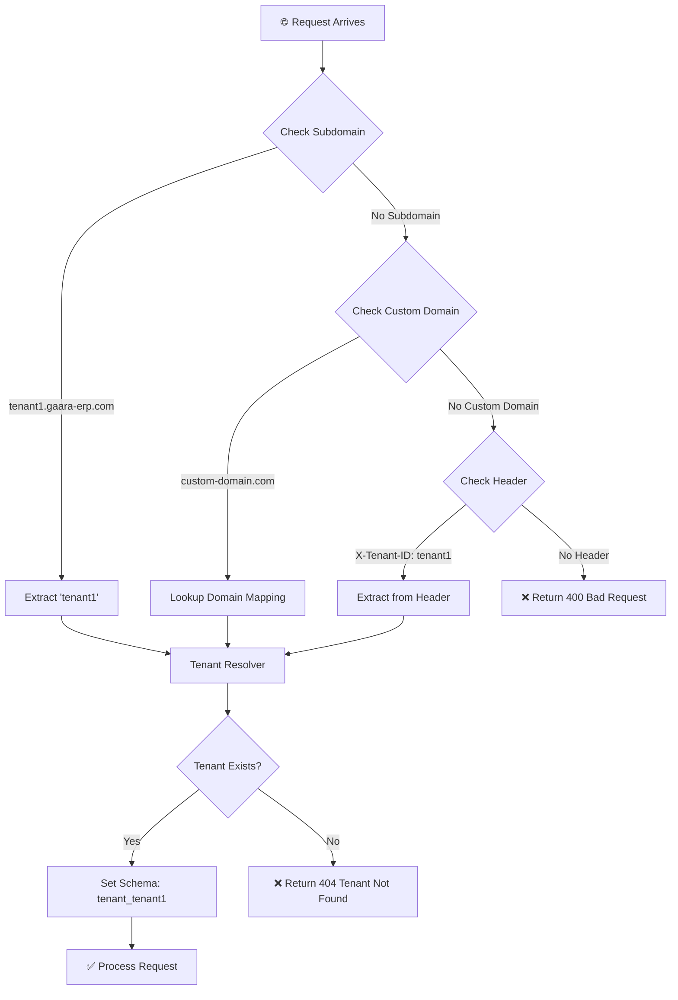
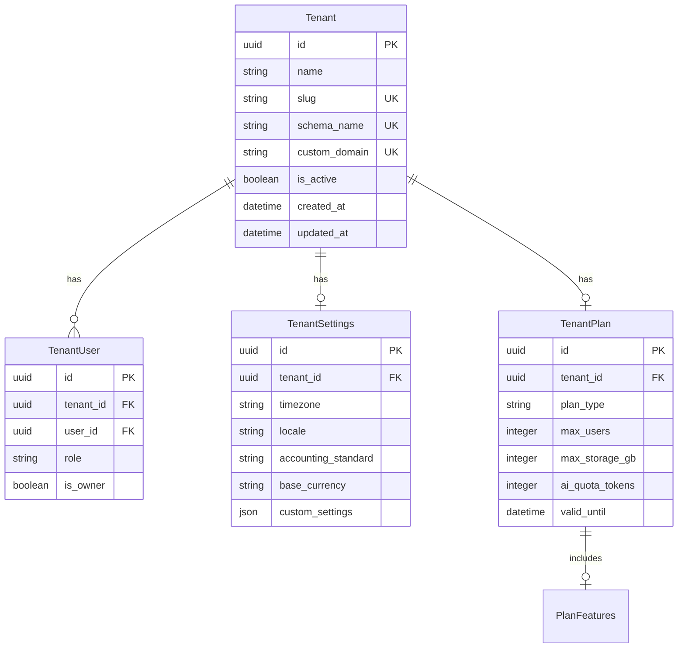

# Spec: Multi-Tenancy System
# مواصفات نظام تعدد المستأجرين

**Version:** 1.0.0
**Date:** 2026-01-17
**Visual Hash:** MT-SPEC-001
**Priority:** 🔴 CRITICAL

---

## 1. النموذج البصري / The Visual Model

### 1.1 تدفق تحديد المستأجر / Tenant Identification Flow



### 1.2 هيكل البيانات / Data Model



---

## 2. قصة المستخدم / User Story

> As a **System Administrator**, I want **to create and manage multiple isolated tenants**, so that **each customer has their own private data space**.

> As a **Tenant Owner**, I want **to customize my tenant settings**, so that **my organization uses our preferred accounting standard and currency**.

---

## 3. المتطلبات الوظيفية / Functional Requirements

### 3.1 Tenant Model (MT-01)

```python
# Target: backend/src/models/tenant.py

class Tenant(models.Model):
    """
    نموذج المستأجر - يمثل مؤسسة واحدة في النظام
    
    كل مستأجر له schema خاص به في PostgreSQL
    """
    id = models.UUIDField(primary_key=True, default=uuid.uuid4)
    name = models.CharField(max_length=255, verbose_name="اسم المؤسسة")
    slug = models.SlugField(unique=True, verbose_name="المعرف الفريد")
    schema_name = models.CharField(max_length=63, unique=True)
    custom_domain = models.CharField(max_length=255, null=True, unique=True)
    is_active = models.BooleanField(default=True)
    created_at = models.DateTimeField(auto_now_add=True)
    updated_at = models.DateTimeField(auto_now=True)
```

### 3.2 Schema Middleware (MT-03)

```python
# Target: backend/src/middleware/tenant_middleware.py

class TenantMiddleware:
    """
    وسيط لتحديد المستأجر وتوجيه الاستعلامات للـ Schema الصحيح
    """
    
    def __init__(self, get_response):
        self.get_response = get_response
    
    def __call__(self, request):
        # 1. تحديد المستأجر
        tenant = self._resolve_tenant(request)
        
        # 2. تعيين الـ Schema
        if tenant:
            connection.set_schema(tenant.schema_name)
            request.tenant = tenant
        else:
            raise TenantNotFoundError()
        
        response = self.get_response(request)
        
        # 3. إعادة الـ Schema العام
        connection.set_schema('public')
        
        return response
    
    def _resolve_tenant(self, request):
        """
        محاولة تحديد المستأجر من:
        1. Subdomain
        2. Custom Domain
        3. Header
        """
        # Try subdomain
        host = request.get_host()
        subdomain = self._extract_subdomain(host)
        if subdomain:
            return Tenant.objects.get(slug=subdomain)
        
        # Try custom domain
        tenant = Tenant.objects.filter(custom_domain=host).first()
        if tenant:
            return tenant
        
        # Try header
        tenant_id = request.headers.get('X-Tenant-ID')
        if tenant_id:
            return Tenant.objects.get(id=tenant_id)
        
        return None
```

### 3.3 Tenant API Endpoints

| Endpoint | Method | Description |
|----------|--------|-------------|
| `/api/tenants/` | GET | List all tenants (admin only) |
| `/api/tenants/` | POST | Create new tenant |
| `/api/tenants/{id}/` | GET | Get tenant details |
| `/api/tenants/{id}/` | PUT | Update tenant |
| `/api/tenants/{id}/` | DELETE | Deactivate tenant |
| `/api/tenants/{id}/settings/` | GET/PUT | Tenant settings |
| `/api/tenants/{id}/users/` | GET/POST | Tenant users |

---

## 4. تقرير الظل / The Shadow Report

### ⚠️ Anti-Patterns

1. **⚠️ لا تخلط البيانات بين المستأجرين**
   - ❌ `SELECT * FROM users` (يجلب من جميع الـ schemas)
   - ✅ Always use `connection.set_schema(tenant.schema_name)` first

2. **⚠️ لا تنس البيانات المشتركة**
   - بعض البيانات يجب أن تكون في `public` schema:
     - قائمة المستأجرين
     - الخطط والباقات
     - المستخدمين الـ Super Admin

3. **⚠️ لا تنشئ Schema بدون Migration**
   - كل schema جديد يحتاج `migrate` منفصل
   - استخدم `django-tenants` أو نظام مشابه

---

## 5. معايير القبول / Acceptance Criteria

- [ ] ✅ Tenant creation creates new PostgreSQL schema
- [ ] ✅ Requests to tenant1.domain.com route to tenant_1 schema
- [ ] ✅ Requests to custom-domain.com route to correct tenant
- [ ] ✅ X-Tenant-ID header works for API clients
- [ ] ✅ Data isolation verified (tenant A cannot see tenant B data)
- [ ] ✅ Tenant admin can manage users within their tenant
- [ ] ✅ Super admin can manage all tenants

---

## 6. الملفات المطلوبة / Required Files

```
backend/src/
├── models/
│   └── tenant.py                    # Tenant, TenantUser, TenantSettings, TenantPlan
├── middleware/
│   └── tenant_middleware.py         # TenantMiddleware
├── services/
│   └── tenant_service.py            # Tenant CRUD operations
├── routes/
│   └── tenant_routes.py             # API endpoints
├── validators/
│   └── tenant_validators.py         # Input validation
└── tests/
    └── test_multi_tenancy.py        # Unit & integration tests
```

---

**Next:** Implement starting with `tenant.py` model
