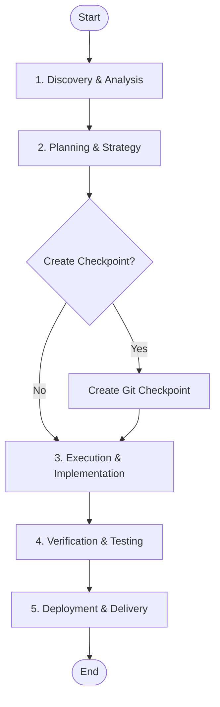

# 🚀 Bootstrap Lifecycle

> **Directive**: The "Big Bang" protocol for initializing new projects.
> **Standard**: Verified Feb 2026 (Swarm Intelligence, Context Engineering, MCP).

### 📊 Logical Chart (Lifecycle Flow)

## 1. Discovery & Analysis 🔍
- [ ] **Read `AGENTS.md`**: Load the core constitution (Single Source of Truth).
- [ ] **Read `AI_CONTEXT_ROUTER.md`**: Determine necessary context.
- [ ] **Run `preflight_check.py`**: Verify environment security and integrity.
- [ ] **Check `memory-bank/lessons.md`**: Review past mistakes to avoid repetition.
- [ ] **Inventory**: Run `speckit.py analyze` to map the terrain.

## 2. Planning & Strategy 🧠
- [ ] **Define Goal**: Clear, measurable objective in `memory-bank/activeContext.md`.
- [ ] **Breakdown Tasks**: Create atomic subtasks in `TASKS.md`.
- [ ] **Select Tools**: Identify required MCP tools and scripts.
- [ ] **Consult `memory-bank/coordination.md`**: Assign Swarm Roles (Architect, Developer, Reviewer).
- [ ] **Workflow Selection**: Read relevant guides in `knowledge/workflows/`.

## 3. Execution & Implementation ⚡
- [ ] **Create Checkpoint**: Run `git commit -m "checkpoint: pre-task-X"` (MANDATORY for risky tasks).
- [ ] **Implement**: Write code/docs following (Create -> Verify -> Execute) pattern.
- [ ] **Update Context**: Keep `memory-bank/activeContext.md` current.
- [ ] **Augmentation**: Run `augment.py` to optimize code quality.

## 4. Verification & Testing ✅
- [ ] **Run Tests**: Unit, Integration, E2E using `pytest-asyncio`.
- [ ] **Verify Logic**: Check against Logical Charts.
- [ ] **Security Scan**: Ensure no secrets or vulnerabilities (`preflight_check.py`).
- [ ] **Self-Healing**: If error -> `augment.py heal`.

## 5. Deployment & Delivery 🚀
- [ ] **Final Commit**: Clean git history.
- [ ] **Update Documentation**: Ensure docs match code.
- [ ] **Handover**: Notify user/manager.
