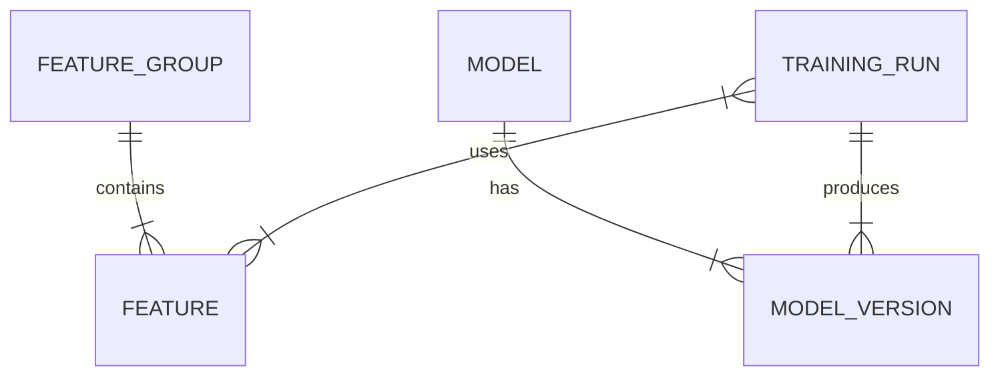

# ML-Database Integration Guide (v2026.2)

## 1. Overview
This guide defines how to link Machine Learning artifacts (models, metrics, features) with relational databases (PostgreSQL) for production systems.

## 2. Schema Architecture
The integration relies on three core tables:
1.  **`feature_store`**: Metadata about features used in training.
2.  **`model_registry`**: Versioned history of trained models.
3.  **`training_runs`**: Logs of experiments, hyperparameters, and metrics.

### 2.1 Entity-Relationship Diagram (ERD)


## 3. Implementation Steps

### Step 1: Define Models (SQLAlchemy)
Use `infrastructure/database/models/ml_models.py` to define your tables.

```python
class TrainingRun(Base):
    __tablename__ = 'training_runs'
    id = Column(Integer, primary_key=True)
    experiment_name = Column(String)
    run_id = Column(String, unique=True)  # MLflow Run ID
    metrics = Column(JSON)  # {"accuracy": 0.95, "loss": 0.1}
    params = Column(JSON)   # {"lr": 0.01, "batch_size": 32}
    start_time = Column(DateTime)
    end_time = Column(DateTime)
```

### Step 2: Log Training Results
In your training script (`train.py`), after `mlflow.log_metrics()`, write to the DB:

```python
# 1. Log to MLflow
mlflow.log_metric("accuracy", 0.95)

# 2. Sync to Database
run = TrainingRun(
    experiment_name="plant_disease_v1",
    run_id=mlflow.active_run().info.run_id,
    metrics={"accuracy": 0.95},
    params={"lr": 0.001}
)
session.add(run)
session.commit()
```

### Step 3: Serve Model from Registry
In your API (`app.py`), query the DB to find the best production model:

```python
best_model = session.query(ModelVersion)\
    .filter_by(model_name="plant_disease", status="production")\
    .order_by(ModelVersion.created_at.desc())\
    .first()

# Load from S3 path stored in DB
model = load_model(best_model.s3_path)
```

## 4. Best Practices
-   **Foreign Keys:** Always link `training_runs` to `model_versions`.
-   **JSONB:** Use JSONB for `metrics` and `params` to allow flexible querying.
-   **Immutability:** Never update a `training_run` record after the run finishes.
-   **Backups:** Backup the ML metadata database daily.
