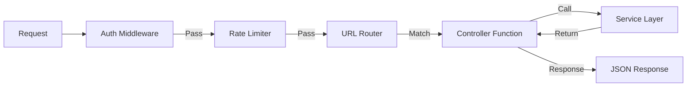
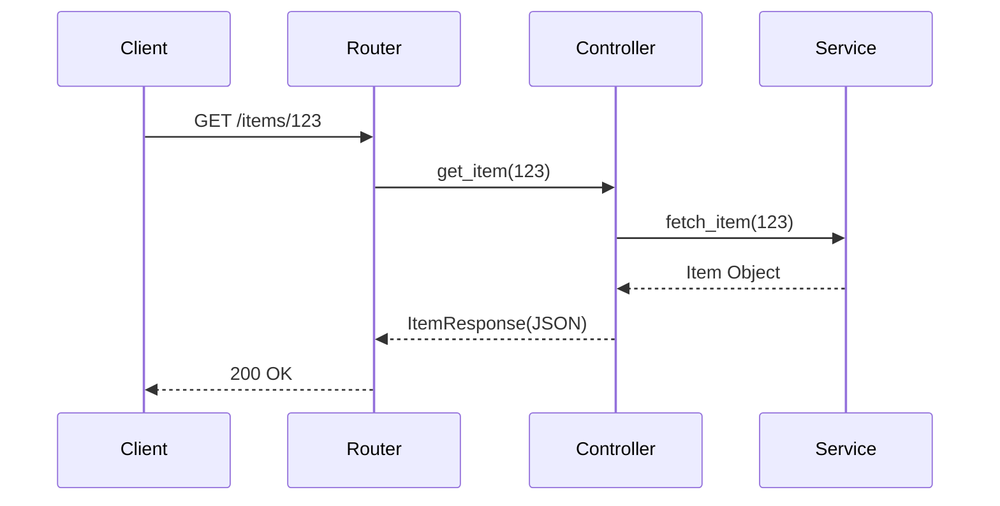

# 🌐 API Development Workflow (Logical Workchart)

This document visualizes request routing and middleware processing.

## 1. Request Processing Pipeline

## 2. Example: RESTful Resource Flow

### 📥 Imports (Routing)
*   **Methods**: GET, POST, PUT, DELETE.
*   **Dependencies**: Auth User, DB Session.

### 📤 Exports (Endpoints)
*   **Routes**: `/items`, `/users`.
*   **Docs**: OpenAPI / Swagger JSON.
