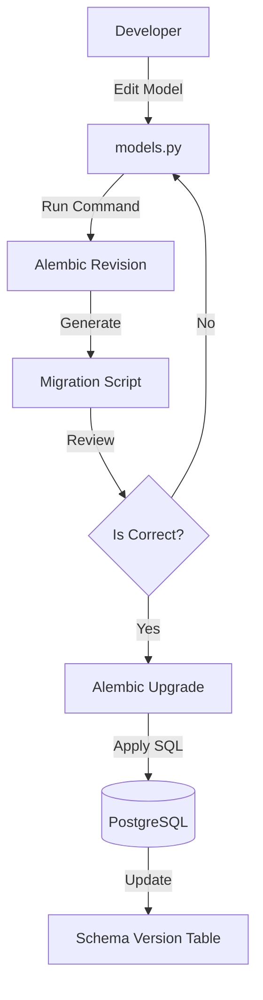
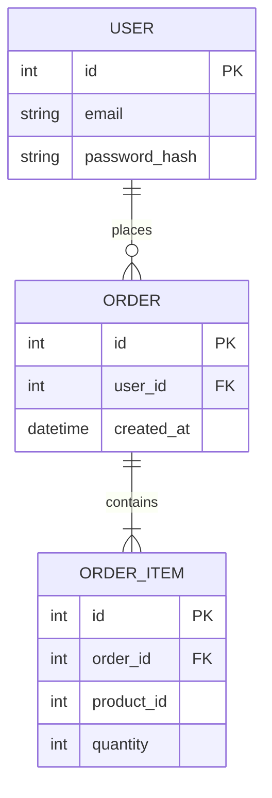

# 🗄️ Database Development Workflow (Logical Workchart)

This document visualizes data modeling and migration flows.

## 1. Migration Lifecycle

## 2. Entity Relationship Diagram (ERD) Example

### 📥 Imports (Definitions)
*   **Types**: Integer, String, DateTime.
*   **Constraints**: Unique, ForeignKey.

### 📤 Exports (Schema)
*   **Tables**: Users, Orders.
*   **Relations**: One-to-Many.
