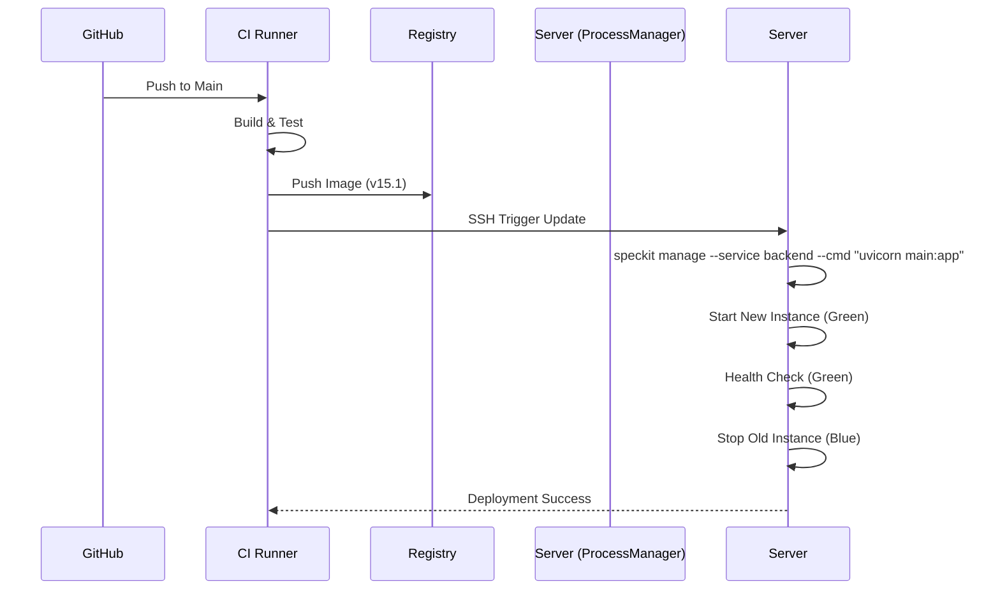

# 🚀 DevOps & CI/CD Workflow (Global System Ultimate v15.9.8)

This document visualizes the logical flow of DevOps pipelines, incorporating the **Smart Port Orchestration** architecture.

## 1. Dynamic Environment Injection
The CI/CD pipeline MUST inject the calculated ports into the build environment:

*   **Build Stage:** `export BACKEND_PORT=8000`, `export FRONTEND_PORT=3000`
*   **Test Stage:** `export DB_PORT=8100`, `export REDIS_PORT=11000`
*   **Deploy Stage:** `docker-compose up -d` (Reads `.env`)

## 2. Standard Pipeline Logic
Every commit triggers this pipeline:

```mermaid
graph TD
    A[Commit] -->|Trigger| B[CI Pipeline]
    B -->|Install| C[Dependencies (uv/pnpm)]
    C -->|Lint| D[Ruff / ESLint]
    D -->|Test| E[Pytest / Vitest]
    E -->|Build| F[Docker Images]
    F -->|Push| G[Registry]
    G -->|Deploy| H[Production (Rolling Update)]
```

## 3. Example: Zero-Downtime Deployment



### 📥 Imports (Triggers)
*   **Source**: GitHub Webhook.
*   **Config**: `.github/workflows/*.yml`.
*   **Secrets**: Docker Hub Credentials.

### 📤 Exports (Artifacts)
*   **Images**: `global-backend:latest`, `global-frontend:latest`.
*   **Logs**: Build & Deploy Logs.
