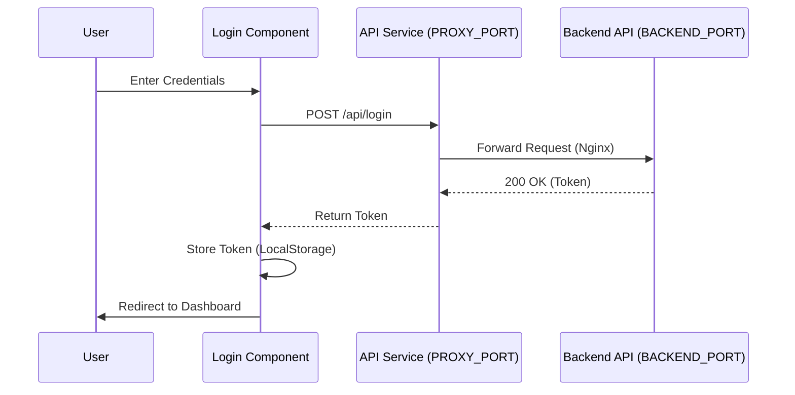

# ⚛️ Frontend Development Workflow (Global System Ultimate v15.9.8)

This document visualizes the logical flow of Frontend modules using Mermaid charts, incorporating the **Smart Port Orchestration** architecture.

## 1. Dynamic API Configuration
The frontend application MUST NOT hardcode API URLs. It must construct them dynamically:

*   **Frontend Port:** `import.meta.env.VITE_FRONTEND_PORT` (or `process.env.FRONTEND_PORT`)
*   **Proxy Port:** `import.meta.env.VITE_PROXY_PORT` (Default 8080)
*   **API Base URL:** `http://localhost:${VITE_PROXY_PORT}/api`

## 2. Standard Component Logic
Every frontend component follows this logical flow:

```mermaid
graph TD
    A[User Action] -->|Event| B[Component State]
    B -->|Effect| C{Needs Data?}
    C -- Yes --> D[API Service (PROXY_PORT)]
    D -->|Fetch| E[Backend API]
    E -->|Response| D
    D -->|Update| B
    B -->|Render| F[UI Update]
```

## 3. Example: Login Flow



### 📥 Imports (Data Sources)
*   **Config**: API Base URL (Loaded from `.env`).
*   **Components**: UI Elements.
*   **Hooks**: `useAuth`, `useFetch`.

### 📤 Exports (Data Sinks)
*   **Public Components**: `<LoginForm />`, `<Dashboard />`.
*   **Artifacts**: User Session.
