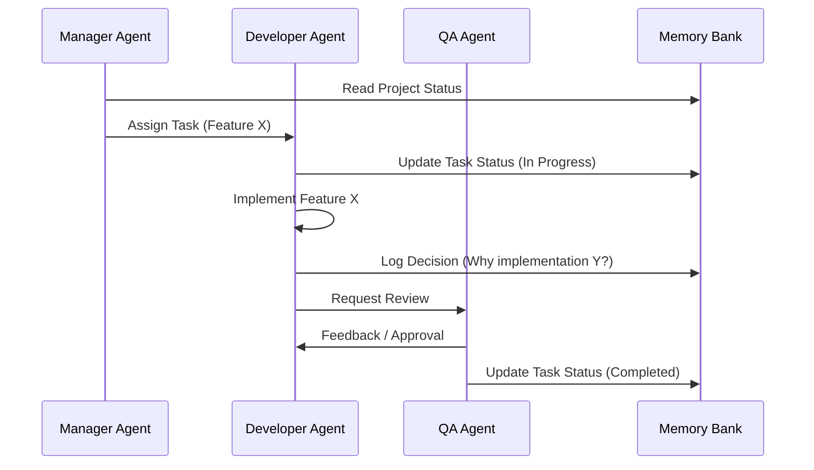

# 🤝 Multi-Agent Coordination Protocol

### 📊 Logical Chart (Coordination Flow)

## 🎯 Purpose
This document defines how multiple AI agents (or a single agent switching roles) coordinate to ensure consistency, avoid duplication, and maintain high quality.

##  roles & Responsibilities

| Role | Responsibility | Key Files |
| :--- | :--- | :--- |
| **Manager** | Planning, Task Assignment, Progress Tracking | `progress.md`, `TASKS.md` |
| **Developer** | Implementation, Refactoring, Bug Fixing | `activeContext.md`, `decisionLog.md` |
| **QA / Reviewer** | Testing, Verification, Security Checks | `lessons.md`, `systemContext.md` |
| **Architect** | System Design, High-Level Decisions | `systemContext.md`, `diagrams/` |

## 🔄 Handoff Protocol

When switching context or handing off a task:

1.  **Update `activeContext.md`**: Summarize what was done, what is pending, and any open questions.
2.  **Log Decisions**: Record any architectural or design decisions in `decisionLog.md`.
3.  **Update Progress**: Mark tasks as completed in `progress.md` or `TASKS.md`.
4.  **Commit**: Ensure all changes are committed (or checkpointed) before switching.

## 🧩 Conflict Resolution

*   **Single Source of Truth**: `AGENTS.md` and `memory-bank/` are the ultimate authorities.
*   **Locking**: If an agent is working on a critical file, they should signal it in `activeContext.md`.
*   **Escalation**: If a conflict cannot be resolved, escalate to the **Manager** role (or user) via `lessons.md`.

## 📡 Communication Channels

*   **Async**: Via `memory-bank/` files (preferred).
*   **Sync**: Via `activeContext.md` (current session focus).
*   **Alerts**: Via `lessons.md` (critical warnings).
