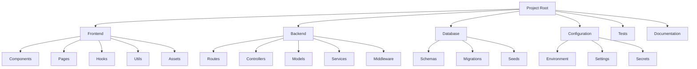
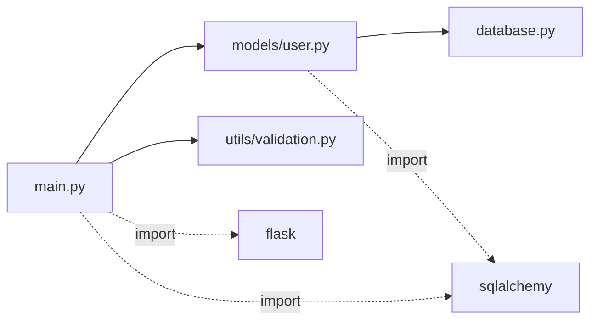
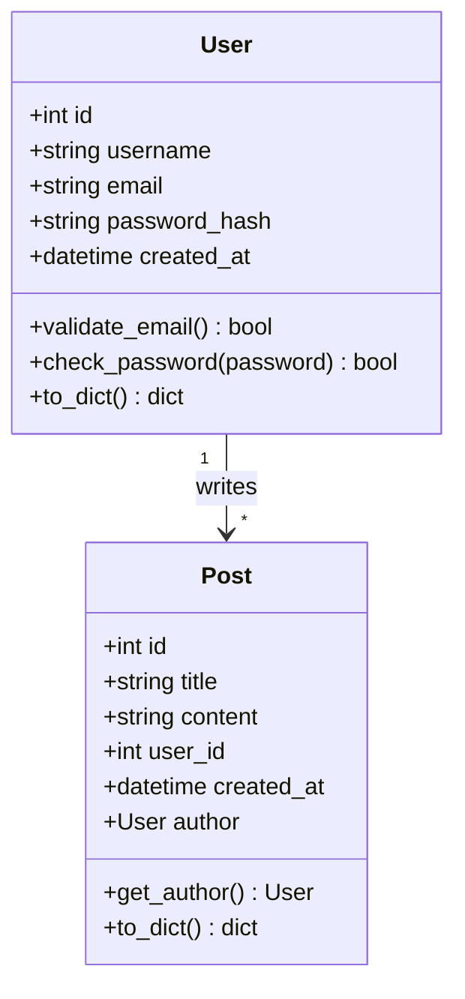
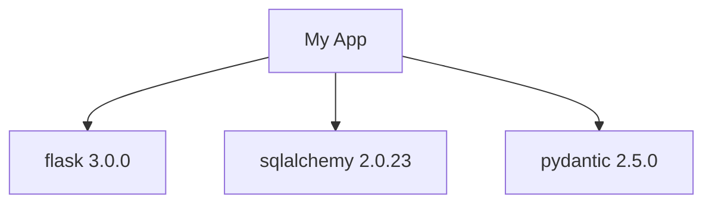

================================================================================
MODULE 03: MCP INTEGRATION LAYER (Global System Ultimate)
================================================================================

⚠️ NOTE: This module is part of Global Guidelines (instruction manual).
Apply this guidance to THE USER'S PROJECT, not to Global Guidelines itself.
Global Guidelines is in: ~/global/ or similar
User's project is in: A separate directory (ask user for project path)

OVERVIEW
--------
This module provides an intelligent integration layer for Model Context Protocol (MCP) servers,
enabling AI to make smart decisions, orchestrate tools, and automate workflows
based on context and goals.

CORE PHILOSOPHY
---------------
"From Passive Manual to Active Intelligent Assistant"

Instead of waiting for the developer to choose tools, the Prompt:
- Automatically analyzes context
- Selects appropriate tools
- Orchestrates workflows
- Makes intelligent decisions
- Learns and improves

================================================================================
SECTION 1: MANDATORY PROJECT MAPPING
================================================================================

OVERVIEW
--------
**MANDATORY:** Before starting any project, the AI MUST create a comprehensive map
of the software documenting all corners and components.

REQUIRED MAPPING COMPONENTS
---------------------------

### 1. PROJECT STRUCTURE MAP

**Format:** Mermaid Diagram



**Tool:** `mermaid.generate_diagram`

```bash
# Generate structure map
manus-render-diagram project_structure.mmd project_structure.png
```

---

### 2. IMPORTS & EXPORTS MAP

**Purpose:** Document all imports and exports in the project

**Format:** JSON + Diagram

```json
{
  "project": "my-app",
  "modules": [
    {
      "file": "src/main.py",
      "imports": [
        {"module": "flask", "items": ["Flask", "request", "jsonify"]},
        {"module": "sqlalchemy", "items": ["create_engine", "Column", "Integer"]},
        {"module": "./models", "items": ["User", "Post"]},
        {"module": "./utils", "items": ["validate_email", "hash_password"]}
      ],
      "exports": [
        {"name": "app", "type": "Flask", "description": "Main Flask application"},
        {"name": "db", "type": "SQLAlchemy", "description": "Database instance"}
      ]
    }
  ]
}
```

**Mermaid Diagram:**



**Tool:** `code-analysis.map_imports_exports`

---

### 3. CLASS DEFINITIONS MAP

**Purpose:** Document all Classes in the project

**Format:** UML Class Diagram



**Tool:** `code-analysis.generate_class_diagram`

---

### 4. LIBRARIES & DEPENDENCIES MAP

**Purpose:** Document all used libraries

**Format:** JSON + Dependency Tree

```json
{
  "project": "my-app",
  "dependencies": {
    "production": [
      {
        "name": "flask",
        "version": "3.0.0",
        "purpose": "Web framework",
        "used_in": ["main.py", "routes/*.py"],
        "critical": true
      }
    ]
  }
}
```

**Mermaid Diagram:**



**Tool:** `code-analysis.analyze_dependencies`

---

### 5. API ENDPOINTS MAP

**Purpose:** Document all API endpoints

**Format:** OpenAPI/Swagger + Diagram

```yaml
openapi: 3.0.0
info:
  title: My App API
  version: 1.0.0

paths:
  /api/users:
    get:
      summary: List all users
```

**Mermaid Diagram:**

```mermaid
graph LR
    Client[Client]
    
    Client -->|GET| ListUsers[/api/users]
    Client -->|POST| CreateUser[/api/users]
    
    ListUsers --> DB[(Database)]
    CreateUser --> DB
```

**Tool:** `code-analysis.generate_api_docs`
