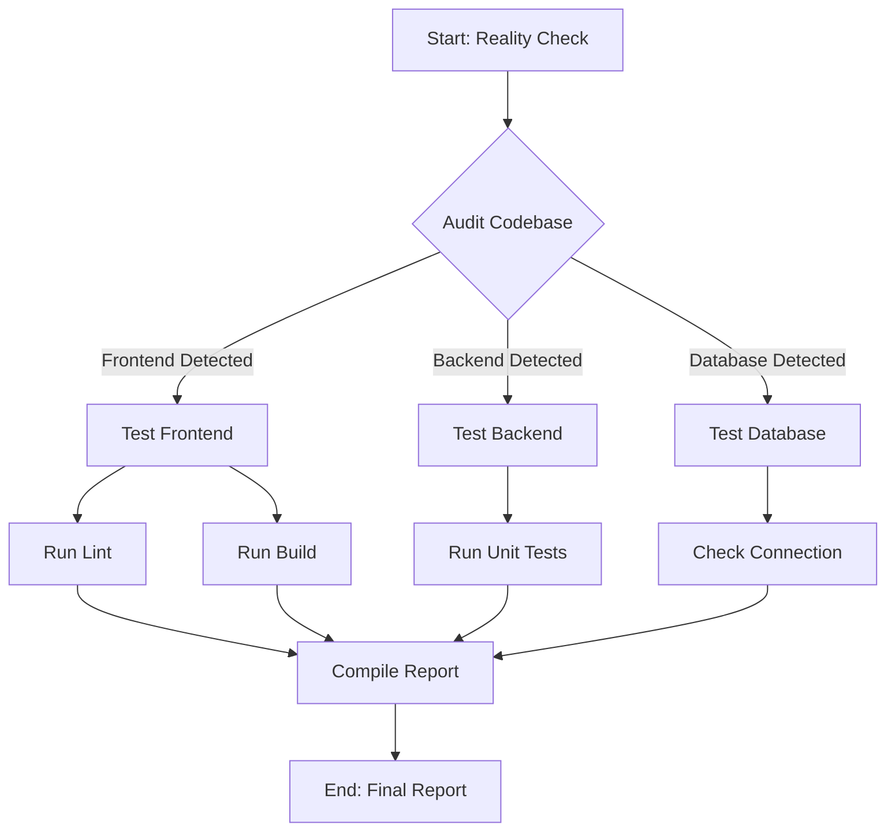

# Spec: Comprehensive System Test
**Version:** 1.0
**Visual Hash:** 9a8b7c6d

## 1. The Visual Model (Mermaid)

## 2. User Story (The "Why")
As a **System Administrator**, I want to **perform a comprehensive test of all system components**, so that **I can verify the integrity and functionality of the Frontend, Backend, and Database before deployment**.

## 3. Functional Requirements (The "What")
*   [ ] **REQ-01:** Automatically detect the presence of Frontend (package.json), Backend (requirements.txt/pyproject.toml), and Database (docker-compose/env).
*   [ ] **REQ-02:** Execute `npm run lint` and `npm run build` for Frontend if detected.
*   [ ] **REQ-03:** Execute `pytest` or `npm test` for Backend if detected.
*   [ ] **REQ-04:** Verify Database connection if configuration exists.
*   [ ] **REQ-05:** Generate a summary report (`reports/test_summary.md`) listing all passed/failed tests.

## 4. The Shadow Report (Anti-Patterns)
*   ⚠️ **Do NOT** run destructive tests on the production database.
*   ⚠️ **Avoid** failing the entire pipeline if only a minor lint warning occurs (log it instead).
*   ⚠️ **Do NOT** assume specific port numbers; read them from `.env` or config.

## 5. Acceptance Criteria (The "Done")
*   [ ] All detected components have been attempted to test.
*   [ ] A final report exists at `reports/test_summary.md`.
*   [ ] No critical system files are deleted during testing.
