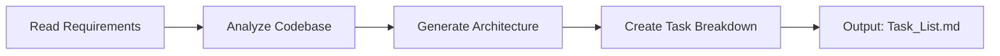
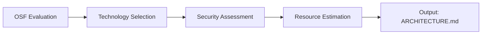
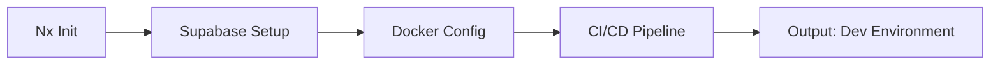
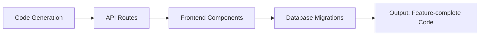
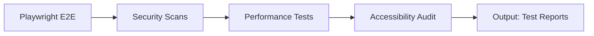
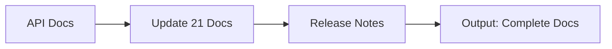
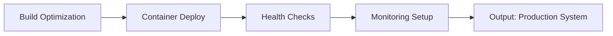

# 📋 COMPLETE IMPLEMENTATION PLAN - Global Professional Core Prompt v23.0

**Generated:** 2026-01-15
**Version:** v23.0 (Modern Tech Stack Edition)
**Target:** 95% Automation

---

## 🎯 EXECUTIVE SUMMARY

This plan implements the **Global Professional Core Prompt v23.0** with full integration of:
- **MCP** (Model Context Protocol) for all external interactions
- **Speckit JIT** (Just-in-Time Documentation)
- **UX Best Practices** for modern user experience

**Total Components:** 66 tasks across 5 major layers
**Automation Target:** 63/66 tasks (95%)

---

## 📊 MASTER COMPONENT MAP

```
┌─────────────────────────────────────────────────────────────────┐
│                    GLOBAL SYSTEM ARCHITECTURE                    │
├─────────────────────────────────────────────────────────────────┤
│                                                                  │
│   ┌───────────────────────────────────────────────────────────┐ │
│   │                    1. INFRASTRUCTURE                       │ │
│   │  ┌─────────┐  ┌─────────┐  ┌─────────┐  ┌─────────┐       │ │
│   │  │   Nx    │  │ Docker  │  │  CI/CD  │  │   CDN   │       │ │
│   │  │Monorepo │  │Container│  │ GitHub  │  │Cloudflare│      │ │
│   │  └─────────┘  └─────────┘  └─────────┘  └─────────┘       │ │
│   └───────────────────────────────────────────────────────────┘ │
│                              │                                   │
│   ┌───────────────────────────────────────────────────────────┐ │
│   │                      2. BACKEND                            │ │
│   │  ┌─────────┐  ┌─────────┐  ┌─────────┐  ┌─────────┐       │ │
│   │  │Supabase │  │ Auth/   │  │  API    │  │Real-time│       │ │
│   │  │PostgreSQL│ │  RBAC   │  │ Routes  │  │  Subs   │       │ │
│   │  └─────────┘  └─────────┘  └─────────┘  └─────────┘       │ │
│   └───────────────────────────────────────────────────────────┘ │
│                              │                                   │
│   ┌───────────────────────────────────────────────────────────┐ │
│   │                      3. FRONTEND                           │ │
│   │  ┌─────────┐  ┌─────────┐  ┌─────────┐  ┌─────────┐       │ │
│   │  │Component│  │  State  │  │  Theme  │  │   PWA   │       │ │
│   │  │ Library │  │ Manager │  │ System  │  │ Support │       │ │
│   │  └─────────┘  └─────────┘  └─────────┘  └─────────┘       │ │
│   └───────────────────────────────────────────────────────────┘ │
│                              │                                   │
│   ┌───────────────────────────────────────────────────────────┐ │
│   │                      4. TESTING                            │ │
│   │  ┌─────────┐  ┌─────────┐  ┌─────────┐  ┌─────────┐       │ │
│   │  │Playwright│ │Security │  │  Load   │  │Visual   │       │ │
│   │  │  E2E    │  │ Tests   │  │ Tests   │  │Regression│      │ │
│   │  └─────────┘  └─────────┘  └─────────┘  └─────────┘       │ │
│   └───────────────────────────────────────────────────────────┘ │
│                              │                                   │
│   ┌───────────────────────────────────────────────────────────┐ │
│   │                  5. DOCUMENTATION                          │ │
│   │  ┌─────────┐  ┌─────────┐  ┌─────────┐  ┌─────────┐       │ │
│   │  │Speckit  │  │   API   │  │ Memory  │  │  Logs   │       │ │
│   │  │  JIT    │  │  Docs   │  │ System  │  │ System  │       │ │
│   │  └─────────┘  └─────────┘  └─────────┘  └─────────┘       │ │
│   └───────────────────────────────────────────────────────────┘ │
│                                                                  │
└─────────────────────────────────────────────────────────────────┘
```

---

## 🔧 LAYER 1: INFRASTRUCTURE (10 Tasks)

### 1.1 Nx Monorepo Setup
```bash
# MCP Command
npx create-nx-workspace@latest my-project --preset=apps

# Structure
my-project/
├── apps/
│   ├── frontend/          # Main frontend app
│   ├── backend/           # Main backend app
│   └── e2e/               # E2E tests
├── libs/
│   ├── ui/                # Shared components
│   ├── utils/             # Utility functions
│   ├── data-access/       # API clients
│   └── types/             # TypeScript types
├── tools/                 # Custom scripts
└── nx.json                # Nx configuration
```

### 1.2 Docker Configuration
```yaml
# docker-compose.yml
version: '3.8'
services:
  frontend:
    build: ./apps/frontend
    ports:
      - "3000:80"
    environment:
      - VITE_API_URL=http://backend:4000

  backend:
    build: ./apps/backend
    ports:
      - "4000:4000"
    environment:
      - DATABASE_URL=${DATABASE_URL}
      - JWT_SECRET=${JWT_SECRET}

  postgres:
    image: supabase/postgres:15
    ports:
      - "5432:5432"
    volumes:
      - postgres_data:/var/lib/postgresql/data

  redis:
    image: redis:7-alpine
    ports:
      - "6379:6379"

volumes:
  postgres_data:
```

### 1.3 CI/CD Pipeline (GitHub Actions)
```yaml
# .github/workflows/ci.yml
name: CI/CD Pipeline

on:
  push:
    branches: [main, develop]
  pull_request:
    branches: [main]

jobs:
  affected:
    runs-on: ubuntu-latest
    steps:
      - uses: actions/checkout@v4
        with:
          fetch-depth: 0

      - name: Setup Node
        uses: actions/setup-node@v4
        with:
          node-version: 20
          cache: 'npm'

      - name: Install dependencies
        run: npm ci

      - name: Run affected tests
        run: npx nx affected -t test --parallel=3

      - name: Run affected lint
        run: npx nx affected -t lint --parallel=3

      - name: Build affected apps
        run: npx nx affected -t build --parallel=3

      - name: Run E2E tests
        run: npx nx affected -t e2e --parallel=1
```

### 1.4-1.10 Additional Infrastructure Tasks
| Task | Description | MCP Tool | Status |
|------|-------------|----------|--------|
| 1.4 | Environment variables | `write_file` | ⬜ |
| 1.5 | Supabase initialization | `browser_*` | ⬜ |
| 1.6 | PostgreSQL + RLS | `start_process` | ⬜ |
| 1.7 | Redis caching | `start_process` | ⬜ |
| 1.8 | CDN configuration | `browser_*` | ⬜ |
| 1.9 | SSL/TLS certificates | `start_process` | ⬜ |
| 1.10 | Monitoring setup | `browser_*` | ⬜ |

---

## 🖥️ LAYER 2: BACKEND (15 Tasks)

### 2.1 Authentication System
```typescript
// Supabase Auth with JWT
import { createClient } from '@supabase/supabase-js'

const supabase = createClient(
  process.env.SUPABASE_URL!,
  process.env.SUPABASE_ANON_KEY!
)

// Login
async function login(email: string, password: string) {
  const { data, error } = await supabase.auth.signInWithPassword({
    email,
    password,
  })
  if (error) throw error
  return data
}

// Session management with idempotency
async function createSession(userId: string, idempotencyKey: string) {
  const cached = await redis.get(`idem:${idempotencyKey}`)
  if (cached) return JSON.parse(cached)

  const session = await supabase
    .from('sessions')
    .insert({ user_id: userId, created_at: new Date() })
    .select()
    .single()

  await redis.set(`idem:${idempotencyKey}`, JSON.stringify(session), 'EX', 86400)
  return session
}
```

### 2.2 Row Level Security (RLS)
```sql
-- Supabase RLS Policies
-- Users can only access their own data
ALTER TABLE profiles ENABLE ROW LEVEL SECURITY;

CREATE POLICY "Users can view own profile"
ON profiles FOR SELECT
USING (auth.uid() = id);

CREATE POLICY "Users can update own profile"
ON profiles FOR UPDATE
USING (auth.uid() = id);

-- Admins can access all data
CREATE POLICY "Admins full access"
ON profiles FOR ALL
USING (
  EXISTS (
    SELECT 1 FROM user_roles
    WHERE user_id = auth.uid()
    AND role = 'admin'
  )
);
```

### 2.3 Idempotency Middleware
```typescript
// middleware/idempotency.ts
import { Request, Response, NextFunction } from 'express'
import Redis from 'ioredis'

const redis = new Redis(process.env.REDIS_URL)
const IDEMPOTENCY_TTL = 86400 // 24 hours

export async function idempotencyMiddleware(
  req: Request,
  res: Response,
  next: NextFunction
) {
  // Skip for GET requests
  if (req.method === 'GET') return next()

  const idempotencyKey = req.headers['idempotency-key'] as string
  
  if (!idempotencyKey) {
    return res.status(400).json({
      error: 'Idempotency-Key header required for mutations'
    })
  }

  // Check cache
  const cached = await redis.get(`idem:${idempotencyKey}`)
  if (cached) {
    const { statusCode, body } = JSON.parse(cached)
    return res.status(statusCode).json(body)
  }

  // Store response
  const originalJson = res.json.bind(res)
  res.json = function(body) {
    redis.set(
      `idem:${idempotencyKey}`,
      JSON.stringify({ statusCode: res.statusCode, body }),
      'EX',
      IDEMPOTENCY_TTL
    )
    return originalJson(body)
  }

  next()
}
```

### 2.4-2.15 Additional Backend Tasks
| Task | Description | MCP Tool | Status |
|------|-------------|----------|--------|
| 2.4 | Authorization (RBAC) | `write_file` | ⬜ |
| 2.5 | API routes | `write_file` | ⬜ |
| 2.6 | Input validation (Zod) | `write_file` | ⬜ |
| 2.7 | Error handling | `write_file` | ⬜ |
| 2.8 | Rate limiting | `write_file` | ⬜ |
| 2.9 | CORS configuration | `write_file` | ⬜ |
| 2.10 | Security headers | `write_file` | ⬜ |
| 2.11 | Database migrations | `start_process` | ⬜ |
| 2.12 | Real-time subscriptions | `write_file` | ⬜ |
| 2.13 | File upload handling | `write_file` | ⬜ |
| 2.14 | Email services | `write_file` | ⬜ |
| 2.15 | Background jobs | `write_file` | ⬜ |

---

## 🎨 LAYER 3: FRONTEND + UX (12 Tasks)

### 3.1 Design System Tokens
```css
/* design-tokens.css */
:root {
  /* Typography */
  --font-primary: 'Geist', 'Cairo', system-ui, sans-serif;
  --font-mono: 'JetBrains Mono', monospace;
  
  /* Spacing Scale */
  --space-1: 0.25rem;
  --space-2: 0.5rem;
  --space-3: 0.75rem;
  --space-4: 1rem;
  --space-6: 1.5rem;
  --space-8: 2rem;
  --space-12: 3rem;
  
  /* Colors - Light Theme */
  --color-background: hsl(0 0% 100%);
  --color-foreground: hsl(222 47% 11%);
  --color-primary: hsl(262 83% 58%);
  --color-secondary: hsl(210 40% 96%);
  --color-accent: hsl(160 84% 39%);
  --color-destructive: hsl(0 84% 60%);
  --color-muted: hsl(210 40% 96%);
  --color-border: hsl(214 32% 91%);
  
  /* Shadows */
  --shadow-sm: 0 1px 2px rgba(0,0,0,0.05);
  --shadow-md: 0 4px 6px rgba(0,0,0,0.1);
  --shadow-lg: 0 10px 15px rgba(0,0,0,0.1);
  
  /* Border Radius */
  --radius-sm: 0.25rem;
  --radius-md: 0.5rem;
  --radius-lg: 1rem;
  --radius-full: 9999px;
  
  /* Transitions */
  --transition-fast: 150ms ease;
  --transition-normal: 300ms ease;
  --transition-slow: 500ms ease;
}

/* Dark Theme */
[data-theme="dark"] {
  --color-background: hsl(222 47% 11%);
  --color-foreground: hsl(210 40% 98%);
  --color-secondary: hsl(217 33% 17%);
  --color-muted: hsl(217 33% 17%);
  --color-border: hsl(217 33% 17%);
}

/* RTL Support */
[dir="rtl"] {
  --font-primary: 'Cairo', 'Geist', system-ui, sans-serif;
}
```

### 3.2 Component Library (shadcn/ui style)
```tsx
// components/ui/Button.tsx
import { cva, type VariantProps } from 'class-variance-authority'
import { forwardRef } from 'react'
import { cn } from '@/lib/utils'

const buttonVariants = cva(
  'inline-flex items-center justify-center gap-2 whitespace-nowrap rounded-md text-sm font-medium transition-colors focus-visible:outline-none focus-visible:ring-2 focus-visible:ring-ring disabled:pointer-events-none disabled:opacity-50',
  {
    variants: {
      variant: {
        default: 'bg-primary text-primary-foreground hover:bg-primary/90',
        destructive: 'bg-destructive text-destructive-foreground hover:bg-destructive/90',
        outline: 'border border-input bg-background hover:bg-accent hover:text-accent-foreground',
        secondary: 'bg-secondary text-secondary-foreground hover:bg-secondary/80',
        ghost: 'hover:bg-accent hover:text-accent-foreground',
        link: 'text-primary underline-offset-4 hover:underline',
      },
      size: {
        default: 'h-10 px-4 py-2',
        sm: 'h-9 rounded-md px-3',
        lg: 'h-11 rounded-md px-8',
        icon: 'h-10 w-10',
      },
    },
    defaultVariants: {
      variant: 'default',
      size: 'default',
    },
  }
)

export interface ButtonProps
  extends React.ButtonHTMLAttributes<HTMLButtonElement>,
    VariantProps<typeof buttonVariants> {
  asChild?: boolean
}

const Button = forwardRef<HTMLButtonElement, ButtonProps>(
  ({ className, variant, size, asChild = false, ...props }, ref) => {
    return (
      <button
        className={cn(buttonVariants({ variant, size, className }))}
        ref={ref}
        {...props}
      />
    )
  }
)
Button.displayName = 'Button'

export { Button, buttonVariants }
```

### 3.3 Loading States & Skeletons
```tsx
// components/ui/Skeleton.tsx
import { cn } from '@/lib/utils'

function Skeleton({
  className,
  ...props
}: React.HTMLAttributes<HTMLDivElement>) {
  return (
    <div
      className={cn(
        'animate-pulse rounded-md bg-muted',
        className
      )}
      {...props}
    />
  )
}

// Usage: Card Skeleton
function CardSkeleton() {
  return (
    <div className="rounded-lg border p-4 space-y-4">
      <Skeleton className="h-4 w-3/4" />
      <Skeleton className="h-4 w-1/2" />
      <div className="flex gap-2">
        <Skeleton className="h-8 w-20" />
        <Skeleton className="h-8 w-20" />
      </div>
    </div>
  )
}
```

### 3.4 Form Handling with Validation
```tsx
// hooks/useForm.ts
import { zodResolver } from '@hookform/resolvers/zod'
import { useForm as useReactHookForm } from 'react-hook-form'
import { z } from 'zod'

const loginSchema = z.object({
  email: z.string().email('البريد الإلكتروني غير صحيح'),
  password: z.string().min(8, 'كلمة المرور يجب أن تكون 8 أحرف على الأقل'),
})

type LoginForm = z.infer<typeof loginSchema>

export function useLoginForm() {
  return useReactHookForm<LoginForm>({
    resolver: zodResolver(loginSchema),
    defaultValues: {
      email: '',
      password: '',
    },
  })
}
```

### 3.5-3.12 Additional Frontend Tasks
| Task | Description | MCP Tool | Status |
|------|-------------|----------|--------|
| 3.5 | Routing system | `write_file` | ⬜ |
| 3.6 | State management | `write_file` | ⬜ |
| 3.7 | Error boundaries | `write_file` | ⬜ |
| 3.8 | Theme system | `write_file` | ⬜ |
| 3.9 | RTL support | `write_file` | ⬜ |
| 3.10 | Responsive design | `write_file` | ⬜ |
| 3.11 | PWA configuration | `write_file` | ⬜ |
| 3.12 | SEO optimization | `write_file` | ⬜ |

---

## 🧪 LAYER 4: TESTING (8 Tasks)

### 4.1 Playwright E2E Configuration
```typescript
// playwright.config.ts
import { defineConfig, devices } from '@playwright/test'

export default defineConfig({
  testDir: './e2e',
  fullyParallel: true,
  forbidOnly: !!process.env.CI,
  retries: process.env.CI ? 2 : 0,
  workers: process.env.CI ? 1 : undefined,
  reporter: [
    ['html', { open: 'never' }],
    ['json', { outputFile: 'reports/test-results.json' }],
  ],
  use: {
    baseURL: 'http://localhost:3000',
    trace: 'on-first-retry',
    screenshot: 'only-on-failure',
    video: 'retain-on-failure',
  },
  projects: [
    {
      name: 'chromium',
      use: { ...devices['Desktop Chrome'] },
    },
    {
      name: 'firefox',
      use: { ...devices['Desktop Firefox'] },
    },
    {
      name: 'webkit',
      use: { ...devices['Desktop Safari'] },
    },
    {
      name: 'mobile-chrome',
      use: { ...devices['Pixel 5'] },
    },
    {
      name: 'mobile-safari',
      use: { ...devices['iPhone 12'] },
    },
  ],
  webServer: {
    command: 'npm run dev',
    url: 'http://localhost:3000',
    reuseExistingServer: !process.env.CI,
  },
})
```

### 4.2 Security Test Suite
```typescript
// e2e/security.spec.ts
import { test, expect } from '@playwright/test'

test.describe('Security Tests', () => {
  test('should have security headers', async ({ request }) => {
    const response = await request.get('/')
    const headers = response.headers()
    
    expect(headers['strict-transport-security']).toBeTruthy()
    expect(headers['x-content-type-options']).toBe('nosniff')
    expect(headers['x-frame-options']).toBe('DENY')
    expect(headers['content-security-policy']).toBeTruthy()
  })

  test('should prevent XSS attacks', async ({ page }) => {
    await page.goto('/search?q=<script>alert(1)</script>')
    const content = await page.content()
    
    expect(content).not.toContain('<script>alert(1)</script>')
    expect(content).toContain('&lt;script&gt;')
  })

  test('should require authentication for protected routes', async ({ page }) => {
    await page.goto('/dashboard')
    await expect(page).toHaveURL('/login')
  })

  test('should validate CSRF tokens', async ({ request }) => {
    const response = await request.post('/api/users', {
      data: { name: 'Test' },
      // No CSRF token
    })
    
    expect(response.status()).toBe(403)
  })
})
```

### 4.3-4.8 Additional Testing Tasks
| Task | Description | MCP Tool | Status |
|------|-------------|----------|--------|
| 4.3 | Unit tests | `start_process` | ⬜ |
| 4.4 | Integration tests | `start_process` | ⬜ |
| 4.5 | Performance tests | `start_process` | ⬜ |
| 4.6 | Accessibility tests | `browser_*` | ⬜ |
| 4.7 | Visual regression | `browser_screenshot` | ⬜ |
| 4.8 | Load testing (k6) | `start_process` | ⬜ |

---

## 📚 LAYER 5: SPECKIT JIT DOCUMENTATION (21 Documents)

### 5.1 Document Generation Schedule

| Document | Generation Phase | Auto-Update | Template |
|----------|------------------|-------------|----------|
| README.md | Start | ✅ Yes | `prompts/70_documentation.md` |
| ARCHITECTURE.md | Planning | ✅ Yes | `knowledge/architecture.md` |
| LICENSE | Start | ❌ No | MIT/Apache |
| API_DOCUMENTATION.md | Development | ✅ Yes | OpenAPI |
| DATABASE_SCHEMA.md | Development | ✅ Yes | From migrations |
| Routes_FE.md | Development | ✅ Yes | From router |
| Routes_BE.md | Development | ✅ Yes | From server |
| Class_Registry.md | Development | ✅ Yes | From TypeScript |
| DEPLOYMENT_GUIDE.md | Pre-deploy | ✅ Yes | `workflows/deploy.md` |
| TESTING_STRATEGY.md | Testing | ✅ Yes | From test files |
| SECURITY_GUIDELINES.md | Development | ✅ Yes | `rules/*.md` |
| Resilience.md | Development | ✅ Yes | From error handling |
| CHANGELOG.md | Continuous | ✅ Yes | Conventional commits |
| CONTRIBUTING.md | Start | ❌ No | Standard template |
| Permissions_Model.md | Development | ✅ Yes | From RBAC |
| Solution_Tradeoff_Log.md | Continuous | ✅ Yes | OSF decisions |
| Status_Report.md | Continuous | ✅ Yes | Auto-generated |
| Task_List.md | Continuous | ✅ Yes | Auto-generated |
| PROJECT_MAPS.md | Continuous | ✅ Yes | `directory_tree` |
| fix_this_error.md | Continuous | ✅ Yes | From error logs |
| To_ReActivated_again.md | Continuous | ✅ Yes | Deferred tasks |

### 5.2 Memory System Structure
```
.memory/
├── conversations/
│   ├── 2026-01-15_initial_planning.md
│   └── 2026-01-15_architecture_review.md
├── decisions/
│   ├── 2026-01-15_database_choice.md
│   └── 2026-01-15_auth_strategy.md
├── checkpoints/
│   ├── phase_1_analysis.json
│   ├── phase_2_planning.json
│   └── phase_3_setup.json
├── context/
│   └── current_task.md
└── learnings/
    ├── supabase_rls.md
    └── playwright_best_practices.md
```

### 5.3 Log System Structure
```
logs/
├── debug.log      # Verbose debugging info
├── info.log       # General application flow
├── warn.log       # Warnings and potential issues
├── error.log      # Error events with stack traces
├── fatal.log      # Critical system failures
└── background.log # Async process status
```

---

## 🤖 MCP TOOL REFERENCE

### Research & Context
| Tool | Usage | Example |
|------|-------|---------|
| `search_wikipedia` | Knowledge lookup | `{"query": "REST API best practices"}` |
| `get_article` | Full article | `{"title": "OAuth 2.0"}` |
| `browser_navigate` | Web research | `{"url": "https://supabase.com/docs"}` |

### File Operations
| Tool | Usage | Example |
|------|-------|---------|
| `read_file` | Read file content | `{"path": "/app/src/index.ts"}` |
| `write_file` | Create/update file | `{"path": "/app/config.ts", "content": "..."}` |
| `edit_block` | Surgical edit | `{"file_path": "...", "old_string": "...", "new_string": "..."}` |
| `directory_tree` | List structure | `{"path": "/app"}` |
| `search_files` | Find files | `{"path": "/app", "pattern": "*.ts"}` |

### Browser Automation
| Tool | Usage | Example |
|------|-------|---------|
| `browser_navigate` | Go to URL | `{"url": "http://localhost:3000"}` |
| `browser_screenshot` | Capture screen | `{"filename": "test.png"}` |
| `browser_click` | Click element | `{"element": "Submit button", "ref": "btn1"}` |
| `browser_fill_form` | Fill inputs | `{"fields": [...]}` |
| `browser_evaluate` | Run JS | `{"function": "() => document.title"}` |

### Development
| Tool | Usage | Example |
|------|-------|---------|
| `run_js_ephemeral` | Run Node.js | `{"code": "console.log('test')"}` |
| `start_process` | Shell command | `{"command": "npm test", "timeout_ms": 60000}` |
| `sandbox_initialize` | Create sandbox | `{"image": "node:lts-slim"}` |

### GitHub
| Tool | Usage | Example |
|------|-------|---------|
| `create_repository` | New repo | `{"name": "my-project", "private": true}` |
| `push_files` | Push code | `{"owner": "...", "repo": "...", "files": [...]}` |
| `create_pull_request` | Create PR | `{"title": "feat: Add login", ...}` |

---

## 🚀 AUTOMATION WORKFLOW (7 Phases)

### Phase 1: Analysis


### Phase 2: Planning


### Phase 3: Setup


### Phase 4: Development


### Phase 5: Testing


### Phase 6: Documentation


### Phase 7: Deployment


---

## ✅ MASTER CHECKLIST

### Infrastructure (10/10)
- [ ] 1.1 Nx monorepo setup
- [ ] 1.2 Docker containerization
- [ ] 1.3 CI/CD with GitHub Actions
- [ ] 1.4 Environment variables
- [ ] 1.5 Supabase initialization
- [ ] 1.6 PostgreSQL + RLS
- [ ] 1.7 Redis caching
- [ ] 1.8 CDN configuration
- [ ] 1.9 SSL/TLS certificates
- [ ] 1.10 Monitoring setup

### Backend (15/15)
- [ ] 2.1 Authentication (JWT + Sessions)
- [ ] 2.2 Row Level Security
- [ ] 2.3 Idempotency middleware
- [ ] 2.4 Authorization (RBAC)
- [ ] 2.5 API routes
- [ ] 2.6 Input validation (Zod)
- [ ] 2.7 Error handling
- [ ] 2.8 Rate limiting
- [ ] 2.9 CORS configuration
- [ ] 2.10 Security headers
- [ ] 2.11 Database migrations
- [ ] 2.12 Real-time subscriptions
- [ ] 2.13 File upload handling
- [ ] 2.14 Email services
- [ ] 2.15 Background jobs

### Frontend (12/12)
- [ ] 3.1 Design system tokens
- [ ] 3.2 Component library
- [ ] 3.3 Loading states
- [ ] 3.4 Form handling
- [ ] 3.5 Routing system
- [ ] 3.6 State management
- [ ] 3.7 Error boundaries
- [ ] 3.8 Theme system
- [ ] 3.9 RTL support
- [ ] 3.10 Responsive design
- [ ] 3.11 PWA configuration
- [ ] 3.12 SEO optimization

### Testing (8/8)
- [ ] 4.1 Playwright E2E
- [ ] 4.2 Security tests
- [ ] 4.3 Unit tests
- [ ] 4.4 Integration tests
- [ ] 4.5 Performance tests
- [ ] 4.6 Accessibility tests
- [ ] 4.7 Visual regression
- [ ] 4.8 Load testing

### Documentation (21/21)
- [ ] README.md
- [ ] ARCHITECTURE.md
- [ ] LICENSE
- [ ] API_DOCUMENTATION.md
- [ ] DATABASE_SCHEMA.md
- [ ] Routes_FE.md
- [ ] Routes_BE.md
- [ ] Class_Registry.md
- [ ] DEPLOYMENT_GUIDE.md
- [ ] TESTING_STRATEGY.md
- [ ] SECURITY_GUIDELINES.md
- [ ] Resilience.md
- [ ] CHANGELOG.md
- [ ] CONTRIBUTING.md
- [ ] Permissions_Model.md
- [ ] Solution_Tradeoff_Log.md
- [ ] Status_Report.md
- [ ] Task_List.md
- [ ] PROJECT_MAPS.md
- [ ] fix_this_error.md
- [ ] To_ReActivated_again.md

---

## 📈 PROGRESS TRACKING

| Layer | Total Tasks | Completed | Progress |
|-------|-------------|-----------|----------|
| Infrastructure | 10 | 0 | 0% |
| Backend | 15 | 0 | 0% |
| Frontend | 12 | 0 | 0% |
| Testing | 8 | 0 | 0% |
| Documentation | 21 | 0 | 0% |
| **TOTAL** | **66** | **0** | **0%** |

---

## 🎯 OSF FRAMEWORK APPLICATION

**Formula:**
```
OSF_Score = (0.35 × Security) + (0.20 × Correctness) + (0.15 × Reliability) + (0.10 × Maintainability) + (0.08 × Performance) + (0.07 × Usability) + (0.05 × Scalability)
```

**Priorities:**
1. 🔒 **Security (35%)** - RLS, JWT, CSRF, XSS prevention
2. ✅ **Correctness (20%)** - Type safety, validation, tests
3. 🛡️ **Reliability (15%)** - Error handling, idempotency
4. 🔧 **Maintainability (10%)** - Clean code, documentation
5. ⚡ **Performance (8%)** - Caching, optimization
6. 🎨 **Usability (7%)** - UX, accessibility
7. 📈 **Scalability (5%)** - Nx monorepo, microservices-ready

---

**END OF COMPLETE IMPLEMENTATION PLAN**

*Generated with Sequential Thinking MCP*
*Version: v23.0 (Modern Tech Stack Edition)*
