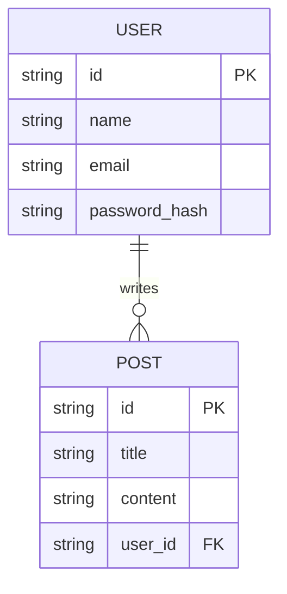

> This is a template. Fill this out for your specific project.

# Database Schema

**Version:** 1.0  
**Last Updated:** YYYY-MM-DD

---

## 1. Overview

*Provide a high-level overview of the database design. What is the database technology used? What are the main tables and their relationships?*

## 2. ERD (Entity-Relationship Diagram)

*Insert an ERD diagram here. This provides a visual representation of the database schema.*

## 3. Tables

*Describe each table in detail.*

### `users`

| Column          | Data Type     | Constraints              | Description                           |
|-----------------|---------------|--------------------------|---------------------------------------|
| `id`            | `VARCHAR(255)`| `PRIMARY KEY`, `NOT NULL`| Unique identifier for the user.       |
| `name`          | `VARCHAR(255)`| `NOT NULL`               | The user's full name.                 |
| `email`         | `VARCHAR(255)`| `UNIQUE`, `NOT NULL`     | The user's email address.             |
| `password_hash` | `VARCHAR(255)`| `NOT NULL`               | The user's hashed password.           |
| `created_at`    | `TIMESTAMP`   | `DEFAULT CURRENT_TIMESTAMP`| Timestamp of when the user was created. |
| `updated_at`    | `TIMESTAMP`   | `DEFAULT CURRENT_TIMESTAMP`| Timestamp of when the user was last updated.|

### `posts`

| Column       | Data Type     | Constraints              | Description                           |
|--------------|---------------|--------------------------|---------------------------------------|
| `id`         | `VARCHAR(255)`| `PRIMARY KEY`, `NOT NULL`| Unique identifier for the post.       |
| `title`      | `VARCHAR(255)`| `NOT NULL`               | The title of the post.                |
| `content`    | `TEXT`        | `NOT NULL`               | The content of the post.              |
| `user_id`    | `VARCHAR(255)`| `FOREIGN KEY (users.id)` | The ID of the user who wrote the post.|
| `created_at` | `TIMESTAMP`   | `DEFAULT CURRENT_TIMESTAMP`| Timestamp of when the post was created. |
| `updated_at` | `TIMESTAMP`   | `DEFAULT CURRENT_TIMESTAMP`| Timestamp of when the post was last updated.|

## 4. Indexes

*List all database indexes and their purpose.*

- **`idx_users_email`**: Index on the `email` column of the `users` table to speed up lookups by email.
- **`idx_posts_user_id`**: Index on the `user_id` column of the `posts` table to speed up queries for a user's posts.

