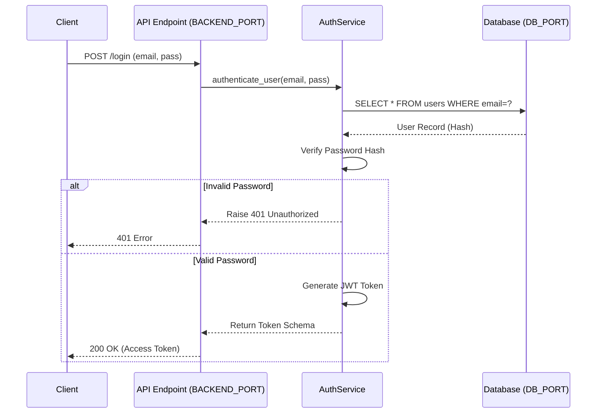

# ⚙️ Backend Development Workflow (Global System v26 Diamond 32 v26.0 Diamond 32 GAARA AI)

This document visualizes the logical flow of Backend modules using Mermaid charts, incorporating the **Smart Port Orchestration** architecture.

## 1. Dynamic Port Configuration
The backend service MUST NOT hardcode ports. It must read from the environment:

*   **Service Port:** `os.getenv("BACKEND_PORT", 8000)`
*   **Database Port:** `os.getenv("DB_PORT", 8100)`
*   **Redis Port:** `os.getenv("REDIS_PORT", 11000)`
*   **AI Service Port:** `os.getenv("AI_PORT", 8200)`

## 2. Standard Module Logic
Every backend service follows this logical flow:

```mermaid
graph TD
    A[Input: DTO/Request] -->|Validate| B{Is Valid?}
    B -- No --> C[Error: 400 Bad Request]
    B -- Yes --> D[Business Logic Layer]
    D -->|Query (DB_PORT)| E[(Database)]
    E -->|Result| D
    D -->|Cache (REDIS_PORT)| R[(Redis)]
    R -->|Hit/Miss| D
    D -->|Transform| F[Output: Response DTO]
    F --> G[Return to Caller]
```

## 3. Example: Authentication Service Flow



### 📥 Imports (Data Sources)
*   **Config**: Settings, Secrets (Loaded from `.env`).
*   **Models**: User Entity.
*   **Utils**: Hashing, JWT.

### 📤 Exports (Data Sinks)
*   **Public Methods**: `login()`, `register()`.
*   **Artifacts**: Access Tokens.
